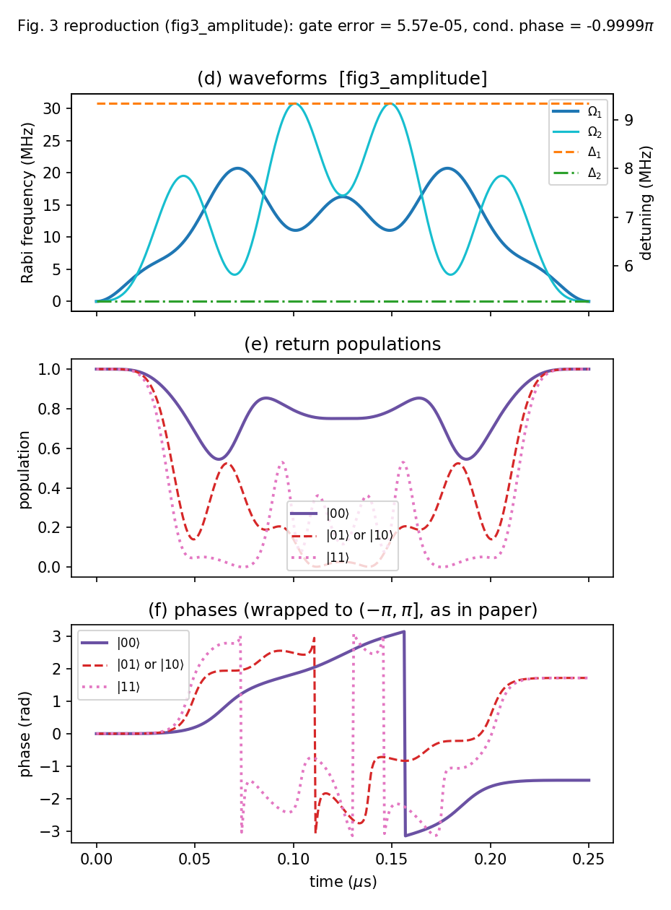
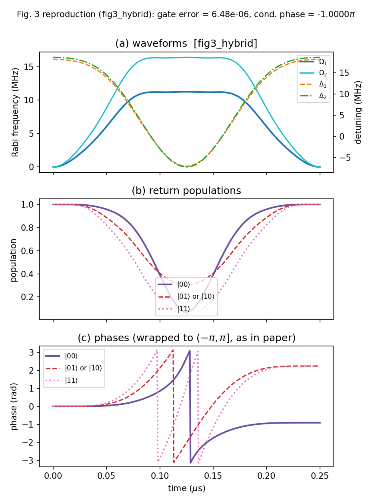
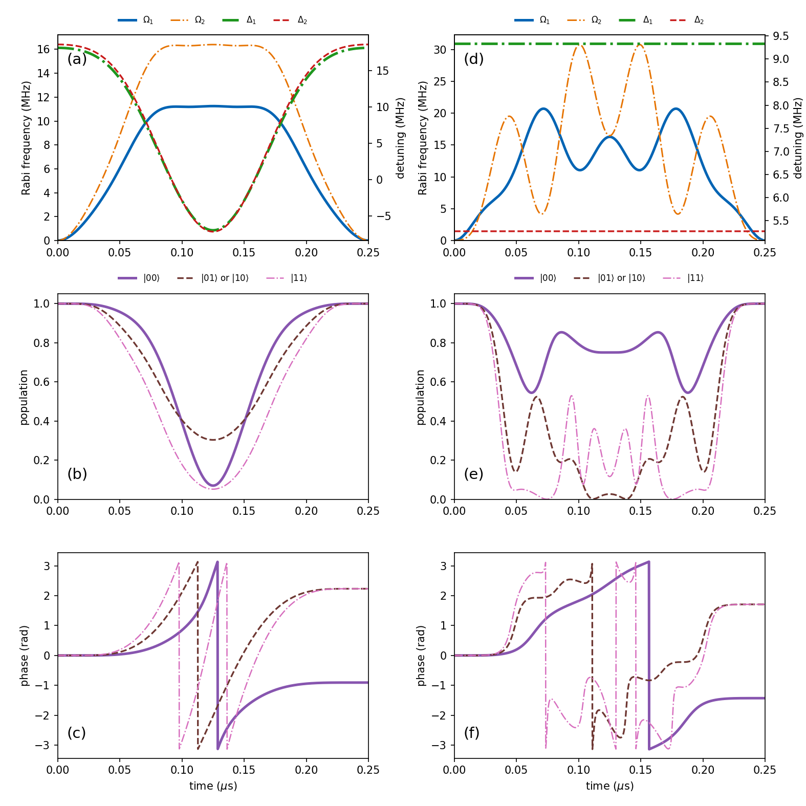
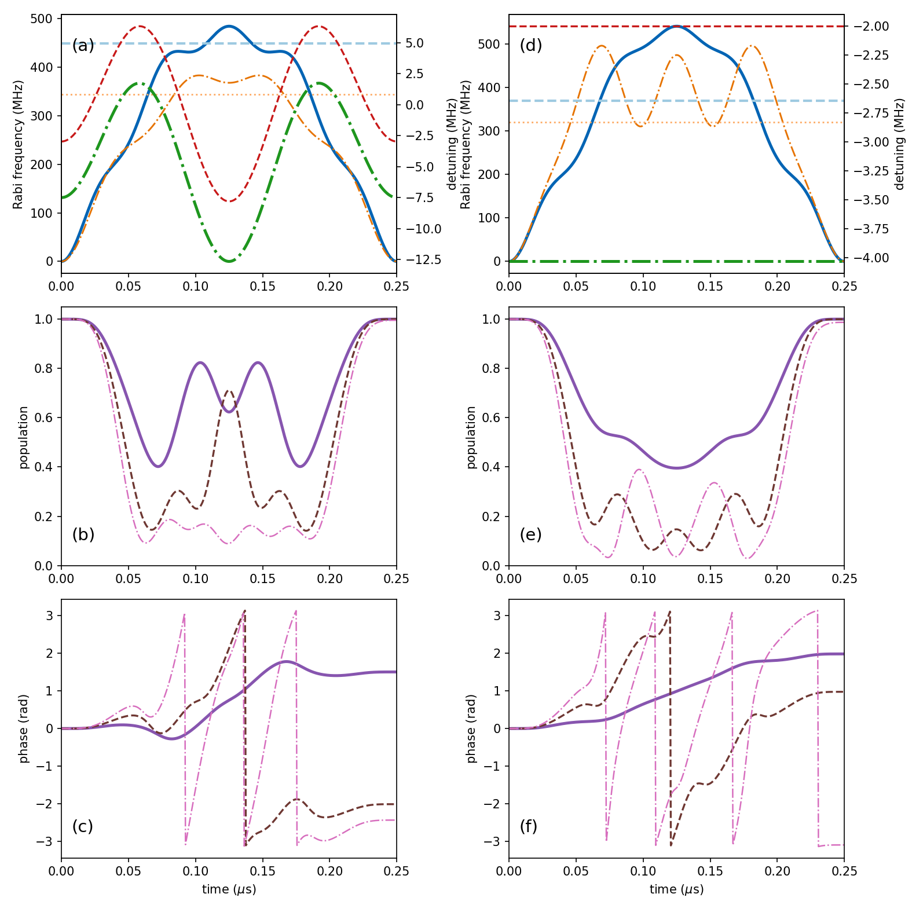
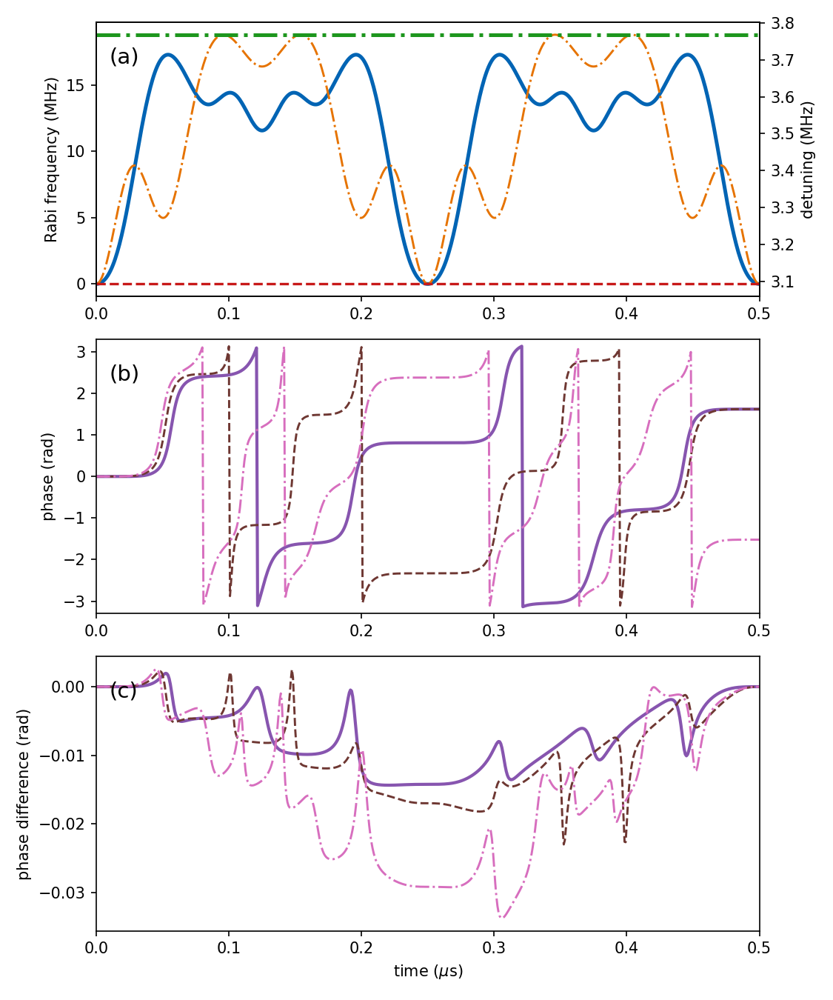
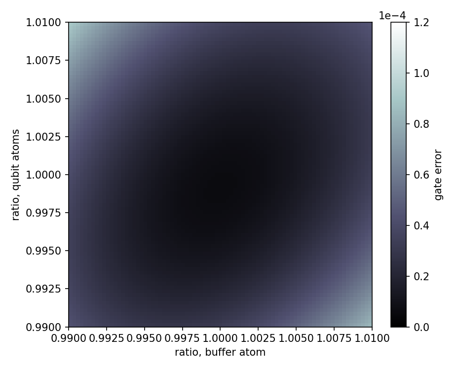

# 10.1007-s11433-024-2478-8: Buffer-atom-mediated quantum logic gates with off-resonant modulated driving

Preprint: **No preprint recorded as of 2026-07-14**

Published as: [Buffer-atom-mediated quantum logic gates with off-resonant modulated driving](https://doi.org/10.1007/s11433-024-2478-8)

Formal citation: Sci. China-Phys. Mech. Astron. 67, 120311 (2024) · DOI `10.1007/s11433-024-2478-8` · Locator `Article 120311`

Public status: **Mixed: Fig. 3 complete, Fig. 4/5/7 feature-level** · Audit score: **84.60/100**

Reproduces the buffer-atom-mediated CZ gate from an independent three-body Rydberg Hamiltonian: single-photon waveforms, populations, and phases (Fig. 3, complete, gate error < 1e-4), the two-photon protocol (Fig. 4), the Doppler-insensitive dual-pulse upgrade (Fig. 5), and the amplitude-ratio robustness map (Fig. 7).

## Start Here / 从这里开始

- [中文复现 Note](note/reproduction-note.zh-CN.md)
- [English reproduction note](note/reproduction-note.en.md)
- [Code and run commands](code/README.md)
- [Machine-readable scorecard](outputs/checks/similarity_scorecard.json)
- [Numerical methods](docs/NUMERICAL_METHODS.md)
- [Lessons learned](docs/LESSONS_LEARNED.md)

## Quick Run

```bash
python -m venv .venv
source .venv/bin/activate
pip install -r requirements.txt
cd cases/10.1007-s11433-024-2478-8/code
python scripts/run_fig3.py
python scripts/run_fig4.py
python scripts/run_fig5.py
python scripts/run_fig7.py
```

Generated files are kept under [data](outputs/data/), [figures](outputs/figures/), and [checks](outputs/checks/).

## Reproduction Boundary

This public case includes paper-derived code, generated data, generated figures, public validation checks, and explanatory notes. It does not redistribute the paper PDF, arXiv source archive, original figures, EPS paths, digitized source curves, source-derived point sets, or source-vs-generated composite panels.

Remaining limitation: The two-photon full three-level model gives gate error ~1e-3 vs the paper's <1e-4 (its waveforms were likely optimised in a reduced/effective model); Fig. 7 peak ~25% below the paper; Fig. 6 three-qubit Toffoli geometry is underspecified and not reproduced; Figs. a6-a8 have no published coefficients.

Final-parameter rule: final public figures use the paper parameters when feasible. Any reduced-scale, subset, proxy, or blocked target must be labeled explicitly and cannot be presented as a complete reproduction.

## Generated Figures












