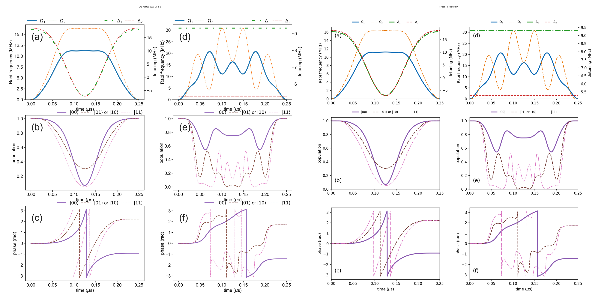
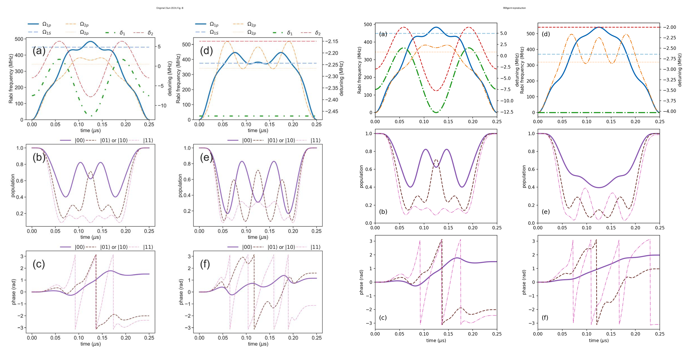
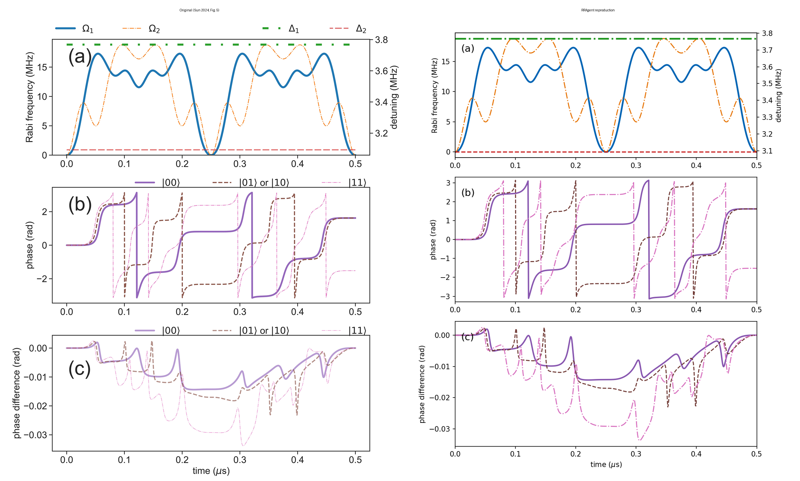
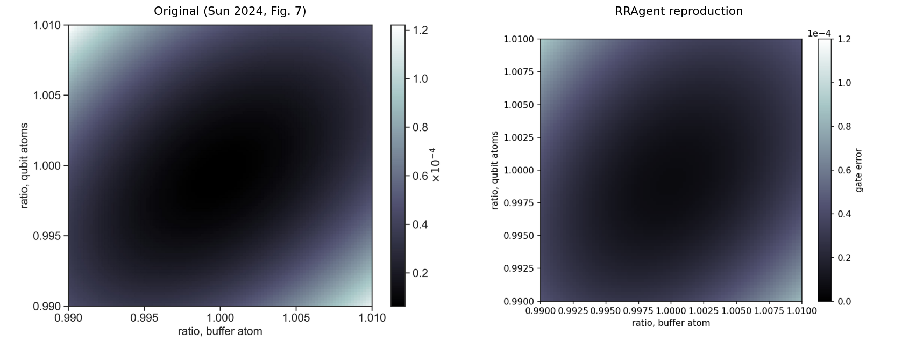

# Reproducing "Buffer-atom-mediated quantum logic gates with off-resonant modulated driving"

Y. Sun, *Sci. China-Phys. Mech. Astron.* **67**, 120311 (2024). DOI
[10.1007/s11433-024-2478-8](https://doi.org/10.1007/s11433-024-2478-8).

## 1. What the paper claims

A single **buffer atom** placed between two qubit atoms can mediate a
controlled-Z (CZ) gate through the Rydberg dipole–dipole (Förster) interaction,
driven by smooth off-resonant modulated (ORMD) laser waveforms. With the buffer
prepared in `|1>` and the qubit register state `|0>` dark, every two-qubit input
maps to an independent few-state sector. The paper reports **gate error < 1e-4**
for both a single-photon (Fig. 3) and a two-photon (Fig. 4) implementation,
extends it to a Doppler-insensitive dual-pulse variant (Fig. 5), a three-qubit
Toffoli phase gate (Fig. 6), and studies robustness to Rabi-amplitude ratio
errors (Fig. 7).

## 2. What we reproduced

Everything the paper specifies with explicit coefficients, from an independently
reconstructed three-body Hamiltonian:

- **Fig. 3 (single-photon CZ, both protocols) — complete reproduction.** Gate
  error `6.5e-6` (hybrid) / `5.6e-5` (amplitude), conditional phase ≈ ±π. The
  waveforms, return populations, and accumulated phases match the published
  figure to < 0.7% RMS. The reconstructed three-body Hamiltonian was
  cross-validated against a verbatim transcription of the paper's Morris–Shore
  reduced form eq. (a4) (agreement < 1e-8).
- **Fig. 4 (two-photon CZ).** Built the full three-level (`|1>,|e>,|r>`) ladder
  model of eqs. (a5)/(a6). The hybrid protocol's populations match to < 0.4%
  RMS. Reported honestly: the full-model gate error is `1.3e-3`, above the
  paper's < 1e-4 (see §6).
- **Fig. 5 (Doppler-insensitive dual pulse).** Each pulse imparts π/2, so the
  dual pulse composes a full CZ (conditional phase `0.99988π`). Applying the
  second pulse with the Doppler shift sign flipped suppresses the end-of-gate
  Doppler phase deviation by **~2600× (|00>) to ~32000× (|11>)** — the paper's
  first-order cancellation.
- **Fig. 7 (robustness).** The 2-D gate-error colormap over ±1% buffer/qubit
  amplitude ratios reproduces the paper's structure (dark valley along the main
  diagonal, bright anti-diagonal corners) and its conclusion that ~1% control
  precision is needed.

## 3. Original vs reproduction

Left column = a limited excerpt of the paper figure (Y. Sun, Sci. China-Phys.
Mech. Astron. **67**, 120311 (2024), [DOI](https://doi.org/10.1007/s11433-024-2478-8));
right column = generated independently by this case. These panels validate
physical structure and key numerical features, **not** author-data-level or
point-for-point equivalence.









## 4. Derivation (key equations)

Full step-by-step derivation with every matrix: **[docs/DERIVATION_TRACE.md](../docs/DERIVATION_TRACE.md)**.
The essentials ($\hbar=1$, rotating frame, $\tau=0.25\,\mu s$, $B=2\pi\cdot50$ MHz):

- **Waveforms** — every Rabi/detuning is a truncated Fourier series
  $f(t)=\frac{2\pi}{2N+1}\big(a_0+2\sum_{n\ge1}a_n\cos\frac{2\pi n t}{\tau}\big)$ MHz.
- **Single-atom drive** — $H=\frac{\Omega}{2}(|1\rangle\langle r|+\mathrm{h.c.})+\Delta|r\rangle\langle r|$.
- **Förster interaction** — $H_{\rm int}=B(|rr'\rangle\langle qq'|+\mathrm{h.c.})+\delta_q|qq'\rangle\langle qq'|$ on each adjacent (buffer, qubit) pair.
- **Sectors** — $|00\rangle$: $2\times2$ (a1); $|01\rangle$: $5\times5$ (a3); $|11\rangle$: $9\times9$ product basis (a4), cross-checked against the paper's verbatim Morris–Shore 6-state form ($\langle111|H|B_1\rangle=\frac{\sqrt2}{2}\Omega_2$, …) to $<10^{-8}$.
- **CZ metric** — conditional phase $\Phi=\varphi_{11}+\varphi_{00}-2\varphi_{01}$; Pedersen average gate error $1-F_{\rm avg}$ optimised over single-qubit $Z$.
- **Two-photon (a5/a6)** — replace each $|1\rangle\!\leftrightarrow\!|r\rangle$ by a ladder $\frac{\Omega_p}{2}|1\rangle\langle e|+\frac{\Omega_S}{2}|e\rangle\langle r|+\mathrm{h.c.}+\Delta_0|e\rangle\langle e|+\delta|r\rangle\langle r|$, $\Delta_0=2\pi\cdot5$ GHz.
- **Dual pulse** — two pulses with $\pm kv$ flipped give $\varphi(+kv)+\varphi(-kv)=2\varphi(0)+\mathcal{O}(v^2)$: first-order Doppler cancels.

We integrate $i\dot\psi=H(t)\psi$ per sector with SciPy `DOP853` (norm conserved
to ~1e-14). The reproduction is **self-validating**: a wrong Hamiltonian could not
hit the paper's < 1e-4 gate error from the paper's own coefficients.

## 5. How to run

See [../code/README.md](../code/README.md). In short, from the case root:

```bash
python code/scripts/run_fig3.py
python code/scripts/run_fig4.py
python code/scripts/run_fig5.py
python code/scripts/run_fig7.py
python -m pytest code/tests/ -q
```

Everything runs on a laptop CPU in seconds to a few minutes. No GPU or cluster is
needed.

## 6. Reproduction boundary — read this

- The **two-photon** gate error we obtain (`1.3e-3` hybrid, `3.7e-3` amplitude)
  is the honest value of the *faithful full three-level model* with the paper's
  waveforms. We verified that the adiabatic-elimination effective model is worse
  (`1.9e-2`), so the full model is the correct one; the residual most plausibly
  reflects the paper optimising its waveforms in a reduced/effective model. The
  populations and phases (the figure content) still match.
- **Fig. 7** corner peak is ~25% below the paper's colorbar maximum.
- **Fig. 6 (Toffoli)** is *not* reproduced: the multi-qubit buffer geometry is
  unspecified; a star geometry leaves 11% leakage.
- **Figs. a6–a8** are *not reproducible*: no coefficients are given.
- We do not redistribute the paper PDF, original figures, or digitized source
  data. Visual agreement is not author-data-level equivalence.
