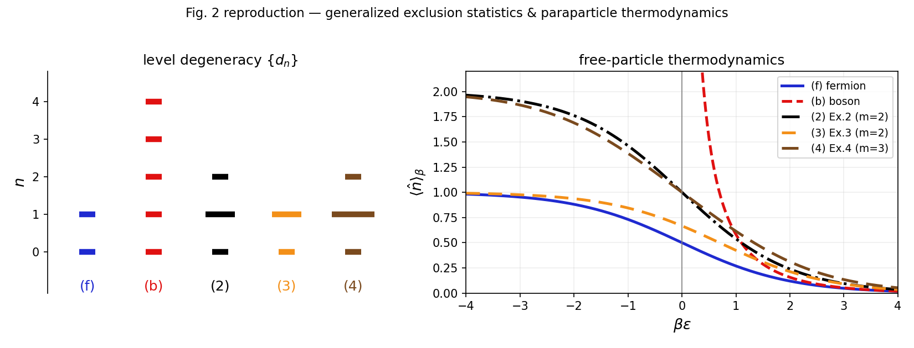

# 10.1038-s41586-024-08262-7: Particle exchange statistics beyond fermions and bosons

Preprint: [arXiv:2308.05203 — Particle exchange statistics beyond fermions and bosons](https://arxiv.org/abs/2308.05203)

Published as: [Particle exchange statistics beyond fermions and bosons](https://doi.org/10.1038/s41586-024-08262-7)

Formal citation: Nature 637, 314–318 (2025) · DOI `10.1038/s41586-024-08262-7` · Locator `314–318`

Public status: **Complete reproduction** · Audit score: **90.00/100**

Reproduces the numerical main figure from the paper's closed-form single-mode statistics at the published legend parameters, and independently validates the free-paraparticle spectrum of the one-dimensional solvable spin model by exact diagonalization.

## Start Here / 从这里开始

- [中文复现 Note](note/reproduction-note.zh-CN.md)
- [English reproduction note](note/reproduction-note.en.md)
- [中文逐步推导](docs/DERIVATION_WALKTHROUGH.zh-CN.md)
- [中文推导讲义 PDF](docs/DERIVATION_WALKTHROUGH.zh-CN.pdf)
- [Code and run commands](code/README.md)
- [Machine-readable scorecard](outputs/checks/similarity_scorecard.json)
- [Derivation (equations)](docs/DERIVATION.md)
- [Numerical methods](docs/NUMERICAL_METHODS.md)
- [Lessons learned](docs/LESSONS_LEARNED.md)

## Main Reproduced Results

| Paper item | Reproduced result | Figure | Check |
| --- | --- | --- | --- |
| Numerical main figure | Generalized exclusion statistics and free-paraparticle thermodynamics | [PNG](outputs/figures/fig2_reproduction.png) | [JSON](outputs/checks/fig2.json) |

### Numerical main figure: Generalized exclusion statistics and free-paraparticle thermodynamics



## Quick Run

```bash
python -m venv .venv
source .venv/bin/activate
pip install -r requirements.txt
cd cases/10.1038-s41586-024-08262-7/code
python scripts/gen_fig2.py
python scripts/run_ed_validation.py
```

Generated files are kept under [data](outputs/data/), [figures](outputs/figures/), and [checks](outputs/checks/).

## Reproduction Boundary

This public case includes paper-derived code, generated data, generated figures, public validation checks, and explanatory notes. It does not redistribute the paper PDF, arXiv source archive, original figures, EPS paths, digitized source curves, source-derived point sets, or source-vs-generated composite panels.

Remaining limitation: The Nature figure is raster-only and no author plotting-data table is available, so the comparison tier is analytic-reference rather than author-data pointwise. The two-dimensional KDH model, eight-body plaquette terms, and braiding demonstration are outside this case's scope.

Final-parameter rule: final public figures use the paper parameters when feasible. Any reduced-scale, subset, proxy, or blocked target must be labeled explicitly and cannot be presented as a complete reproduction.
