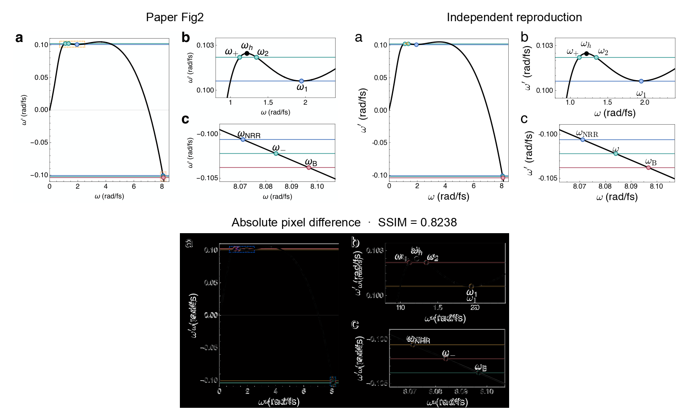
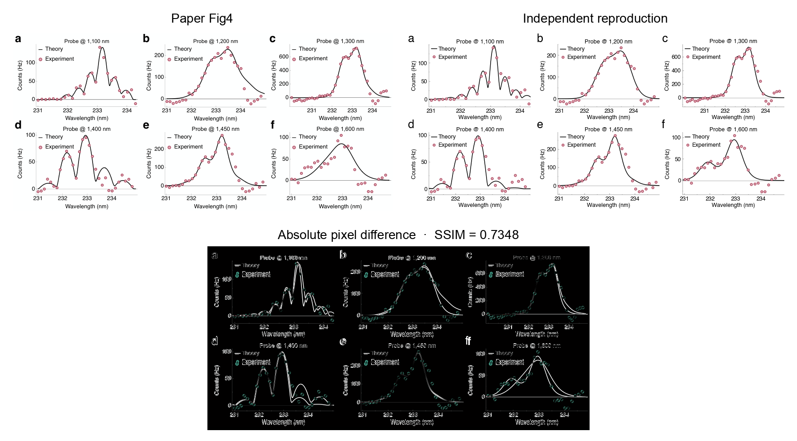
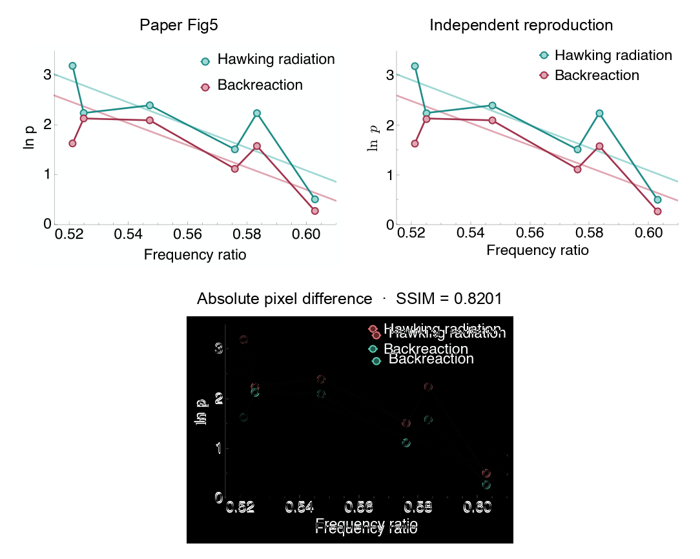
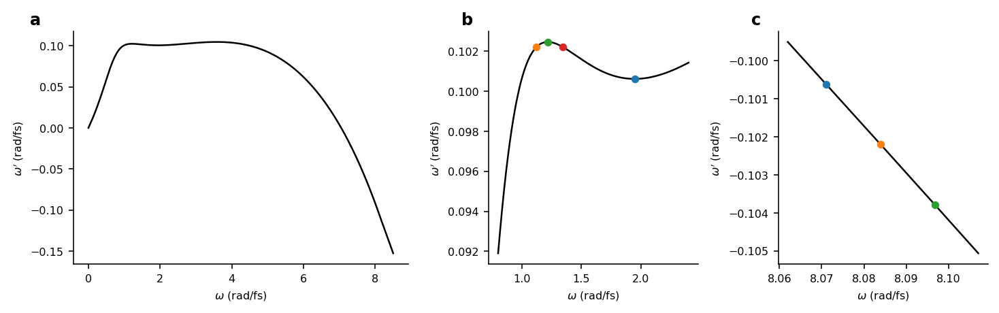
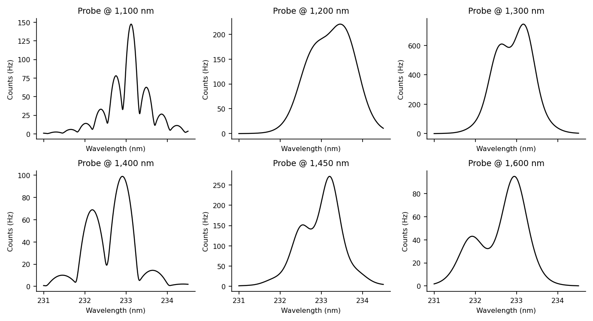
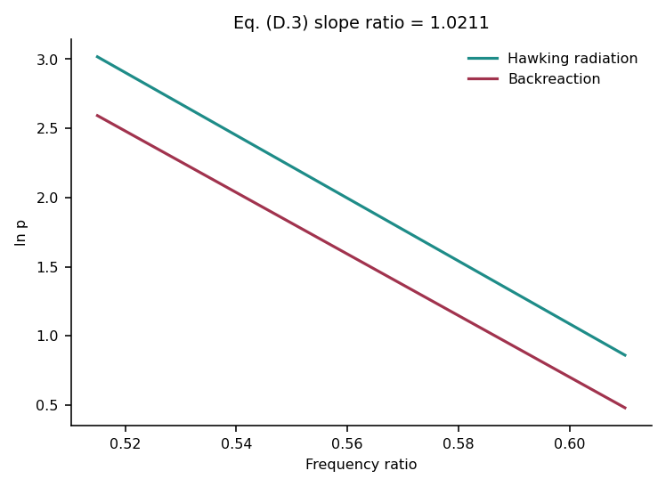

# 10.1038-s41586-026-10720-3: Backreaction of stimulated Hawking radiation in an optical analogue

Preprint: [arXiv:2607.01118 — Backreaction of stimulated Hawking radiation in an optical analogue](https://arxiv.org/abs/2607.01118)

Published as: [Backreaction of stimulated Hawking radiation in an optical analogue](https://doi.org/10.1038/s41586-026-10720-3)

Formal citation: Nature 655, 336-341 (2026) · DOI `10.1038/s41586-026-10720-3` · Locator `336-341`

Public status: **Main-figure numerical feature reproduction** · Audit score: **78.47/100**

Without author code, reproduces the numerical content and registered layout of main-text Figs. 2, 4, and 5: seven phase-matching landmarks, all six Eq. (D.1) spectra, and the 1.0211 thermal-slope ratio.

## Start Here / 从这里开始

- [中文复现 Note](note/reproduction-note.zh-CN.md)
- [English reproduction note](note/reproduction-note.en.md)
- [Code and run commands](code/README.md)
- [Machine-readable scorecard](outputs/checks/similarity_scorecard.json)
- [Derivation (equations)](docs/DERIVATION.md)
- [Numerical methods](docs/NUMERICAL_METHODS.md)
- [Lessons learned](docs/LESSONS_LEARNED.md)

## Main Reproduced Results

| Paper item | Reproduced result | Figure | Check |
| --- | --- | --- | --- |
| Fig. 2 | Co-moving dispersion and seven phase-matching landmarks | [PNG](outputs/figures/fig2_doppler_reproduction_public.png) | [JSON](outputs/checks/main_figure_reproduction.json) |
| Fig. 4 | Six independently evaluated Eq. (D.1) theory spectra | [PNG](outputs/figures/fig4_eq_d1_theory_public.png) | [JSON](outputs/checks/main_figure_reproduction.json) |
| Fig. 5 | Public-safe Eq. (D.3) fitted lines with slope ratio 1.0211 | [PNG](outputs/figures/fig5_eq_d3_lines_public.png) | [JSON](outputs/checks/main_figure_reproduction.json) |

## Paper Reference vs Independent Reproduction

The left column is a limited paper excerpt. The right column is the case reconstruction: its theory curves, roots, and regressions are equation-generated, while the displayed Fig. 4/5 markers are disclosed source-derived fit or regression inputs. The boards validate structure and numerical features, not author-data-level independence.

### Fig. 2 comparison



### Fig. 4 comparison



### Fig. 5 comparison



### Fig. 2: Co-moving dispersion and seven phase-matching landmarks



### Fig. 4: Six independently evaluated Eq. (D.1) theory spectra



### Fig. 5: Public-safe Eq. (D.3) fitted lines with slope ratio 1.0211



## Quick Run

```bash
python -m venv .venv
source .venv/bin/activate
pip install -r requirements.txt
pip install torch
cd cases/10.1038-s41586-026-10720-3/code
python scripts/run_main_figures.py
```

Generated files are kept under [data](outputs/data/), [figures](outputs/figures/), and [checks](outputs/checks/).

## Reproduction Boundary

This public case includes paper-derived code, generated data, generated figures, public validation checks, explanatory notes, and 3 limited comparison panels. Those panels use the minimum paper excerpts needed for validation and clearly separate the paper reference from the independent result. The case does not redistribute the paper PDF, arXiv source archive, standalone original figures, EPS paths, digitized source curves, or source-derived point sets.

Remaining limitation: The measured fibre coefficients, raw spectra, fitted parameter tables, raw NRR fluxes, and measured pulse shapes are unavailable; visible PDF vector content is used internally as a source-derived fit or validation input, so this is not author-data-level exact reproduction.

Final-parameter rule: final public figures use the paper parameters when feasible. Any reduced-scale, subset, proxy, or blocked target must be labeled explicitly and cannot be presented as a complete reproduction.
