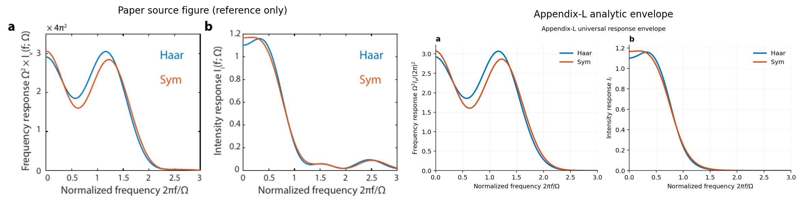
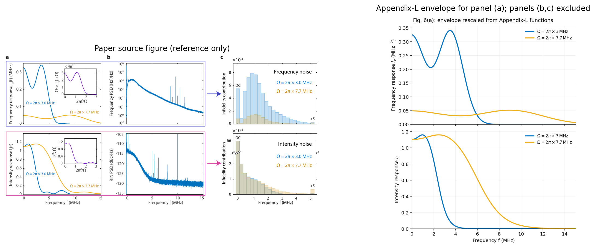
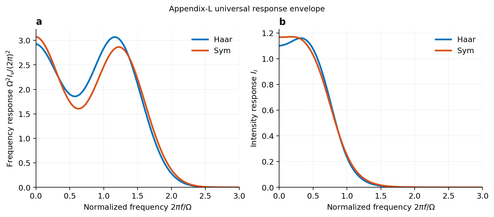
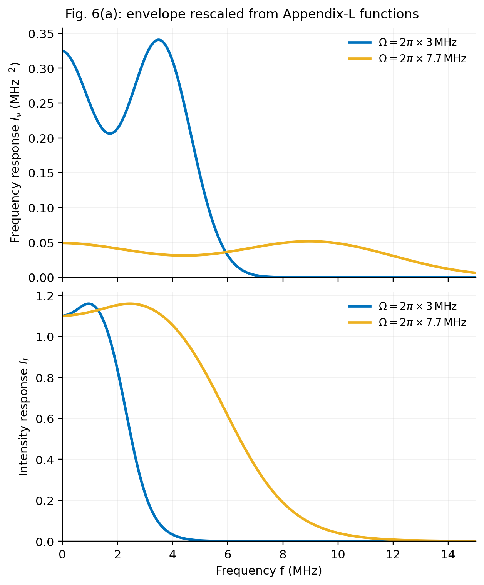
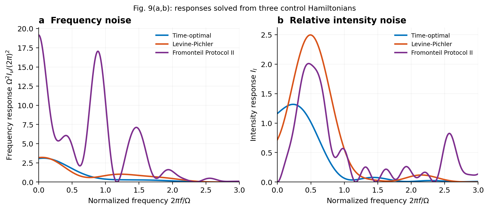
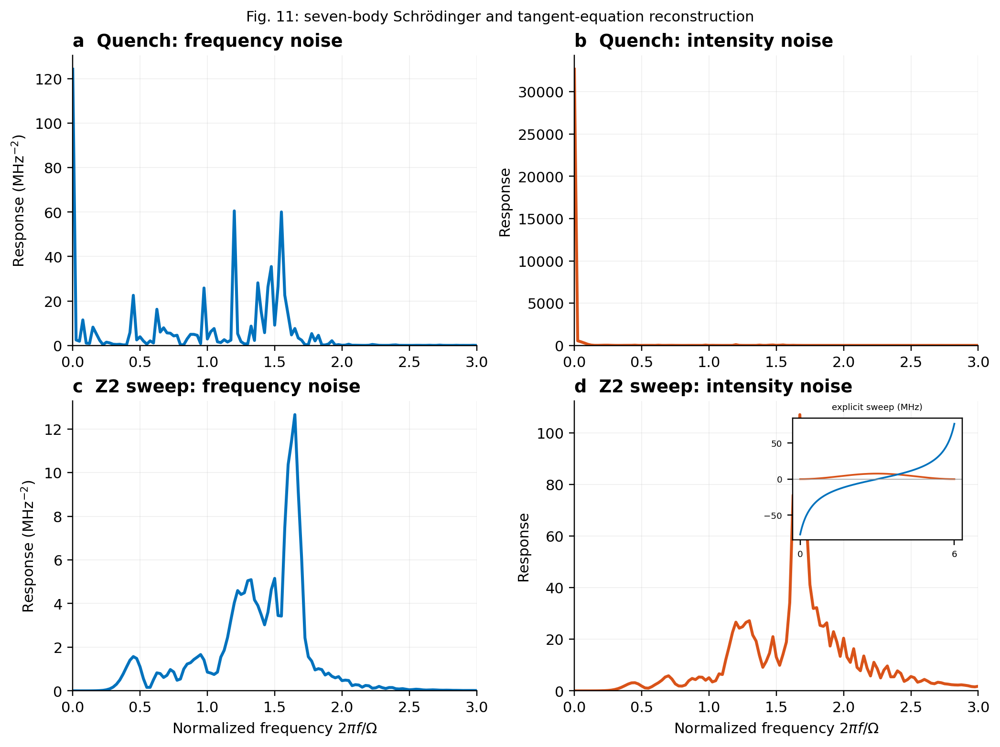
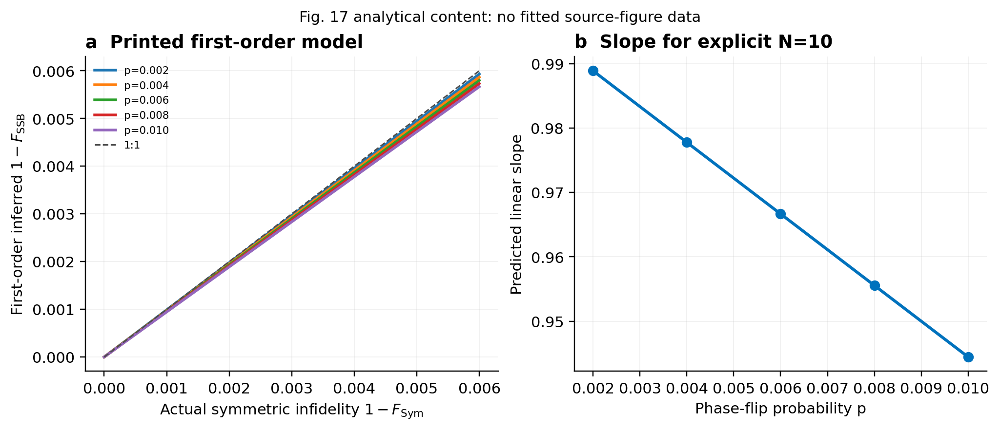

# 10.1103-PRXQuantum.6.010331: Benchmarking and Fidelity Response Theory of High-Fidelity Rydberg Entangling Gates

Preprint: [arXiv:2407.20184 — Benchmarking and Fidelity Response Theory of High-Fidelity Rydberg Entangling Gates](https://arxiv.org/abs/2407.20184)

Published as: [Benchmarking and Fidelity Response Theory of High-Fidelity Rydberg Entangling Gates](https://doi.org/10.1103/PRXQuantum.6.010331)

Formal citation: PRX Quantum 6, 010331 (2025) · DOI `10.1103/PRXQuantum.6.010331` · Locator `010331`

Public status: **Formula-derived numerical reproduction** · Audit score: **79.89/100**

Reproduces all nine theory targets closed by printed formulas and public control parameters: Appendix-L universal responses and scaling, error and principal-quantum-number laws, three protocol-level CZ responses, spin-lock and cavity filters, the phase-flip/SSB model, and a seven-site many-body response. Every dataset is generated from formulas or Hamiltonian propagation; no source-figure pixels enter computation.

## Start Here / 从这里开始

- [中文复现 Note](note/reproduction-note.zh-CN.md)
- [English reproduction note](note/reproduction-note.en.md)
- [Code and run commands](code/README.md)
- [Machine-readable scorecard](outputs/checks/similarity_scorecard.json)
- [Derivation (equations)](docs/DERIVATION.md)
- [Numerical methods](docs/NUMERICAL_METHODS.md)
- [Lessons learned](docs/LESSONS_LEARNED.md)

## Main Reproduced Results

| Paper item | Reproduced result | Figure | Check |
| --- | --- | --- | --- |
| Fig. 15 | Universal Haar and symmetric-Haar frequency/intensity responses from Appendix-L formulas | [PNG](outputs/figures/fig15_universal_response.png) | [JSON](outputs/checks/universal_response.json) |
| Fig. 6(a) | Dimensional response scaling at 3.0 and 7.7 MHz with universal-collapse verification | [PNG](outputs/figures/fig6a_scaled_response.png) | [JSON](outputs/checks/fig6a_scaled_response.json) |
| Fig. 9(a,b) | Independent eight-dimensional Hamiltonian responses for three Rydberg CZ protocols | [PNG](outputs/figures/fig9_protocol_responses.png) | [JSON](outputs/checks/formula_theory_targets.json) |
| Fig. 11 | Independent seven-site, 128-dimensional quench and quasi-adiabatic response reconstruction | [PNG](outputs/figures/fig11_many_body_responses.png) | [JSON](outputs/checks/formula_theory_targets.json) |
| Fig. 17 | Phase-flip fidelity polynomials and first-order symmetric-stabilizer cancellation | [PNG](outputs/figures/fig17_phase_flip_first_order.png) | [JSON](outputs/checks/formula_theory_targets.json) |

## Paper Reference vs Independent Reproduction

The left column in each panel is a limited excerpt from Tsai et al., [PRX Quantum 6, 010331 (2025)](https://doi.org/10.1103/PRXQuantum.6.010331); the right column is generated independently from this case. These comparisons validate physical structure and key numerical features, not author-data-level or point-for-point equivalence.

### Fig. 15 comparison



### Fig. 6(a) comparison



### Fig. 15: Universal Haar and symmetric-Haar frequency/intensity responses from Appendix-L formulas



### Fig. 6(a): Dimensional response scaling at 3.0 and 7.7 MHz with universal-collapse verification



### Fig. 9(a,b): Independent eight-dimensional Hamiltonian responses for three Rydberg CZ protocols



### Fig. 11: Independent seven-site, 128-dimensional quench and quasi-adiabatic response reconstruction



### Fig. 17: Phase-flip fidelity polynomials and first-order symmetric-stabilizer cancellation



## Quick Run

```bash
python -m venv .venv
source .venv/bin/activate
pip install -r requirements.txt
cd cases/10.1103-PRXQuantum.6.010331/code
python scripts/run_reproduction.py
python scripts/run_formula_theory_targets.py
```

Generated files are kept under [data](outputs/data/), [figures](outputs/figures/), and [checks](outputs/checks/).

## Reproduction Boundary

This public case includes paper-derived code, generated data, generated figures, public validation checks, explanatory notes, and 2 limited comparison panels. Those panels use the minimum paper excerpts needed for validation and clearly separate the paper reference from the independent result. The case does not redistribute the paper PDF, arXiv source archive, standalone original figures, EPS paths, digitized source curves, or source-derived point sets.

Remaining limitation: The 79.89 score covers only T001-T002, which have paper-exact analytic references. Exact absolute curves that require unreleased PSD or calibration arrays, target-specific pulse/ramp identity, atomic geometry, or discrete circuit metadata remain explicitly partial or reconstructed and were not filled by tracing paper figures.

Final-parameter rule: final public figures use the paper parameters when feasible. Any reduced-scale, subset, proxy, or blocked target must be labeled explicitly and cannot be presented as a complete reproduction.
