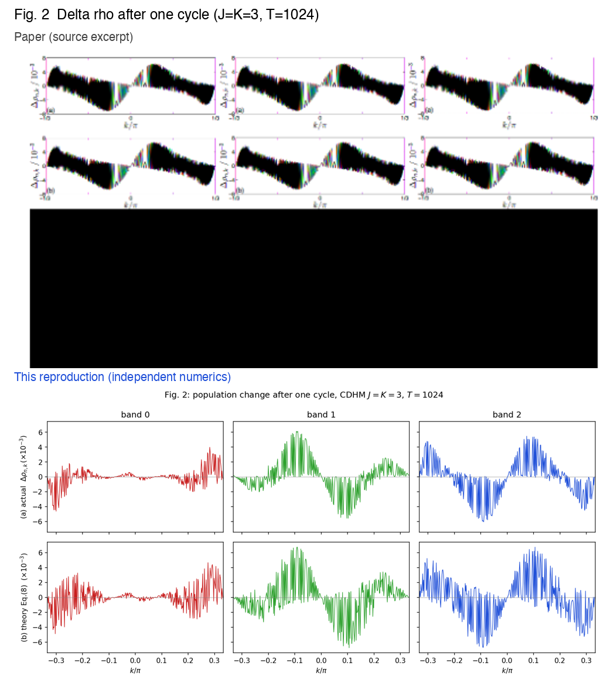
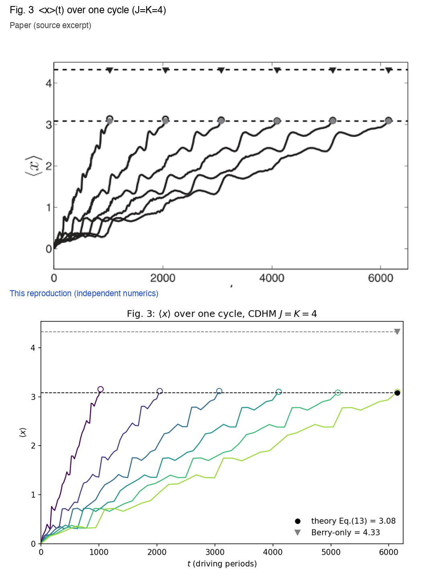
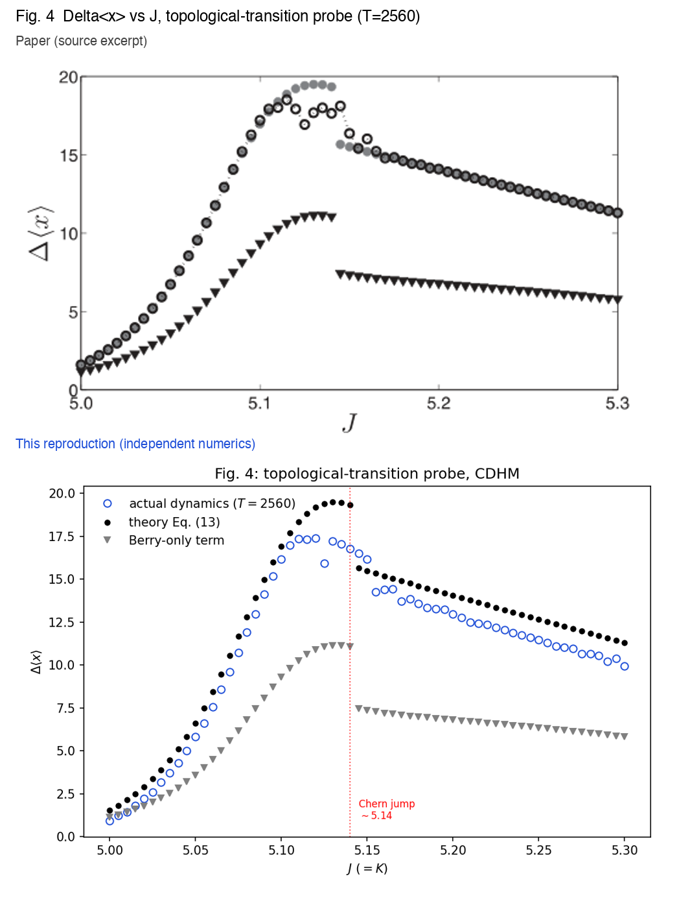
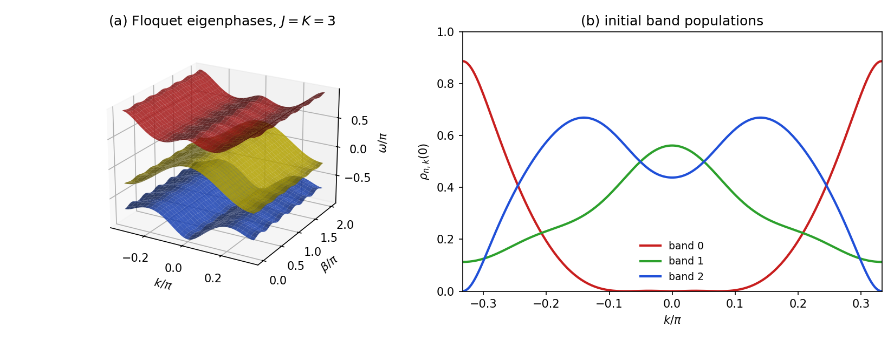
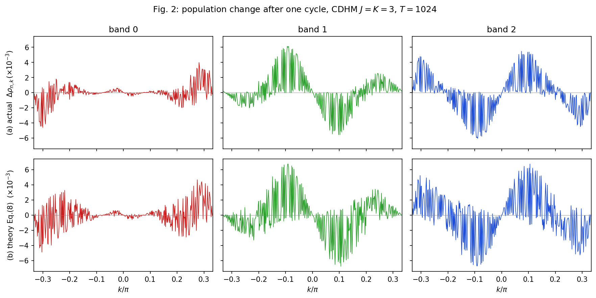
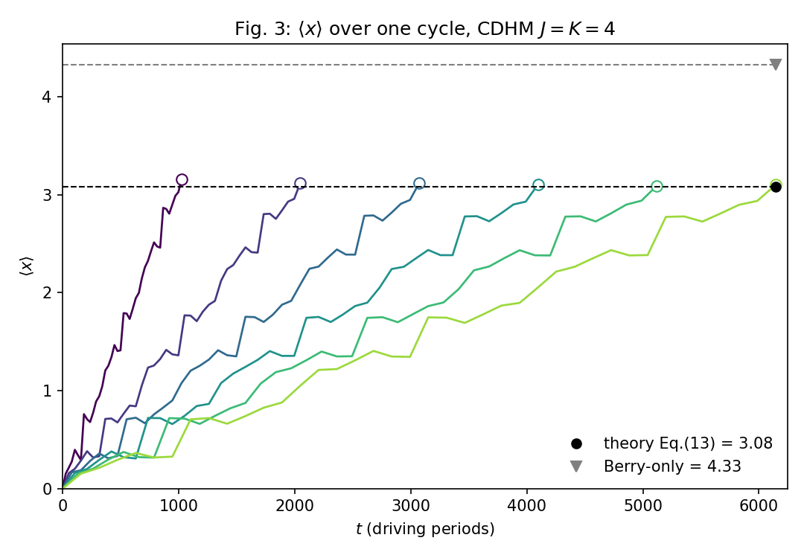
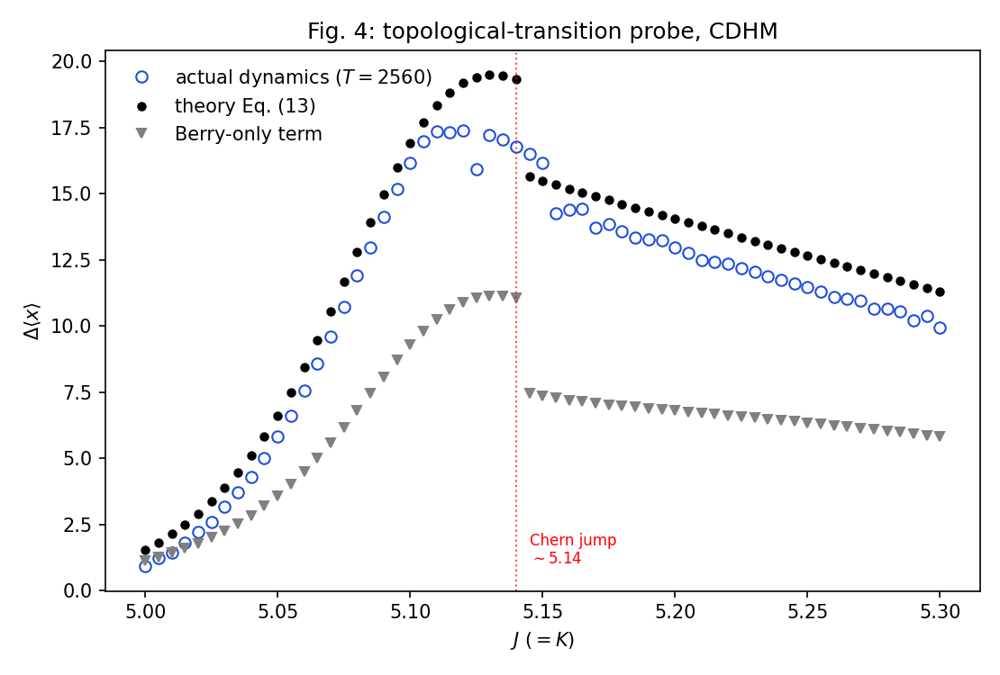

# 10.1103-PhysRevB.91.085420: Interband coherence induced correction to adiabatic pumping in periodically driven systems

Preprint: **No preprint recorded as of 2026-07-14**

Published as: [Interband coherence induced correction to adiabatic pumping in periodically driven systems](https://doi.org/10.1103/PhysRevB.91.085420)

Formal citation: Physical Review B 91, 085420 (2015) · DOI `10.1103/PhysRevB.91.085420` · Locator `085420`

Public status: **Feature-level reproduction** · Audit score: **79.54/100**

Independently reproduces all four figures of the continuously driven Harper model pumping study: the Floquet spectrum and initial populations, the one-cycle population change from exact dynamics versus Eq. (8), the T-independent wave-packet displacement, and the topological-transition probe -- confirming that the Berry-only term is wrong and the interband-coherence correction of Eq. (13) is essential.

## Start Here / 从这里开始

- [中文复现 Note](note/reproduction-note.zh-CN.md)
- [English reproduction note](note/reproduction-note.en.md)
- [Code and run commands](code/README.md)
- [Machine-readable scorecard](outputs/checks/similarity_scorecard.json)
- [Derivation (equations)](docs/DERIVATION.md)
- [Numerical methods](docs/NUMERICAL_METHODS.md)
- [Lessons learned](docs/LESSONS_LEARNED.md)

## Main Reproduced Results

| Paper item | Reproduced result | Figure | Check |
| --- | --- | --- | --- |
| Fig. 1 | Floquet spectrum omega(k,beta) and initial band populations, J=K=3 | [PNG](outputs/figures/fig1_reproduction.png) | [JSON](outputs/checks/fig1.json) |
| Fig. 2 | One-cycle population change Delta rho: exact dynamics vs Eq. (8), J=K=3, T=1024 | [PNG](outputs/figures/fig2_reproduction.png) | [JSON](outputs/checks/fig2.json) |
| Fig. 3 | T-independent wave-packet displacement <x>(t); Eq. (13) total vs Berry-only, J=K=4 | [PNG](outputs/figures/fig3_reproduction.png) | [JSON](outputs/checks/fig3.json) |
| Fig. 4 | Delta<x> vs J across the Floquet-Chern transition; actual vs Eq. (13) vs Berry-only | [PNG](outputs/figures/fig4_reproduction.png) | [JSON](outputs/checks/fig4.json) |

## Paper Reference vs Independent Reproduction

The left column in each panel is a limited excerpt from Wang, Zhou, and Gong, [Physical Review B 91, 085420 (2015)](https://doi.org/10.1103/PhysRevB.91.085420); the right column is generated independently from this case. These comparisons validate physical structure and key numerical features, not author-data-level or point-for-point equivalence.

### Fig. 1 comparison


### Fig. 2 comparison



### Fig. 3 comparison



### Fig. 4 comparison



### Fig. 1: Floquet spectrum omega(k,beta) and initial band populations, J=K=3



### Fig. 2: One-cycle population change Delta rho: exact dynamics vs Eq. (8), J=K=3, T=1024



### Fig. 3: T-independent wave-packet displacement <x>(t); Eq. (13) total vs Berry-only, J=K=4



### Fig. 4: Delta<x> vs J across the Floquet-Chern transition; actual vs Eq. (13) vs Berry-only



## Quick Run

```bash
python -m venv .venv
source .venv/bin/activate
pip install -r requirements.txt
cd cases/10.1103-PhysRevB.91.085420/code
python scripts/run_fig1.py
python scripts/run_fig2.py
python scripts/run_fig3.py
python scripts/run_fig4.py
```

Generated files are kept under [data](outputs/data/), [figures](outputs/figures/), and [checks](outputs/checks/).

## Reproduction Boundary

This public case includes paper-derived code, generated data, generated figures, public validation checks, explanatory notes, and 4 limited comparison panels. Those panels use the minimum paper excerpts needed for validation and clearly separate the paper reference from the independent result. The case does not redistribute the paper PDF, arXiv source archive, standalone original figures, EPS paths, digitized source curves, or source-derived point sets.

Remaining limitation: Comparison is a source-vs-reproduction feature contract against the paper's raster figures (no author data or tables); Fig. 2 is feature-level due to the intrinsic ~10^2-rad phase sensitivity of Eq. (8) at T=1024, and the Fig. 4 actual peak sits below the paper value in the narrow band-touching window where the dynamics is genuinely T-sensitive.

Final-parameter rule: final public figures use the paper parameters when feasible. Any reduced-scale, subset, proxy, or blocked target must be labeled explicitly and cannot be presented as a complete reproduction.
