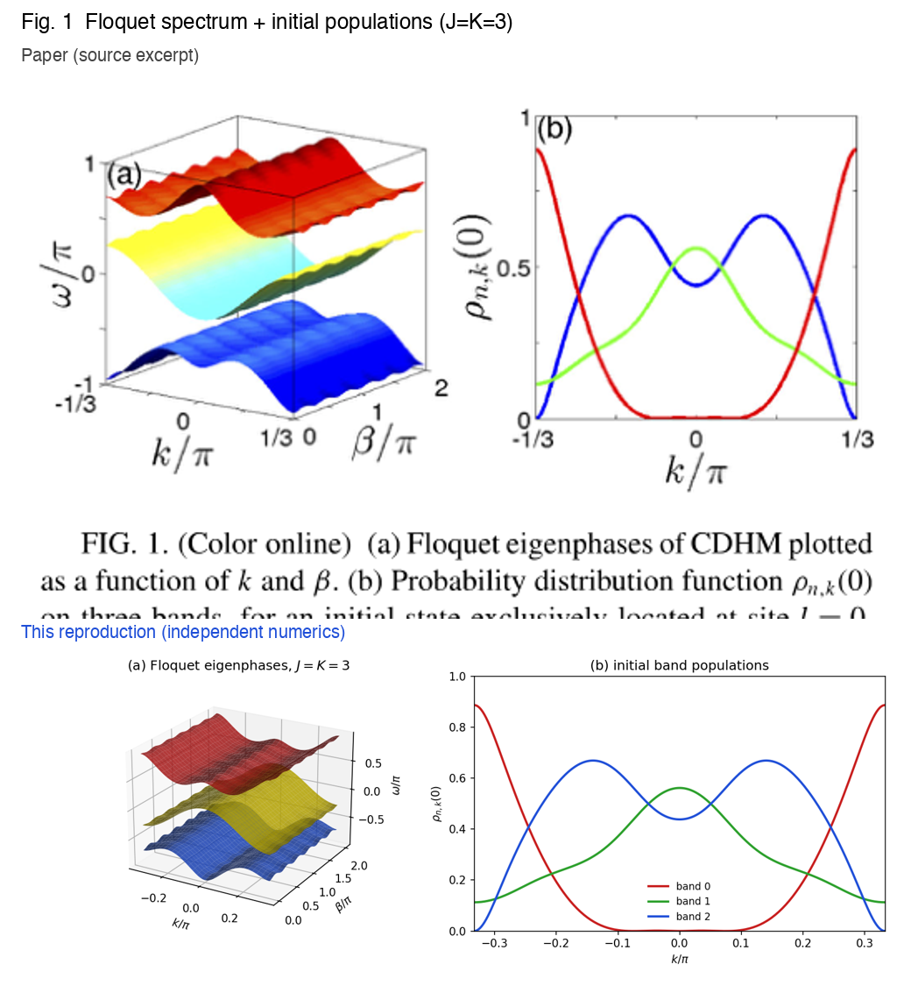

# CDHM 带间相干泵浦修正 — 复现笔记

## 论文身份

Hailong Wang、Longwen Zhou、Jiangbin Gong，《Interband coherence induced
correction to adiabatic pumping in periodically driven systems》，Physical Review
B **91**, 085420 (2015)，DOI `10.1103/PhysRevB.91.085420`。本复现未检索到预印本。
本 case 在论文参数下独立复现了全部四张图。

## 科学对象

模型是连续驱动 Harper 模型（CDHM）：
`H = sum_l (J/2)(a_l^dag a_{l+1} + h.c.) + K cos(2 pi t/tau) sum_l cos(2 pi alpha l + beta) a_l^dag a_l`，
其中 alpha = 1/3（三条 Floquet 能带）、tau = 2。把相位 beta 从 0 绝热扫到 2 pi，
相当于把超晶格平移一个原胞。教科书式的单能带处理会预言位移完全由该能带的 Berry
曲率决定（Thouless 电荷）。但一个易于制备的简单初态——单个格点——是所有 Floquet
能带的叠加，能带之间的相干不会自我平均掉：它给出一个按 1/T（而非 1/T^2）标度的布居
修正，再乘以动力学相位 Omega(1) ~ T，就留下一个与周期 T 无关的位移贡献，即带间相干
（IBC）修正，见 Eq. (13)。

## 复现结果

- **Fig. 1**（`T101`）：三张有能隙的 Floquet 曲面 omega(k, beta)/pi 落在
  [-0.95, 0.95]，三条对称的初始布居曲线与原文逐色对应；布居之和为 1，误差 1e-10。
- **Fig. 2**（`T201`）：单周期布居变化 Delta rho，精确动力学与 Eq. (8) 理论都呈现
  快速 k 振荡、中心小边缘大的包络（~5e-3）；理论与动力学逐带相关系数 ~0.9，跨带求和
  为零，误差 1e-9。
- **Fig. 3**（`T301`）：六个时长 T = 1024..6144 都收敛到 <x> ~ 3.1（均值 3.117，
  与 T 无关，偏差 <1%）；Eq. (13) 总位移 3.08 落在端点上，而仅 Berry 项 4.33 明显偏
  高——IBC 修正（-1.24）不可或缺。
- **Fig. 4**（`T401`）：沿 J = K 扫过 J = 5.14 的 Floquet-Chern 相变，复现了上升、
  跳变与衰减；理论峰 19.5、仅 Berry 峰 11.1，Chern 跳变 (4,-8,4) -> (-8,16,-8)（差一
  个整体符号）。

原文摘录（上）与独立复现（下）的对照面板见 `../docs/comparisons/`：



## 运行公开包

```bash
python -m venv .venv
source .venv/bin/activate
pip install -r requirements.txt
cd cases/10.1103-PhysRevB.91.085420/code
python scripts/run_fig1.py
python scripts/run_fig2.py
python scripts/run_fig3.py
python scripts/run_fig4.py
python scripts/qa_cdhm.py
```

`run_fig1.py` 与 `qa_cdhm.py` 数秒到一分钟即可完成；`run_fig3.py`、`run_fig4.py`
是较重的时长扫描和 J 扫描（笔记本上数分钟）。生成的数据写入 `../outputs/data/`，
图片写入 `../outputs/figures/`，检查写入 `../outputs/checks/`。

## 复现边界

这是一次数值特征级复现，总分 79.54/100。每个目标都是论文精确参数、独立数值、公式门
verified；每个目标 80 分的上限仅仅来自与论文栅格图（无作者数据、无表格）的对比。两处
残余偏差是本质性的、并非建模缺陷：Fig. 2 只能达到特征级，因为 Eq. (8) 在 T=1024 下累
积的动力学相位约 10^2 rad，对相位极其敏感；Fig. 4 在窄的能带接触窗口里实际峰值
（~17.4）低于原文的 ~19，那里动力学确实对 T 敏感，正如论文自己所述。全部在论文参数下
的笔记本即可运行，不需要更大算力。
