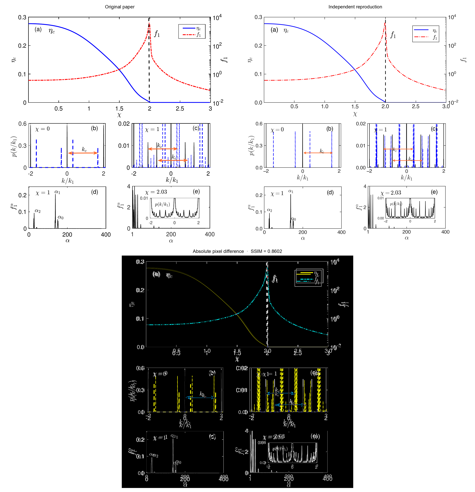
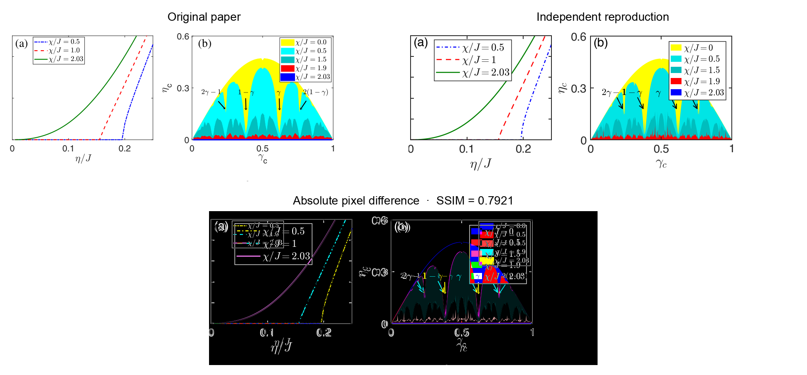
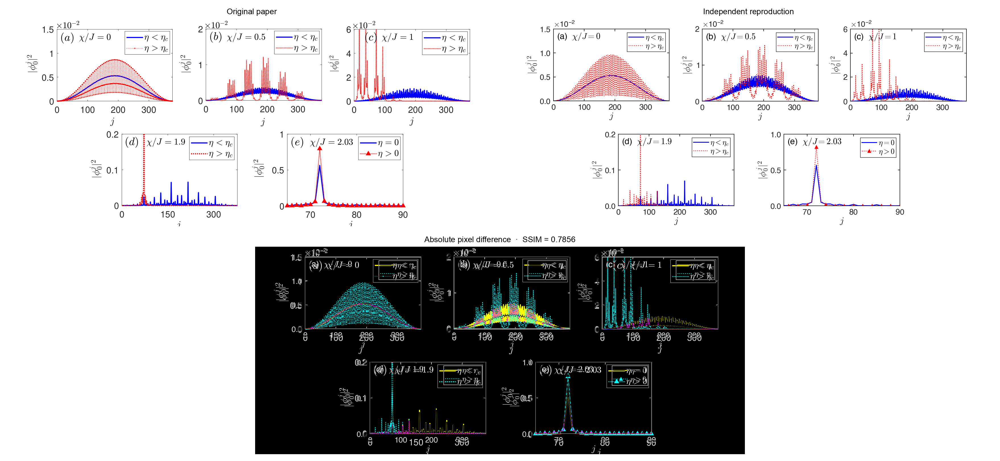
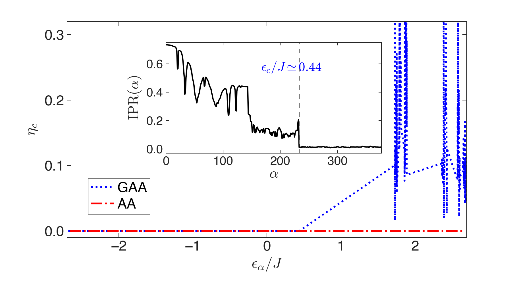
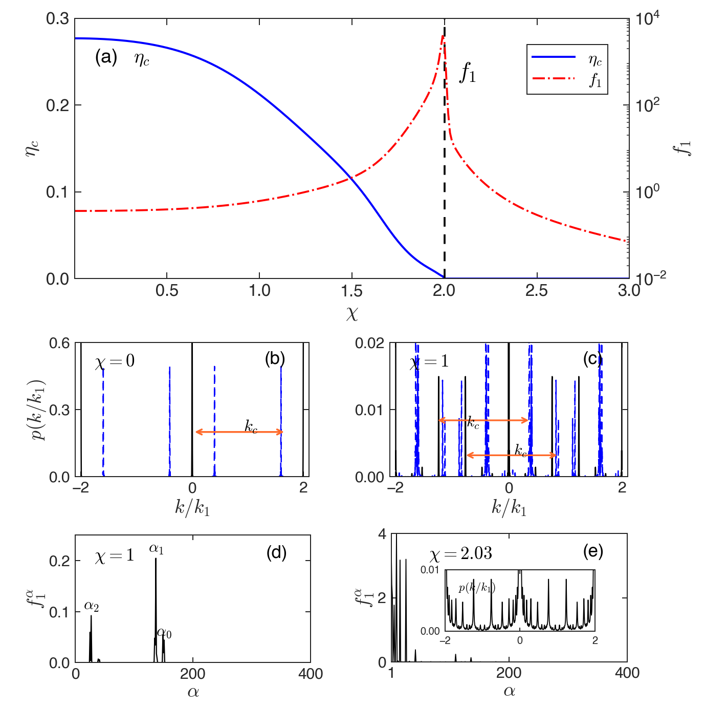
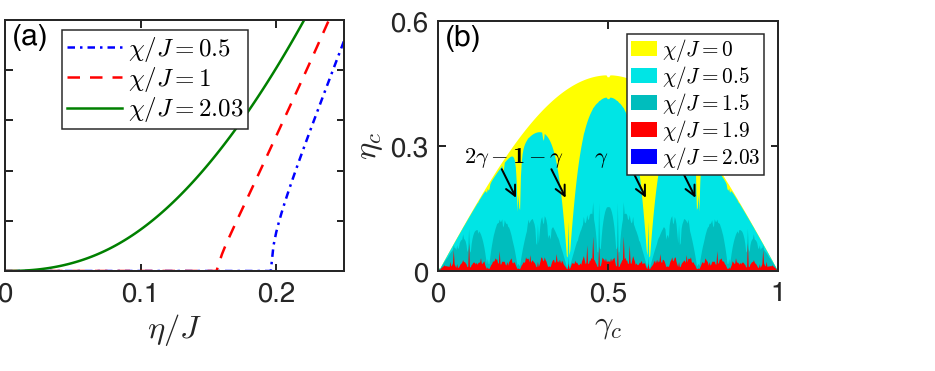
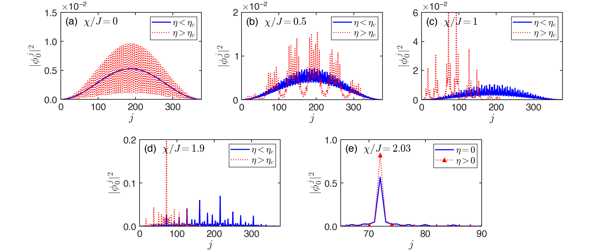

# 10.1103-PhysRevLett.124.113601: Localization Driven Superradiant Instability

Preprint: [arXiv:1909.08125 — Localization Driven Superradiant Instability](https://arxiv.org/abs/1909.08125)

Published as: [Localization Driven Superradiant Instability](https://doi.org/10.1103/PhysRevLett.124.113601)

Formal citation: Physical Review Letters 124, 113601 (2020) · DOI `10.1103/PhysRevLett.124.113601` · Locator `113601`

Public status: **Pixel-registered numerical feature reproduction** · Audit score: **88.56/100**

Independently reproduces Figs. 2–4 and Supplement Fig. S1 from AA/GAA and cavity mean-field numerics, including a complete Fig. 3 reproduction, a 377-point IPR match, nonlinear photon onset, and pixel-registered paper geometry.

## Start Here / 从这里开始

- [中文复现 Note](note/reproduction-note.zh-CN.md)
- [English reproduction note](note/reproduction-note.en.md)
- [Code and run commands](code/README.md)
- [Machine-readable scorecard](outputs/checks/similarity_scorecard.json)
- [Derivation (equations)](docs/DERIVATION.md)
- [Numerical methods](docs/NUMERICAL_METHODS.md)
- [Lessons learned](docs/LESSONS_LEARNED.md)

## Main Reproduced Results

| Paper item | Reproduced result | Figure | Check |
| --- | --- | --- | --- |
| Fig. 2 | Mobility-edge IPR and state-resolved threshold | [PNG](outputs/figures/fig2_pixel_registered.png) | [JSON](outputs/checks/fig2_state_thresholds.json) |
| Fig. 3 | Susceptibility and momentum-scattering mechanism | [PNG](outputs/figures/fig3_pixel_registered.png) | [JSON](outputs/checks/fig3_mechanism.json) |
| Fig. 4 | Nonlinear photon onset and critical-pump landscape | [PNG](outputs/figures/fig4_pixel_registered.png) | [JSON](outputs/checks/fig4a_photon_number.json) |
| Fig. S1 | Self-consistent normal and superradiant density profiles | [PNG](outputs/figures/figs1_pixel_registered.png) | [JSON](outputs/checks/figs1_density_profiles.json) |

## Paper Reference vs Independent Reproduction

Each board uses a limited attributed paper excerpt as an audit reference, an independently generated numerical render, and an absolute-pixel-difference panel. Reference pixels and PDF vectors do not enter the numerical model or generated image.

### Fig. 3 comparison



### Fig. 4 comparison



### Fig. S1 comparison



### Fig. 2: Mobility-edge IPR and state-resolved threshold



### Fig. 3: Susceptibility and momentum-scattering mechanism



### Fig. 4: Nonlinear photon onset and critical-pump landscape



### Fig. S1: Self-consistent normal and superradiant density profiles



## Quick Run

```bash
python -m venv .venv
source .venv/bin/activate
pip install -r requirements.txt
cd cases/10.1103-PhysRevLett.124.113601/code
python scripts/run_linear_targets.py
python scripts/run_nonlinear_targets.py
python scripts/render_pixel_registered.py
```

Generated files are kept under [data](outputs/data/), [figures](outputs/figures/), and [checks](outputs/checks/).

## Reproduction Boundary

This public case includes paper-derived code, generated data, generated figures, public validation checks, explanatory notes, and 3 limited comparison panels. Those panels use the minimum paper excerpts needed for validation and clearly separate the paper reference from the independent result. The case does not redistribute the paper PDF, arXiv source archive, standalone original figures, EPS paths, digitized source curves, or source-derived point sets.

Remaining limitation: Only Fig. 3 is final-reproduction eligible. Fig. 2 omits the excited-state threshold normalization, Fig. 4 has a published/arXiv detuning-convention split, and Fig. S1 omits pump samples and iterative-solver metadata.

Final-parameter rule: final public figures use the paper parameters when feasible. Any reduced-scale, subset, proxy, or blocked target must be labeled explicitly and cannot be presented as a complete reproduction.
