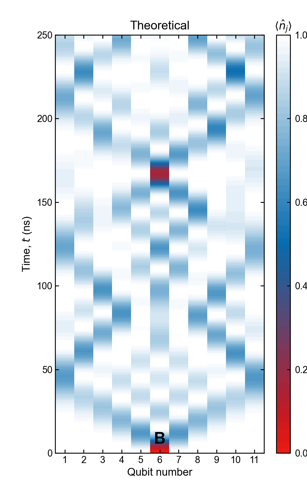
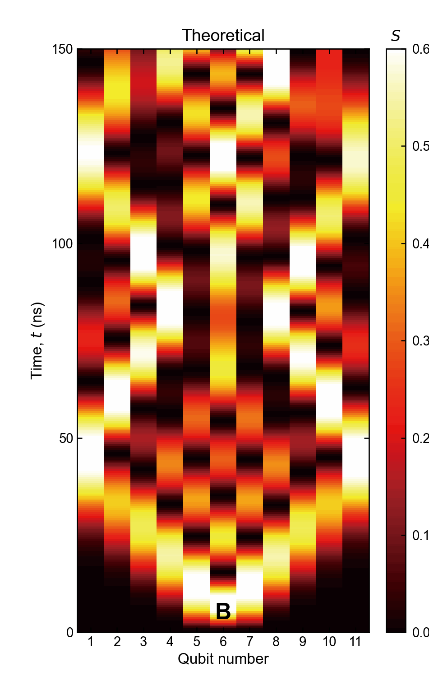
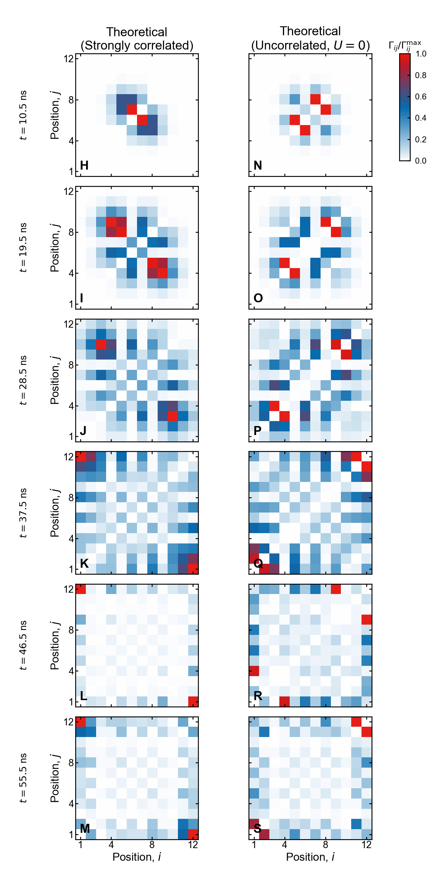
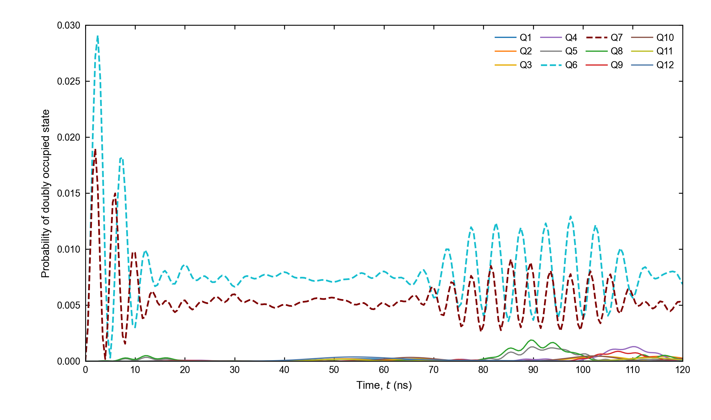

# 10.1126-science.aaw1611: Strongly correlated quantum walks with a 12-qubit superconducting processor

Preprint: **No preprint recorded as of 2026-07-15**

Published as: [Strongly correlated quantum walks with a 12-qubit superconducting processor](https://doi.org/10.1126/science.aaw1611)

Formal citation: Science 364, 753–756 (2019) · DOI `10.1126/science.aaw1611` · Locator `753–756`

Public status: **Pixel-audited numerical feature reproduction** · Audit score: **80.00/100**

Independently reproduces the calibrated one- and two-photon Bose–Hubbard dynamics, information-spreading observables, interaction-induced antibunching, and double-occupancy suppression. A supplemental scalar-field pixel audit covers the theoretical interiors of Figs. S14–S20.

## Start Here / 从这里开始

- [中文复现 Note](note/reproduction-note.zh-CN.md)
- [English reproduction note](note/reproduction-note.en.md)
- [Code and run commands](code/README.md)
- [Machine-readable scorecard](outputs/checks/similarity_scorecard.json)
- [Derivation (equations)](docs/DERIVATION.md)
- [Numerical methods](docs/NUMERICAL_METHODS.md)
- [Lessons learned](docs/LESSONS_LEARNED.md)

## Main Reproduced Results

| Paper item | Reproduced result | Figure | Check |
| --- | --- | --- | --- |
| Fig. 2D–F / Figs. S14–S16 | Calibrated one-photon density from Q6, Q1, and Q11 launches | [PNG](outputs/figures/S14_density_Q6.png) | [JSON](outputs/checks/T001_checks.json) |
| Fig. 3B–E / Fig. S17 | One-site entropy and information spreading from a Q6 launch | [PNG](outputs/figures/S17_entropy_Q6.png) | [JSON](outputs/checks/T002_checks.json) |
| Fig. 4 / Figs. S19–S20 | Two-photon density and correlator fermionization against free and hard-core controls | [PNG](outputs/figures/S20_two_particle_correlator_theory.png) | [JSON](outputs/checks/T003_checks.json) |
| Fig. S8 | Site-resolved suppression of double occupancy | [PNG](outputs/figures/S8_double_occupancy.png) | [JSON](outputs/checks/T004_checks.json) |

### Fig. 2D–F / Figs. S14–S16: Calibrated one-photon density from Q6, Q1, and Q11 launches



### Fig. 3B–E / Fig. S17: One-site entropy and information spreading from a Q6 launch



### Fig. 4 / Figs. S19–S20: Two-photon density and correlator fermionization against free and hard-core controls



### Fig. S8: Site-resolved suppression of double occupancy



## Quick Run

```bash
python -m venv .venv
source .venv/bin/activate
pip install -r requirements.txt
cd cases/10.1126-science.aaw1611/code
python scripts/run_reproduction.py
```

Generated files are kept under [data](outputs/data/), [figures](outputs/figures/), and [checks](outputs/checks/).

## Reproduction Boundary

This public case includes paper-derived code, generated data, generated figures, public validation checks, and explanatory notes. It does not redistribute the paper PDF, arXiv source archive, original figures, EPS paths, digitized source curves, source-derived point sets, or source-vs-generated composite panels.

Remaining limitation: Author theory tables, experimental shots, and tomography arrays are unavailable. Publisher rasters are used only for internal validation and are not redistributed; the S20 correlator audit remains visibly weaker than the density panels.

Final-parameter rule: final public figures use the paper parameters when feasible. Any reduced-scale, subset, proxy, or blocked target must be labeled explicitly and cannot be presented as a complete reproduction.
