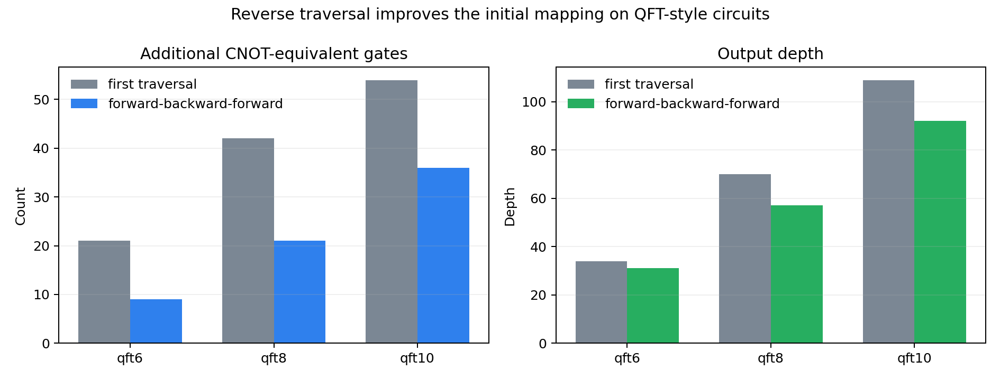
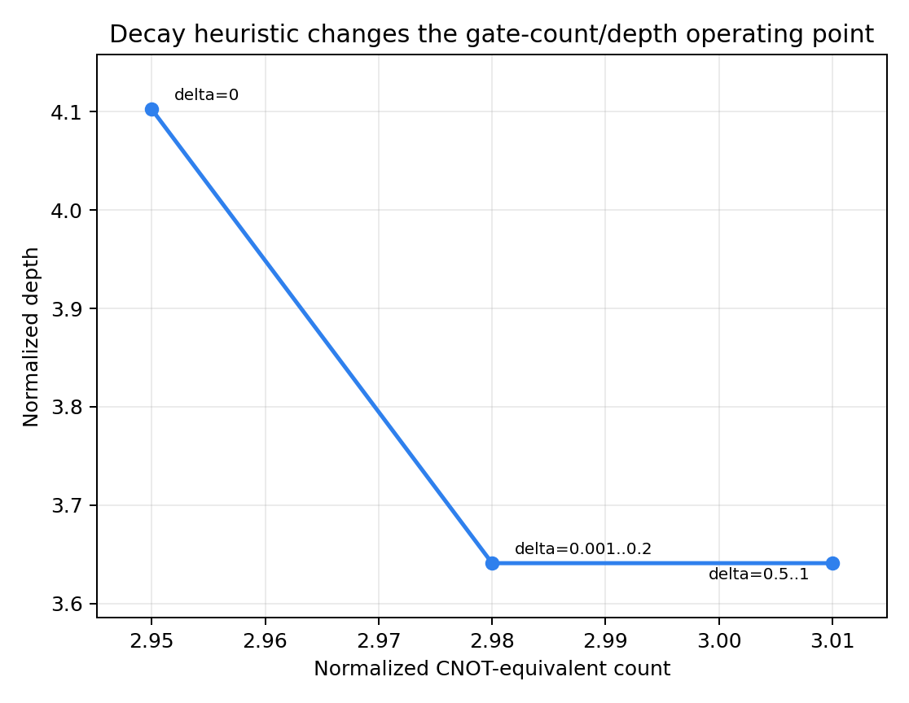
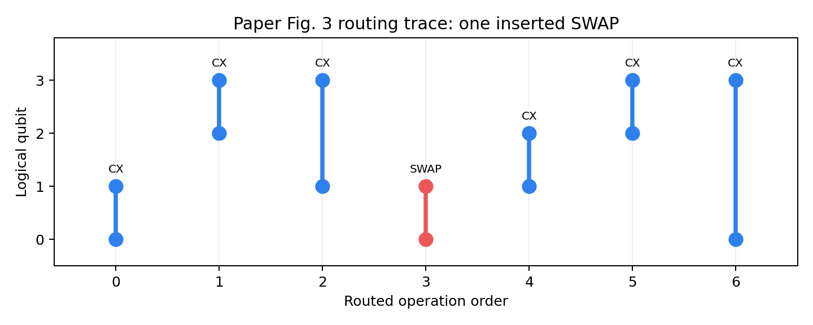

# 10.1145-3297858.3304023: Tackling the Qubit Mapping Problem for NISQ-Era Quantum Devices

Paper: [Tackling the Qubit Mapping Problem for NISQ-Era Quantum Devices](https://doi.org/10.1145/3297858.3304023)

Public status: **Feature-level reproduction with partial benchmark coverage**

Audit score at export: **68.29/100**

Similarity level: `numerical_feature_reproduction`

Reconstructs the SABRE routing pipeline, swap trace, reverse traversal, decay trade-off, and a partial Table II rerun.

## Start Here / 上手讲义

- [中文上手讲义](note/reproduction-note.zh-CN.md)
- [English getting-started note](note/reproduction-note.en.md)
- [Bilingual note index](note/reproduction-note.md)
- [Code and run commands](code/README.md)
- [Machine-readable scorecard](outputs/checks/similarity_scorecard.json)
- [Numerical methods](docs/NUMERICAL_METHODS.md)
- [Lessons learned](docs/LESSONS_LEARNED.md)

## Public Boundary

This public case includes paper-derived code, generated data, generated figures, public validation checks, and explanatory notes. It does not redistribute the paper PDF, arXiv source archive, original figures, EPS paths, digitized source curves, source-derived point sets, or source-vs-generated composite panels.

Remaining limitation: Several large benchmark rows lack complete public metadata and remain subset or proxy evaluations.

Final-parameter rule: final public figures use the paper parameters when feasible. Any reduced-scale, subset, proxy, or blocked target must be labeled explicitly and cannot be presented as a complete reproduction.

## Quick Run

```bash
python -m venv .venv
source .venv/bin/activate
pip install -r requirements.txt
pip install networkx qiskit
cd cases/10.1145-3297858.3304023/code
python scripts/run_paper_swap_example.py
python scripts/run_core_benchmarks.py
python scripts/run_decay_tradeoff.py
```

## Generated Figures








