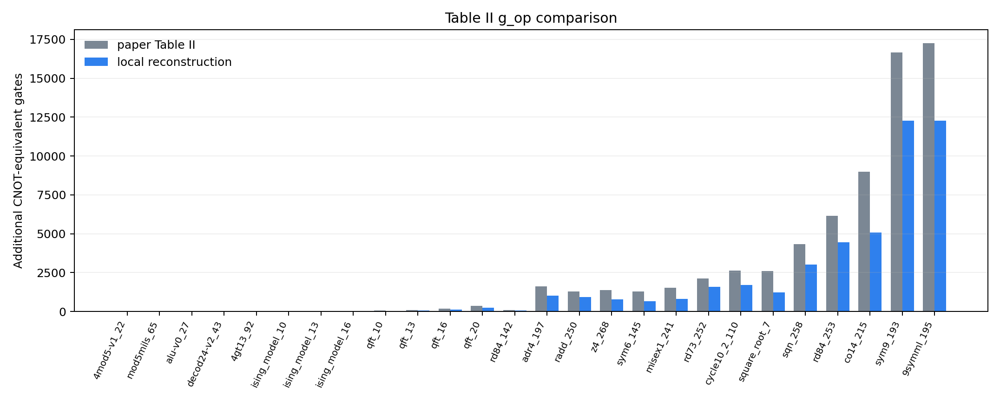

# 10.1145-3297858.3304023: Tackling the Qubit Mapping Problem for NISQ-Era Quantum Devices

Preprint: [arXiv:1809.02573 — Tackling the Qubit Mapping Problem for NISQ-Era Quantum Devices](https://arxiv.org/abs/1809.02573)

Published as: [Tackling the Qubit Mapping Problem for NISQ-Era Quantum Devices](https://doi.org/10.1145/3297858.3304023)

Formal citation: ASPLOS '19, pp. 1001–1014 · DOI `10.1145/3297858.3304023` · Locator `1001–1014`

Public status: **Full-corpus mechanism reproduction** · Audit score: **68.29/100**

Reconstructs the SABRE routing pipeline, swap trace, reverse traversal, decay trade-off, and all 26 rows of Table II. Row-exact optimized values remain limited by unpublished run metadata.

## Start Here / 从这里开始

- [中文复现 Note](note/reproduction-note.zh-CN.md)
- [English reproduction note](note/reproduction-note.en.md)
- [Code and run commands](code/README.md)
- [Machine-readable scorecard](outputs/checks/similarity_scorecard.json)
- [Machine-readable completion boundary](outputs/checks/completion_assessment.json)
- [Numerical methods](docs/NUMERICAL_METHODS.md)
- [Lessons learned](docs/LESSONS_LEARNED.md)

## Paper Reference vs Independent Reproduction

The left column in each panel is a limited excerpt from Li et al., [ASPLOS '19, pp. 1001–1014](https://doi.org/10.1145/3297858.3304023); the right column is generated independently from this case. These comparisons validate physical structure and key numerical features, not author-data-level or point-for-point equivalence.

### Table 2 comparison



## Quick Run

```bash
python -m venv .venv
source .venv/bin/activate
pip install -r requirements.txt
pip install networkx qiskit
cd cases/10.1145-3297858.3304023/code
python scripts/run_paper_swap_example.py
python scripts/run_core_benchmarks.py
python scripts/run_decay_tradeoff.py
```

Generated files are kept under [data](outputs/data/), [figures](outputs/figures/), and [checks](outputs/checks/).

## Reproduction Boundary

This public case includes paper-derived code, generated data, generated figures, public validation checks, explanatory notes, and 1 limited comparison panels. Those panels use the minimum paper excerpts needed for validation and clearly separate the paper reference from the independent result. The case does not redistribute the paper PDF, arXiv source archive, standalone original figures, EPS paths, digitized source curves, or source-derived point sets.

Remaining limitation: All 26 Table II rows run and produce hardware-compliant routes, but row-exact optimized values require the paper's unpublished random seeds, tie-breaking order, and BKA post-processing inputs. This is a metadata boundary, not a compute boundary.

Final-parameter rule: final public figures use the paper parameters when feasible. Any reduced-scale, subset, proxy, or blocked target must be labeled explicitly and cannot be presented as a complete reproduction.

## Generated Figures


