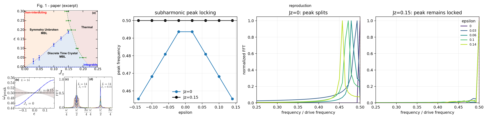
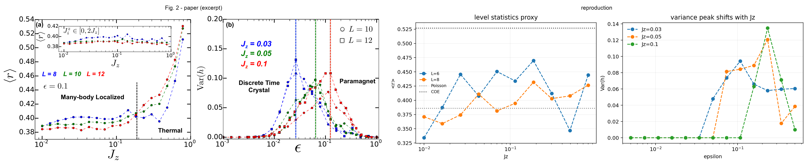
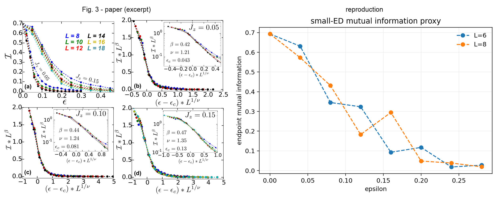
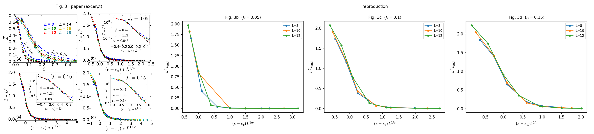
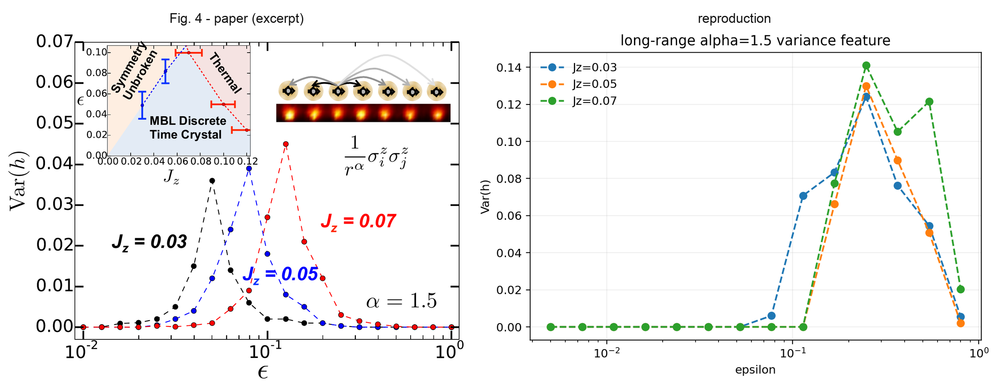
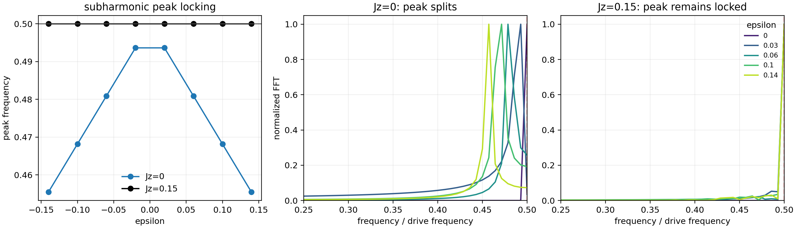
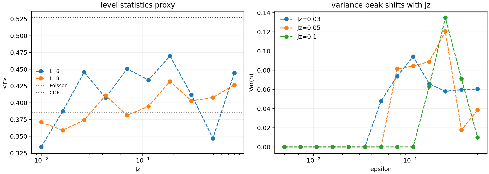
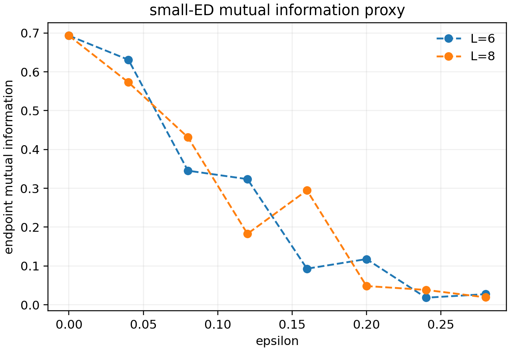
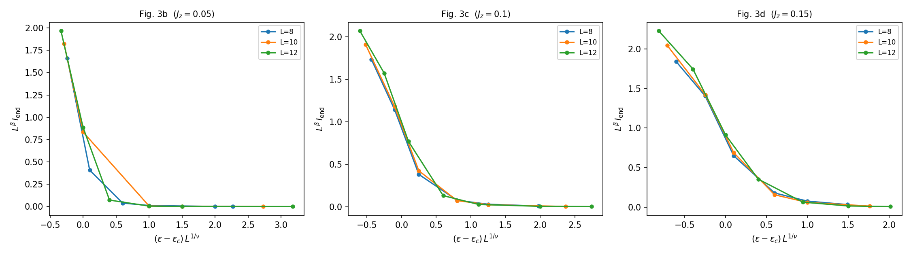
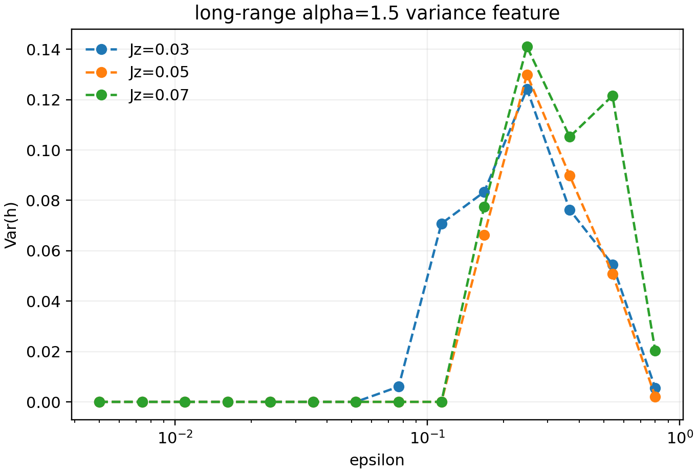

# 1608.02589: Discrete time crystals: rigidity, criticality, and realizations

Preprint: [arXiv:1608.02589 — Discrete time crystals: rigidity, criticality, and realizations](https://arxiv.org/abs/1608.02589)

Published as: [Discrete Time Crystals: Rigidity, Criticality, and Realizations](https://doi.org/10.1103/PhysRevLett.118.030401)

Formal citation: Physical Review Letters 118, 030401 (2017) · DOI `10.1103/PhysRevLett.118.030401` · Locator `030401`

Public status: **Medium-scale partial reproduction** · Audit score: **73.56/100**

Reproduces subharmonic rigidity, level statistics, variance, long-range variance, and mutual-information features with exact local evolution.

## Start Here / 从这里开始

- [中文复现 Note](note/reproduction-note.zh-CN.md)
- [English reproduction note](note/reproduction-note.en.md)
- [Code and run commands](code/README.md)
- [Machine-readable scorecard](outputs/checks/similarity_scorecard.json)
- [Machine-readable completion boundary](outputs/checks/completion_assessment.json)
- [Derivation (equations)](docs/DERIVATION.md)
- [Numerical methods](docs/NUMERICAL_METHODS.md)
- [Lessons learned](docs/LESSONS_LEARNED.md)

## Paper Reference vs Independent Reproduction

The left column in each panel is a limited excerpt from Yao et al., [Physical Review Letters 118, 030401 (2017)](https://doi.org/10.1103/PhysRevLett.118.030401); the right column is generated independently from this case. These comparisons validate physical structure and key numerical features, not author-data-level or point-for-point equivalence.

### Fig. 1 comparison



### Fig. 2 comparison



### Fig. 3(a) comparison



### Fig. 3(b-d) comparison



### Fig. 4 comparison



## Quick Run

```bash
python -m venv .venv
source .venv/bin/activate
pip install -r requirements.txt
cd cases/1608.02589/code
python scripts/run_reproduction.py
python scripts/plot_reproduction.py
python scripts/run_reproduction_iteration2.py
python scripts/plot_reproduction_iteration2.py
python scripts/extract_fig3_scaling_collapse.py
```

Generated files are kept under [data](outputs/data/), [figures](outputs/figures/), and [checks](outputs/checks/).

## Reproduction Boundary

This public case includes paper-derived code, generated data, generated figures, public validation checks, explanatory notes, and 5 limited comparison panels. Those panels use the minimum paper excerpts needed for validation and clearly separate the paper reference from the independent result. The case does not redistribute the paper PDF, arXiv source archive, standalone original figures, EPS paths, digitized source curves, or source-derived point sets.

Remaining limitation: The published medium campaign aggregates 168 jobs into 55 paper-parameter points at L=8,10,12. The final L=8,10,12,14 high-statistics campaign was not launched; optional L=16,18 also require a memory-aware eigensolver.

Final-parameter rule: final public figures use the paper parameters when feasible. Any reduced-scale, subset, proxy, or blocked target must be labeled explicitly and cannot be presented as a complete reproduction.

## Generated Figures












