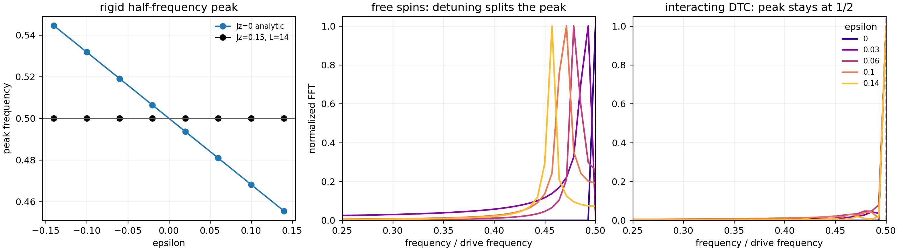
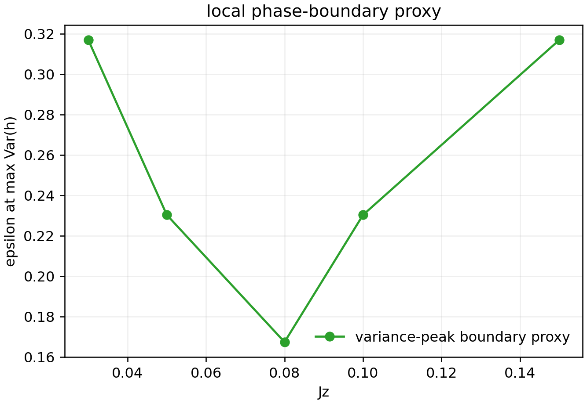
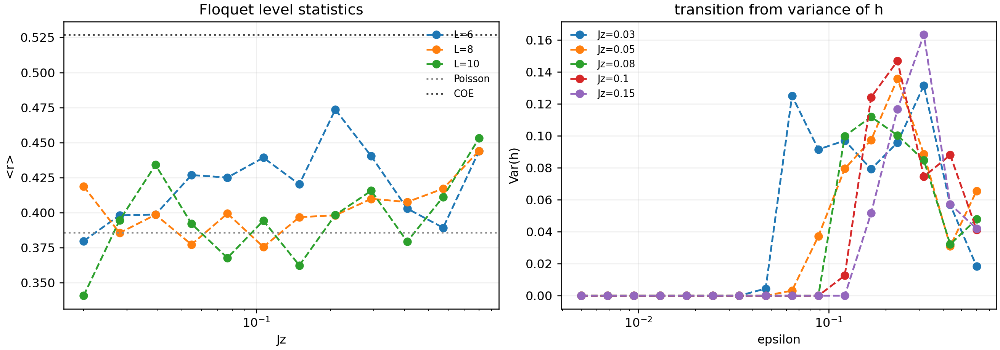
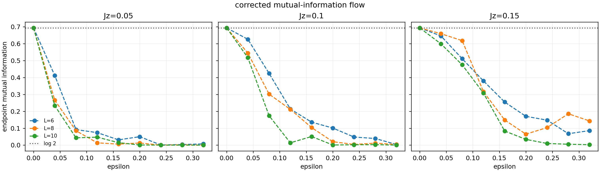
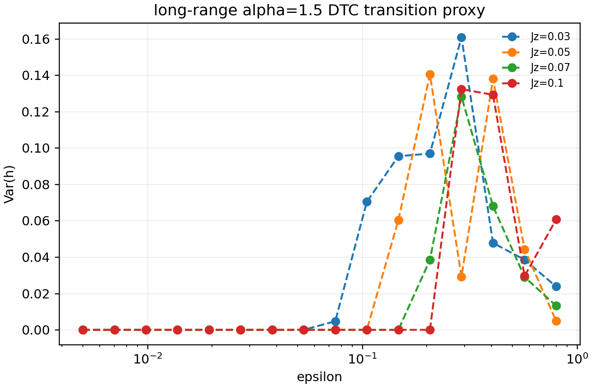

# Case Intro: Discrete Time Crystals

## 一句话结果

这个 case 已经跑通了一篇离散时间晶体论文的主要数值链路：从 Floquet 公式出发，写出可执行模型，生成结构化数据，再把核心物理特征画出来。第二轮迭代后，Fig. 1、Fig. 2、Fig. 3、Fig. 4 的主要数值特征都已经能在本地复现；临界指数和原文级别的大规模 disorder 平均仍然不在本地完成范围内。

## 相似度等级

当前等级：**数值特征复现**。

当前相似度分数：**71.22/100**。

这个 case 已经体现了原论文的主要物理特征：相互作用系统的半频峰锁定在 `1/2`，自由自旋峰会随 pulse error 漂移，`Var(h)` 出现转变峰，endpoint mutual information 在小 `epsilon` 时接近 `log 2`、在大 `epsilon` 时下降，长程相互作用版本也出现方差峰。

它还不是“完整复现”，因为原论文 Fig. 3b-d 的 scaling collapse、临界指数和大规模 disorder 平均没有在本地完成。本地结果不是失败；它已经展示了时间晶体的核心数值特征，但精度和统计规模还不足以复刻论文的临界指数图。

## 这篇文章在做什么

论文研究一个周期驱动的一维自旋链。每个周期分两段：

```text
先做一个接近 pi 的自旋翻转
再让自旋在无序和 Ising 相互作用下演化
```

没有相互作用时，一个很小的 pulse error 就会让响应频率离开 `1/2`。加入相互作用和无序后，系统会集体同步，响应峰继续锁在驱动频率的一半。这就是文章要展示的 discrete time crystal 现象。

## 公式结构

论文的 Floquet unitary 写成：

```text
U_f = exp(-i H2) exp(-i H1)
```

其中：

```text
H1 = (pi/2 - epsilon) sum_i sigma_i^x
H2 = sum_i J_i^z sigma_i^z sigma_{i+1}^z + B_i^z sigma_i^z
```

核心观测量是 stroboscopic autocorrelation：

```text
R(n) = <sigma_i^z(n) sigma_i^z(0)>
```

我们从 `R(n)` 的 Fourier spectrum 中提取半频峰 `h`，再用 `h` 的位置、方差和远端 mutual information 来判断时间晶体相的特征。

## 数值方法

本地实现采用 exact Floquet simulation：

- `H1` 用单比特 `x` 旋转实现；
- `H2` 在 `z` 基里是对角相位；
- 对随机 product states 做 stroboscopic 演化；
- 先保存 CSV，再从 CSV 画图；
- 对较小系统显式对角化 Floquet unitary，计算 level statistics 和 endpoint mutual information。

第二轮把 Fig. 1 的主计算提升到 `L=14`，与原文 Fig. 1 caption 中的系统尺寸一致；Fig. 2 和 Fig. 4 提升到 `L=10`；Fig. 3 修正了 endpoint reduced density matrix 的轴顺序，并加入 `GHZ -> log 2` 的 sanity check。

## Fig. 1: 亚谐波响应的刚性

原图展示：自由自旋的峰会随 pulse error 漂移；相互作用系统的峰锁在 `1/2`。


我们的第二轮复现：



一致性说明：蓝线给出自由自旋的解析峰位置，随 `epsilon` 线性移动；黑线是 `L=14` 相互作用系统，峰位置始终保持在 `1/2`。右侧 Fourier spectrum 也显示出同样的对比：自由自旋峰分裂，相互作用系统保留半频峰。

## Fig. 1a: phase diagram proxy

原文 Fig. 1a 是综合多个诊断得到的相图。我们本地生成了一个基于 `Var(h)` 峰位置的 phase-boundary proxy。



一致性说明：这个图只能作为本地边界估计，不等价于原文完整相图。它记录了方差峰随参数移动的趋势，但小样本下仍有波动，所以不把它标成精确相边界复现。

## Fig. 2: level statistics 和峰方差

原图用 level statistics 诊断局域化，并用 `Var(h)` 的峰定位时间晶体熔化转变。


我们的第二轮复现：



一致性说明：右图的 `Var(h)` 峰清楚出现，并在较强相互作用下移动到更大的 detuning 区域。左图已经加入 `L=10`，但 disorder 数量仍远少于原文，level-statistics crossing 只能作为局部特征参考。

## Fig. 3: mutual information flow

原图展示远端 mutual information 的 finite-size flow 和 scaling collapse。


我们的第二轮复现：



一致性说明：第二轮修正后，`epsilon=0` 时 endpoint mutual information 回到 `log 2`，大 detuning 时快速下降，和原文 Fig. 3a 的主要物理特征一致。原文 Fig. 3b-d 的 scaling collapse 和临界指数需要更大的系统尺寸与更多 disorder 平均；我们已经把推荐的大规模 ED 参数写入 `FIG3_LARGE_ED_PLAN.md` 和 `config/fig3_large_ed_recommended.yaml`，但本地 case 不声明完成这部分。

## Fig. 4: 长程相互作用下的 trapped-ion 版本

原图展示长程相互作用 `alpha=1.5` 时，`Var(h)` 仍然能作为转变信号。


我们的第二轮复现：



一致性说明：长程模型同样出现了明显的方差峰，说明 trapped-ion 版本中也能看到时间晶体熔化的数值信号。原图右上角的实验示意图不是数值图，因此不复现。

## 当前结论

第二轮之后，这个 case 已经完成了主文数值图的核心特征复现：

- 半频峰锁定；
- 自由自旋和相互作用系统的 Fourier response 差异；
- level statistics 的同类可观测量；
- `Var(h)` 的转变峰；
- endpoint mutual information 从 `log 2` 到接近 0 的 finite-size flow；
- 长程相互作用模型中的方差峰。

保留限制也很清楚：原文的大规模相图、Fig. 3 的 scaling collapse、临界指数和 `10^3-10^4` 级 disorder 平均还没有在本地重跑。

## 还有哪些问题

与原论文之间的差异主要是统计精度和系统尺寸：

- Fig. 1 的半频峰锁定已经非常清楚，`L=14` 的 interacting peak 锁定误差为 `0.0`，这一物理特征体现得很好。
- Fig. 2 的 `Var(h)` 峰已经出现，但 level statistics 的 crossing 需要更多 disorder 样本和更大系统尺寸才接近原文。
- Fig. 3a 的 mutual information flow 已经体现，`epsilon=0` 时接近 `log 2`，`epsilon=0.32` 时降到约 `0.143` 以下；但 Fig. 3b-d 的 scaling collapse 和临界指数还没有完成。
- Fig. 4 的长程相互作用方差峰已经出现，但仍是本地小规模版本。

没有出现“完全没有体现物理特征”的目标。当前主要问题是精度、采样和规模不够，不是物理机制跑错。

## 推荐算力

如果要从当前“数值特征复现”推进到“完整复现”，推荐：

- 高内存 CPU 节点或集群队列，优先支持大量独立 disorder samples；
- 对 Fig. 3b-d，至少按 `FIG3_LARGE_ED_PLAN.md` 运行 `L=8,10,12,14` 的 dense ED 批处理；
- 若要尝试 `L=16,18`，需要更高内存或优化 ED 方法，不能用当前本地 naive dense ED 强行跑；
- 每个 `(J_z, L, epsilon)` 切片独立保存，方便断点续跑和后续 scaling collapse 拟合。

当前本地机器适合验证物理特征，不适合独立完成论文级临界指数和 full scaling collapse。
