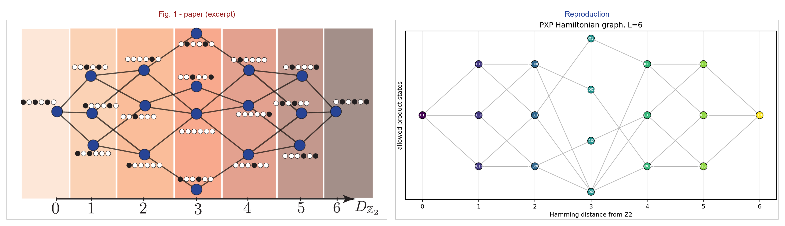
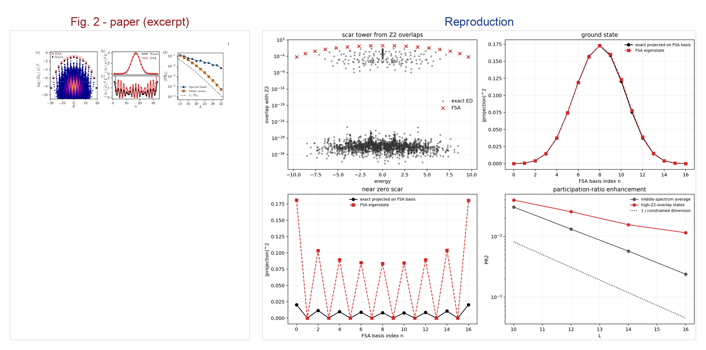
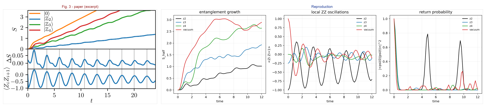
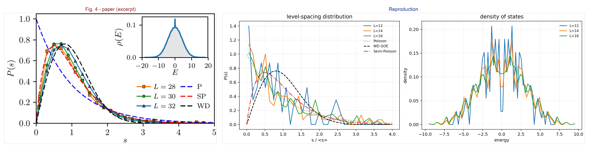

# 1711.03528: Quantum many-body scars

Preprint: [arXiv:1711.03528 — Quantum many-body scars](https://arxiv.org/abs/1711.03528)

Published as: [Weak ergodicity breaking from quantum many-body scars](https://doi.org/10.1038/s41567-018-0137-5)

Formal citation: Nature Physics 14, 745–749 (2018) · DOI `10.1038/s41567-018-0137-5` · Locator `745–749`

Public status: **Symmetry-resolved partial reproduction** · Audit score: **72.50/100**

Reproduces constrained Hilbert-space structure, scar overlaps, revivals, participation ratios, and symmetry-resolved level statistics.

## Start Here / 从这里开始

- [中文复现 Note](note/reproduction-note.zh-CN.md)
- [English reproduction note](note/reproduction-note.en.md)
- [Code and run commands](code/README.md)
- [Machine-readable scorecard](outputs/checks/similarity_scorecard.json)
- [Machine-readable completion boundary](outputs/checks/completion_assessment.json)
- [Derivation (equations)](docs/DERIVATION.md)
- [Numerical methods](docs/NUMERICAL_METHODS.md)
- [Lessons learned](docs/LESSONS_LEARNED.md)

## Paper Reference vs Independent Reproduction

The left column in each panel is a limited excerpt from Turner et al., [Nature Physics 14, 745–749 (2018)](https://doi.org/10.1038/s41567-018-0137-5); the right column is generated independently from this case. These comparisons validate physical structure and key numerical features, not author-data-level or point-for-point equivalence.

### Fig. 1 comparison



### Fig. 2 comparison



### Fig. 3 comparison



### Fig. 4 comparison



## Quick Run

```bash
python -m venv .venv
source .venv/bin/activate
pip install -r requirements.txt
cd cases/1711.03528/code
python scripts/run_reproduction.py
python scripts/plot_reproduction.py
python scripts/run_symmetry_resolved_sector.py
python scripts/plot_symmetry_resolved_sector.py
```

Generated files are kept under [data](outputs/data/), [figures](outputs/figures/), and [checks](outputs/checks/).

## Reproduction Boundary

This public case includes paper-derived code, generated data, generated figures, public validation checks, explanatory notes, and 4 limited comparison panels. Those panels use the minimum paper excerpts needed for validation and clearly separate the paper reference from the independent result. The case does not redistribute the paper PDF, arXiv source archive, standalone original figures, EPS paths, digitized source curves, or source-derived point sets.

Remaining limitation: The paper's k=0, I=+1 sector is reproduced at L=28 (dimension 13201), including the 15-state scar tower. L=32 is not launched because one float64 dense matrix is already about 47 GB before eigensolver workspace on the current 40 GB A100 path; thermodynamic-limit iTEBD also remains unimplemented.

Final-parameter rule: final public figures use the paper parameters when feasible. Any reduced-scale, subset, proxy, or blocked target must be labeled explicitly and cannot be presented as a complete reproduction.

## Generated Figures


