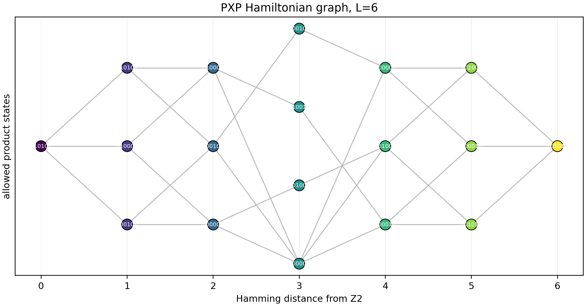
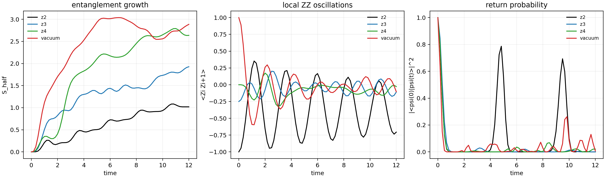
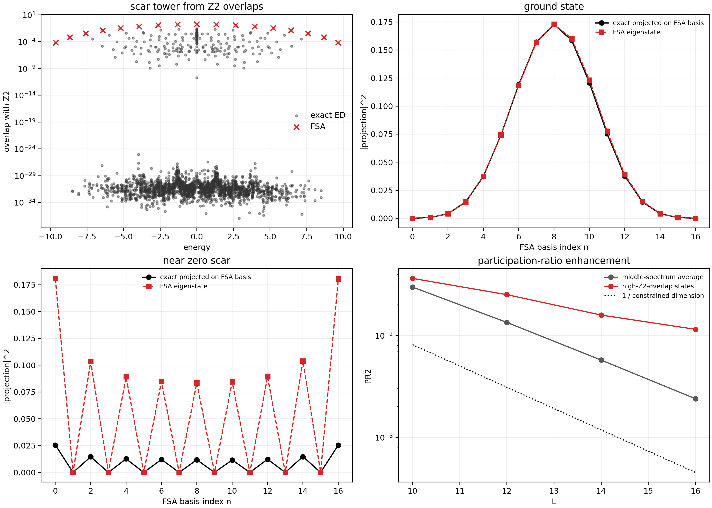
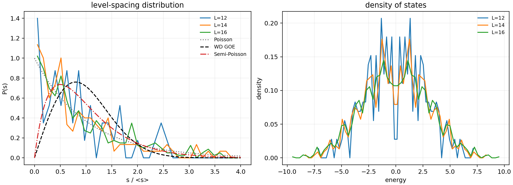

# Case Intro: Quantum Many-Body Scars

## One-Sentence Result

这个案例跟随 arXiv:1711.03528 的 PXP / Fibonacci 链模型，复现了量子多体 scar 的核心数值特征：`Z2` 初态的慢纠缠增长和长时间振荡、谱中的高重叠 scar tower、FSA 近似结构，以及小尺寸下的能级统计趋势。

## Similarity Level

- Current level: `numerical_feature_reproduction`
- Similarity score: `72.50/100`
- Meaning: 主要物理特征已经出现，但还不是论文 `L=32` 和 iTEBD 尺度下的完整复现。
- Important note: 我们看重的是图里表达的数值特征是否一致，不把颜色、线宽、排版和视角差异当作科学误差。

## Paper And Goal

- Paper: Turner et al., "Quantum many-body scars"
- PaperID: `1711.03528`
- Case type: 理论物理数值复现
- Reproduction scope: 只做数值图和由 Hamiltonian 生成的结构图
- Out of scope: 实验数据、纯示意图、论文级 `L=32` 全尺寸计算

## Intuitive Derivation

这篇论文的核心从一个很直观的规则开始：每个原子可以被激发，也可以回到基态，但相邻两个原子不能同时处在激发态。写成程序就是：只有当左右邻居都是基态时，中间这个 site 才允许翻转。

这个规则给出 PXP Hamiltonian。它不是普通的自旋链，因为可用的 Hilbert 空间已经被 Rydberg blockade 削掉了一大块，维数按 Fibonacci 数增长。我们先核验了这个维数公式，再核验粒子-空穴反对易关系和 FSA 的 `H = H+ + H-` 分解。公式门通过之后，才开始跑数值。

如果复现是对的，应该看到四个特征：

1. `L=6` 的 Hamiltonian graph 有正确的 Fibonacci basis。
2. 从 `Z2` 初态出发，系统不会很快热化，而是出现明显的振荡。
3. 谱里有一组本征态对 `Z2` 的重叠异常高，形成 scar tower。
4. 能级统计不是普通的 Poisson 积分系统特征，但完整 WD 趋势需要更大尺寸和对称性分解。

## Numerical Method

本地复现采用 exact diagonalization 和 exact time evolution。当前机器能稳定完成 `L=16` 的 constrained Hilbert space 计算，因此本 case 把论文级大规模结果降为特征复现。

生成顺序是：

1. 构造所有不含相邻激发的 bitstring basis。
2. 按 PXP 翻转规则建立 Hamiltonian。
3. 先跑公式检查。
4. 生成 CSV 数据。
5. 用 CSV 画出复现图。
6. 对每张图按数值特征打分。

## Original vs Reproduced

### T001: Fig. 1 Hamiltonian Graph

**Consistency:** `reproduced`

**Similarity level:** `complete_reproduction`

**Similarity score:** `90/100`

Explanation:

- Feature being checked: `L=6` 受限 Hilbert 空间，以及 Hamiltonian 在 basis 图上的连接结构。
- What matches: 节点数为 `18`，与论文的 Fibonacci 计数一致；边由 PXP 翻转规则生成。
- What remains different: 版式和节点摆放不完全一样，这是展示方式差异，不影响物理结构。
- Evidence: `../outputs/data/fig1_graph_nodes.csv`, `../outputs/data/fig1_graph_edges.csv`

### T002: Entanglement Dynamics

**Consistency:** `physically_consistent`

**Similarity level:** `numerical_feature_reproduction`

**Similarity score:** `70/100`

Explanation:

- Feature being checked: `Z2` 初态的慢纠缠增长、局域关联振荡和 return probability revival。
- What matches: `Z2` 的纠缠增长最慢；局域关联振荡周期为 `2.375`，接近论文报告的 `~2.35`；`Z2` 的 revival 明显强于其他初态。
- What remains different: 论文使用 iTEBD 热力学极限；这里是 `L=16` finite-size exact evolution。
- Evidence: `../outputs/data/fig_ent_dynamics.csv`, `../outputs/checks/pxp_feature_checks.json`

### T003: Fig. 2 Scar Tower And FSA

**Consistency:** `physically_consistent`

**Similarity level:** `numerical_feature_reproduction`

**Similarity score:** `70/100`

Explanation:

- Feature being checked: 本征态与 `Z2` 的重叠、FSA 近似、participation ratio enhancement。
- What matches: spectrum 中出现高 `Z2` overlap 的 scar tower；FSA ground-state profile 与 exact projection 高度一致；special states 的 participation ratio 高于中间谱平均。
- What remains different: 论文使用 `L=32` 对称性 sector；本地是 `L=16` full constrained sector。near-zero scar 的 FSA 只捕捉到振荡结构，幅度不完全一致。
- Evidence: `../outputs/data/fig2a_scar_overlaps.csv`, `../outputs/data/fig2bc_fsa_basis_overlaps.csv`, `../outputs/data/fig2d_participation_ratio.csv`

### T004: Fig. 4 Level Statistics

**Consistency:** `partial`

**Similarity level:** `feature_not_accepted`

**Similarity score:** `58/100`

Explanation:

- Feature being checked: 能级统计从非 Poisson 向 WD 类统计靠近，以及 density of states 的钟形结构。
- What matches: density of states 的整体钟形结构出现；`r` 值随尺寸有上升趋势。
- What remains different: 未做论文的 `k=0, I=+` 对称性分解和 unfolding，spacing distribution 仍受小尺寸和未分解对称性影响。
- Evidence: `../outputs/data/fig4_level_spacing_distribution.csv`, `../outputs/data/fig4_density_of_states.csv`

## What Still Differs From The Paper

- Fig. 2 和 Fig. 4 没有达到 `L=32` 论文尺度。
- Fig. 4 的 level statistics 还没有进入完整验收层级。
- 动力学图是 finite-size ED，不是 iTEBD 热力学极限。

## Recommended Compute For Complete Reproduction

- 64 GB memory 起步，128 GB 更稳。
- 16+ CPU cores。
- 建议 overnight 到 multi-day 运行。
- 关键任务是实现 `k=0, I=+` sector 并复现 unfolded spacing distribution。

## Code Structure

- `src/pxp_scars.py`: PXP basis、Hamiltonian、FSA、dynamics、checks。
- `scripts/run_reproduction.py`: 生成 CSV 和 JSON 检查。
- `scripts/plot_reproduction.py`: 从 CSV 生成图。
- `../outputs/data/`: 图背后的数值数据。
- `../outputs/checks/`: 公式和特征检查。

## Final Takeaway

这个 case 说明 Harness 已经能完成一条完整的理论物理复现路径：先从论文公式建立可执行模型，再用数值结果验证图中的物理特征。它已经复现了量子多体 scar 的核心机制，但完整论文级复现还需要更大的算力和对称性 sector 实现。
