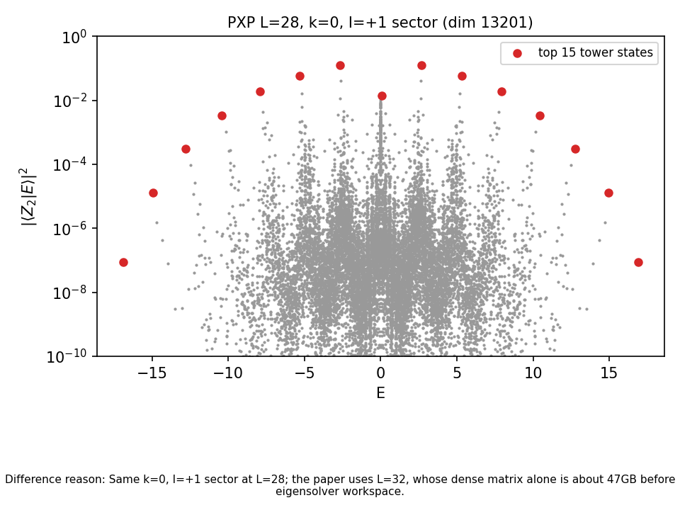
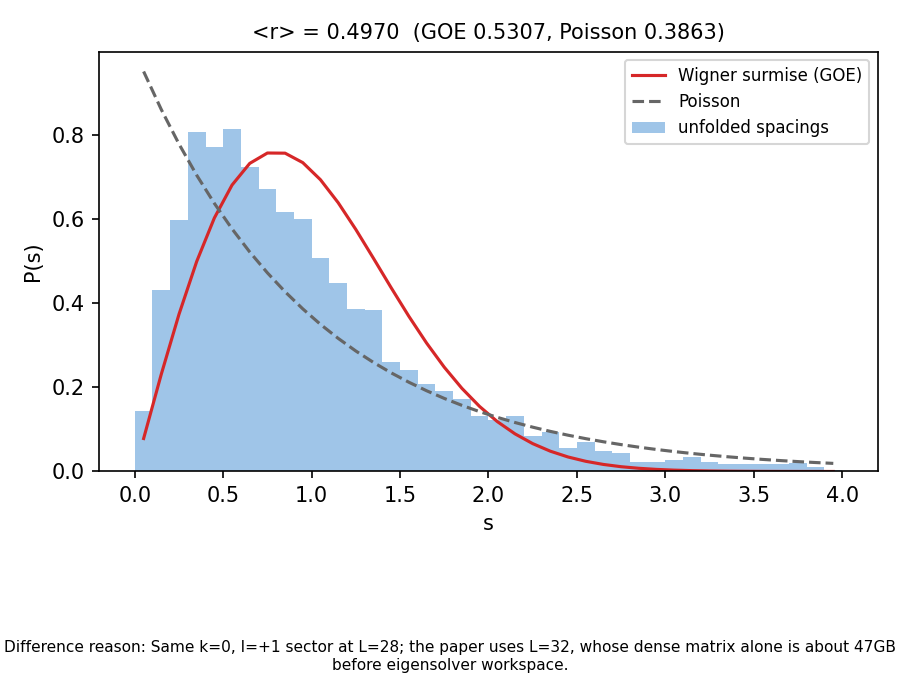

# Case Intro: Quantum Many-Body Scars

## One-Sentence Result

这个案例跟随 arXiv:1711.03528 的 PXP / Fibonacci 链模型，复现了量子多体 scar 的核心数值特征：`Z2` 初态的慢纠缠增长和长时间振荡、谱中的高重叠 scar tower、FSA 近似结构，以及 `L=28`、`k=0, I=+1` 对称 sector 的 unfolded level statistics。

## Similarity Level

- Current level: `numerical_feature_reproduction`
- Similarity score: `72.50/100`
- Public status: `symmetry_resolved_partial_reproduction`
- Meaning: 论文同一对称 sector 已做到 `L=28`；`L=32` 和 iTEBD 热力学极限仍未完成。
- Important note: 我们看重的是图里表达的数值特征是否一致，不把颜色、线宽、排版和视角差异当作科学误差。

## Paper And Goal

- Paper: Turner et al., "Quantum many-body scars"
- PaperID: `1711.03528`
- Case type: 理论物理数值复现
- Reproduction scope: 只做数值图和由 Hamiltonian 生成的结构图
- Out of scope: 实验数据、纯示意图、论文级 `L=32` 全尺寸计算

## Intuitive Derivation

这篇论文的核心从一个很直观的规则开始：每个原子可以被激发，也可以回到基态，但相邻两个原子不能同时处在激发态。写成程序就是：只有当左右邻居都是基态时，中间这个 site 才允许翻转。

这个规则给出 PXP Hamiltonian。它不是普通的自旋链，因为可用的 Hilbert 空间已经被 Rydberg blockade 削掉了一大块，维数按 Fibonacci 数增长。我们先核验了这个维数公式，再核验粒子-空穴反对易关系和 FSA 的 `H = H+ + H-` 分解。公式门通过之后，才开始跑数值。

如果复现是对的，应该看到四个特征：

1. `L=6` 的 Hamiltonian graph 有正确的 Fibonacci basis。
2. 从 `Z2` 初态出发，系统不会很快热化，而是出现明显的振荡。
3. 谱里有一组本征态对 `Z2` 的重叠异常高，形成 scar tower。
4. 能级统计不是普通的 Poisson 积分系统特征，但完整 WD 趋势需要更大尺寸和对称性分解。

## Numerical Method

基础复现采用 `L=16` exact diagonalization 和 exact time evolution。之后又完成了 `L=28`、`k=0, I=+1` 对称 sector 的 dense ED，sector 维数为 13201，用时约 285 秒。

生成顺序是：

1. 构造所有不含相邻激发的 bitstring basis。
2. 按 PXP 翻转规则建立 Hamiltonian。
3. 先跑公式检查。
4. 生成 CSV 数据。
5. 用 CSV 画出复现图。
6. 对每张图按数值特征打分。

`L=32` sector 约 7.7 万维，一个 float64 dense 矩阵就约 47 GB，尚未计入本征求解器额外 workspace，因此当前 40 GB A100 路径不启动该任务。

## Original vs Reproduced

### T001: Fig. 1 Hamiltonian Graph

**Consistency:** `reproduced`

**Similarity level:** `complete_reproduction`

**Similarity score:** `90/100`

Explanation:

- Feature being checked: `L=6` 受限 Hilbert 空间，以及 Hamiltonian 在 basis 图上的连接结构。
- What matches: 节点数为 `18`，与论文的 Fibonacci 计数一致；边由 PXP 翻转规则生成。
- What remains different: 版式和节点摆放不完全一样，这是展示方式差异，不影响物理结构。
- Evidence: `../outputs/data/fig1_graph_nodes.csv`, `../outputs/data/fig1_graph_edges.csv`

### T002: Entanglement Dynamics

**Consistency:** `physically_consistent`

**Similarity level:** `numerical_feature_reproduction`

**Similarity score:** `70/100`

Explanation:

- Feature being checked: `Z2` 初态的慢纠缠增长、局域关联振荡和 return probability revival。
- What matches: `Z2` 的纠缠增长最慢；局域关联振荡周期为 `2.375`，接近论文报告的 `~2.35`；`Z2` 的 revival 明显强于其他初态。
- Difference reason: 论文使用 iTEBD 热力学极限；这里是 `L=16` finite-size exact evolution。原因也直接写在图脚。
- Evidence: `../outputs/data/fig_ent_dynamics.csv`, `../outputs/checks/pxp_feature_checks.json`

### T003: Fig. 2 Scar Tower And FSA

同一对称 sector 的 `L=28` scar tower：

**Consistency:** `physically_consistent`

**Similarity level:** `numerical_feature_reproduction`

**Similarity score:** `70/100`

Explanation:

- Feature being checked: 本征态与 `Z2` 的重叠、FSA 近似、participation ratio enhancement。
- What matches: `L=28` 同一 `k=0, I=+1` sector 中出现完整的 15 态 scar tower，能量间距相对标准差为 `0.104`；小尺寸测试还验证了 sector spectrum 是 full spectrum 的精确子集。
- Difference reason: 论文使用 `L=32`；当前 dense `L=32` 的单个矩阵约 47 GB，超过 40 GB A100，尚未计 eigensolver workspace。
- Evidence: `../outputs/data/sector_scar_tower.csv`, `../outputs/checks/symmetry_resolved_sector.json`

### T004: Fig. 4 Level Statistics

**Consistency:** `physically_consistent`

**Similarity level:** `numerical_feature_reproduction`

**Similarity score:** `70/100`

Explanation:

- Feature being checked: 能级统计从非 Poisson 向 WD 类统计靠近，以及 density of states 的钟形结构。
- What matches: 已完成 `L=28` 的 `k=0, I=+1` 对称性分解、去零模和 central-window unfolding；`r=0.497` 更接近 GOE `0.531` 而不是 Poisson `0.386`，spacing histogram 对 Wigner 的 L1 距离也更小。
- Difference reason: 与论文的差异主要剩系统尺寸 `L=28` 对 `L=32`，原因是当前 dense 求解路径的显存/workspace 上限。
- Evidence: `../outputs/data/sector_level_spacings.csv`, `../outputs/checks/symmetry_resolved_sector.json`

## What Still Differs From The Paper

- Fig. 2 和 Fig. 4 已进入论文同一对称 sector，但系统尺寸为 `L=28`，不是 `L=32`。
- 动力学图是 finite-size ED，不是 iTEBD 热力学极限。

## Recommended Compute For Complete Reproduction

- `L=32` 建议使用 128 GB 以上高内存 CPU 节点，或改成不构造完整 dense 矩阵的 memory-aware eigensolver；当前 40 GB A100 不够。
- iTEBD 需要先实现和验证 bond dimension 约 400 的 runner，再单独评估 GPU/CPU 时间预算。
- 本轮不启动这两个任务，也不用小尺寸 proxy 冒充缺失结果。

## Code Structure

- `src/pxp_scars.py`: PXP basis、Hamiltonian、FSA、dynamics、checks。
- `scripts/run_reproduction.py`: 生成 CSV 和 JSON 检查。
- `scripts/plot_reproduction.py`: 从 CSV 生成图。
- `scripts/run_symmetry_resolved_sector.py`: `L=28` 对称 sector ED。
- `scripts/plot_symmetry_resolved_sector.py`: 不重跑 ED，直接由已保存数据重画 sector 图。
- `../outputs/data/`: 图背后的数值数据。
- `../outputs/checks/`: 公式和特征检查。

## Final Takeaway

这个 case 已经复现量子多体 scar 的核心机制，并把对称性分解推进到 `L=28`。完整论文级复现仍需要高内存 `L=32` 求解与经过验证的 iTEBD；两项都在资源边界处停止，原因记录于 `outputs/checks/completion_assessment.json`。
