# 1803.01876: Edge states and topological invariants of non-Hermitian systems

Paper: [Edge states and topological invariants of non-Hermitian systems](https://arxiv.org/abs/1803.01876)

Public status: **Paper-parameter complete reproduction**

Audit score at export: **94.00/100**

Similarity level: `complete_reproduction`

Reproduces the open-boundary spectrum, generalized Brillouin zone, skin profiles, non-Bloch winding, and the nonzero-t3 extension.

## Start Here / 上手讲义

- [中文上手讲义](note/reproduction-note.zh-CN.md)
- [English getting-started note](note/reproduction-note.en.md)
- [Bilingual note index](note/reproduction-note.md)
- [Code and run commands](code/README.md)
- [Machine-readable scorecard](outputs/checks/similarity_scorecard.json)
- [Numerical methods](docs/NUMERICAL_METHODS.md)
- [Lessons learned](docs/LESSONS_LEARNED.md)

## Public Boundary

This public case includes paper-derived code, generated data, generated figures, public validation checks, and explanatory notes. It does not redistribute the paper PDF, arXiv source archive, original figures, EPS paths, digitized source curves, source-derived point sets, or source-vs-generated composite panels.

Remaining limitation: Author plotting data are unavailable; digitized source references were used internally for validation but are not redistributed.

Final-parameter rule: final public figures use the paper parameters when feasible. Any reduced-scale, subset, proxy, or blocked target must be labeled explicitly and cannot be presented as a complete reproduction.

## Quick Run

```bash
python -m venv .venv
source .venv/bin/activate
pip install -r requirements.txt
pip install mpmath
cd cases/1803.01876/code
python scripts/run_fig2_open_spectrum.py
python scripts/run_fig3_beta_skin.py
python scripts/run_fig4_winding.py
python scripts/run_fig5_t3.py
```

## Generated Figures

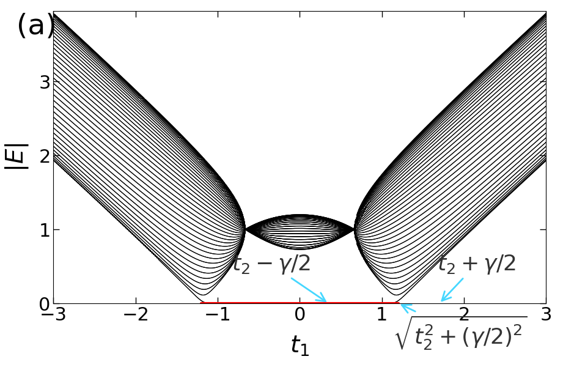

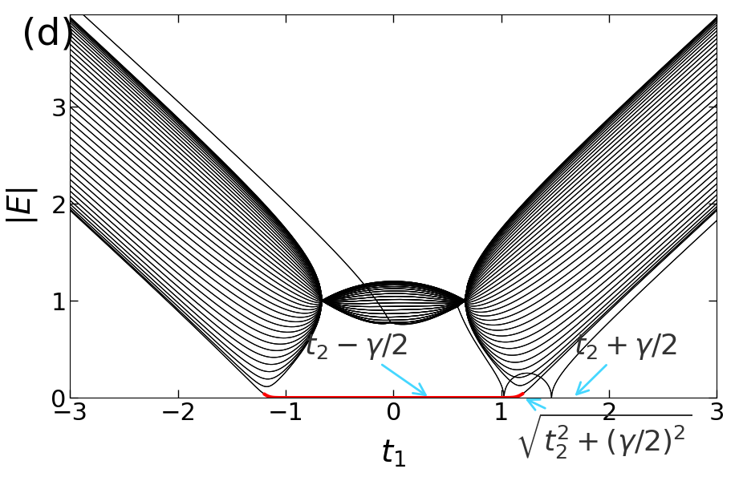

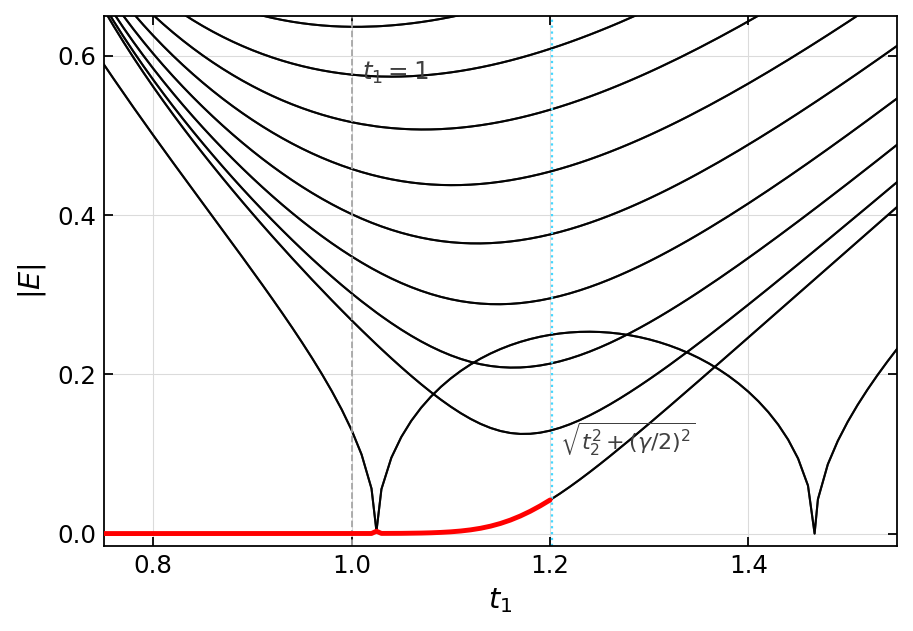

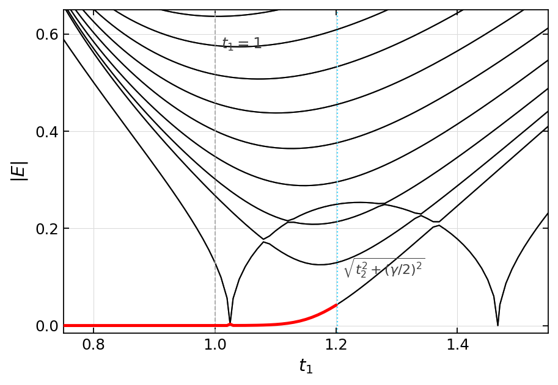

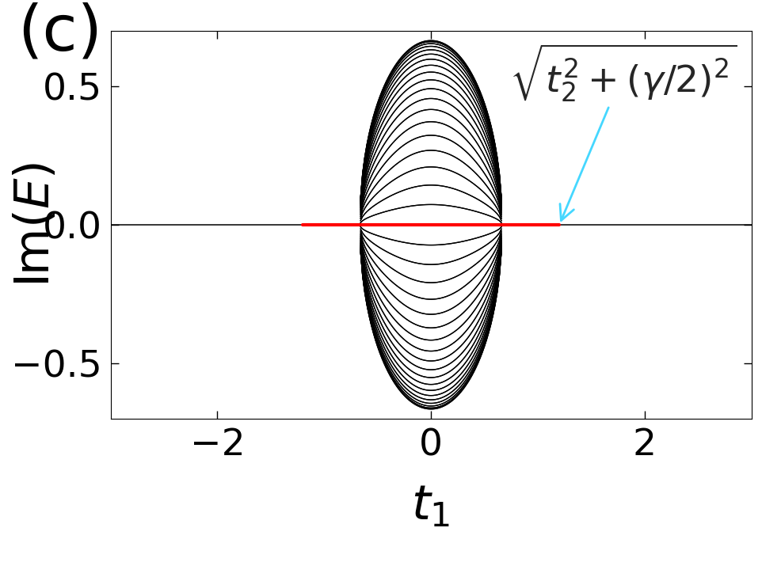


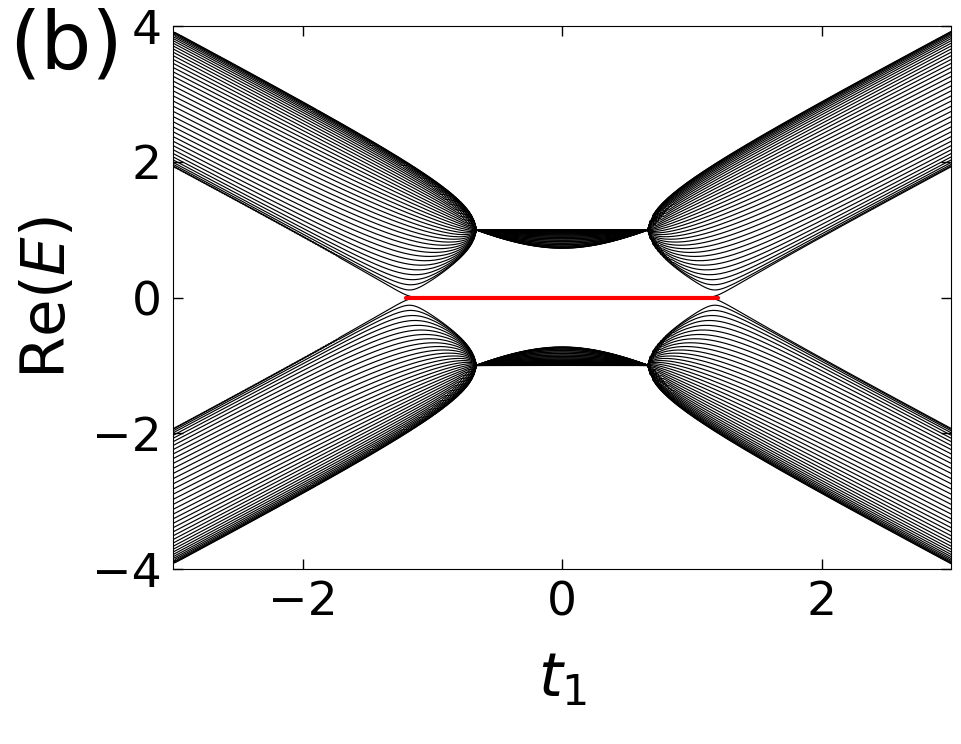

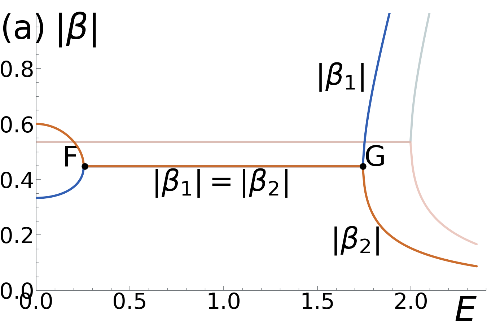


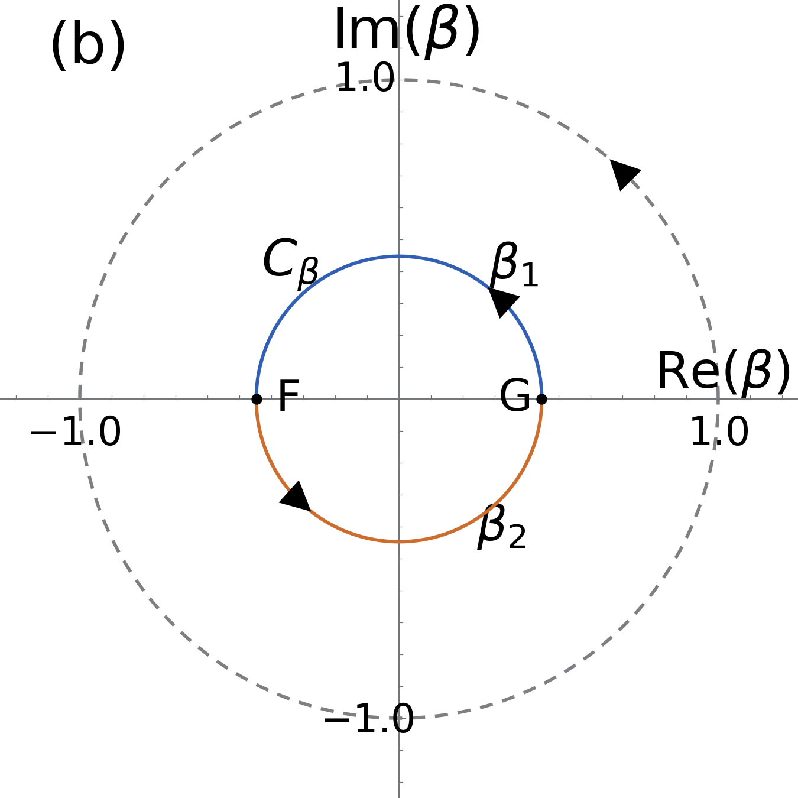

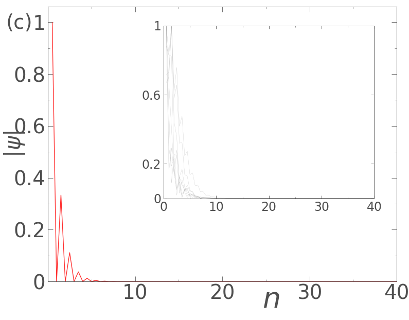


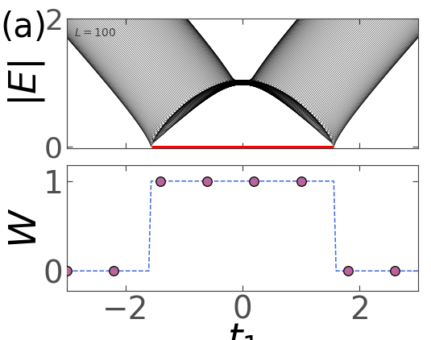

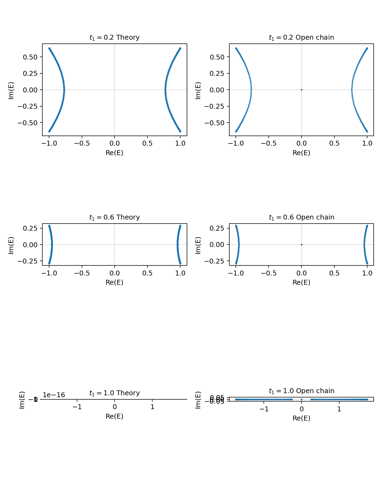

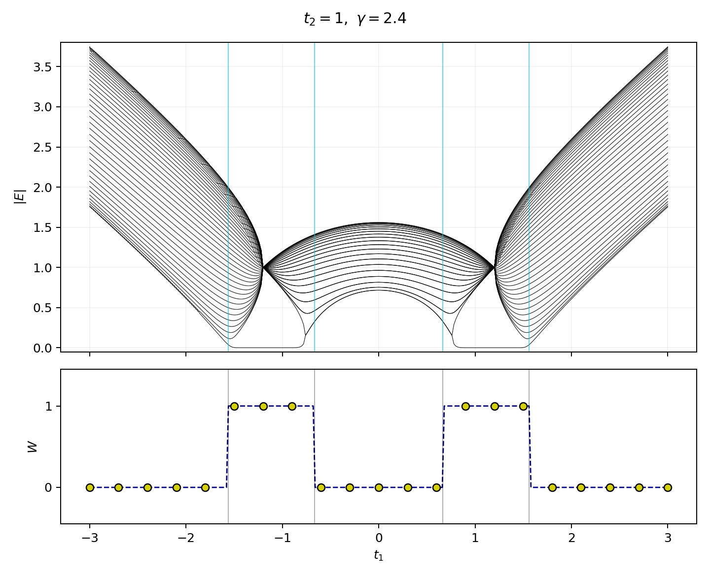
