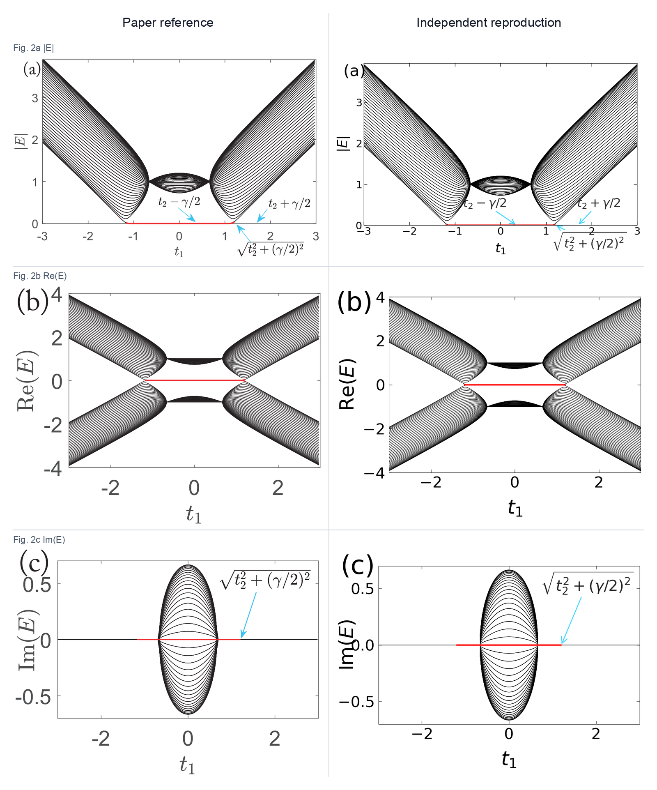
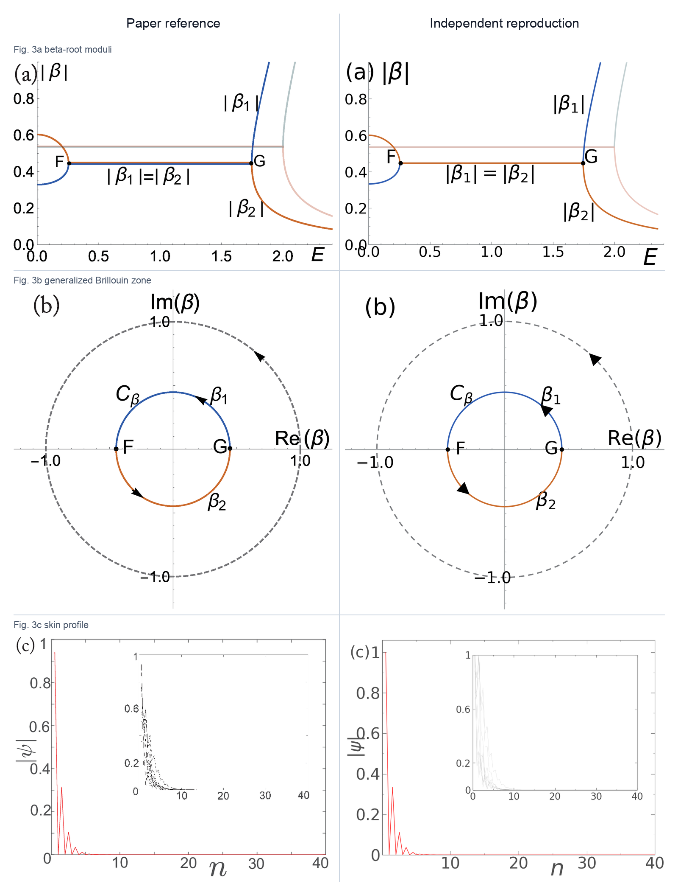
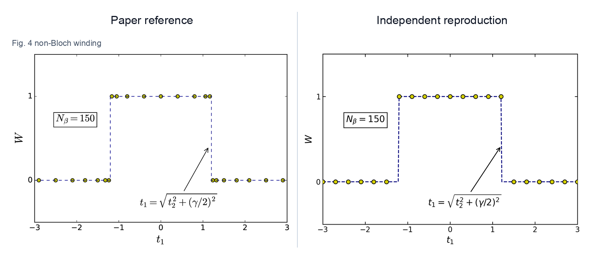
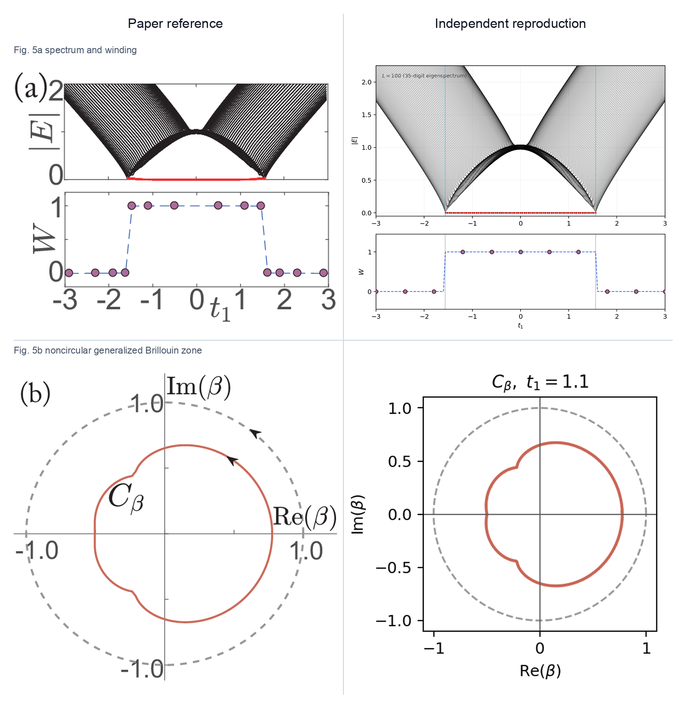
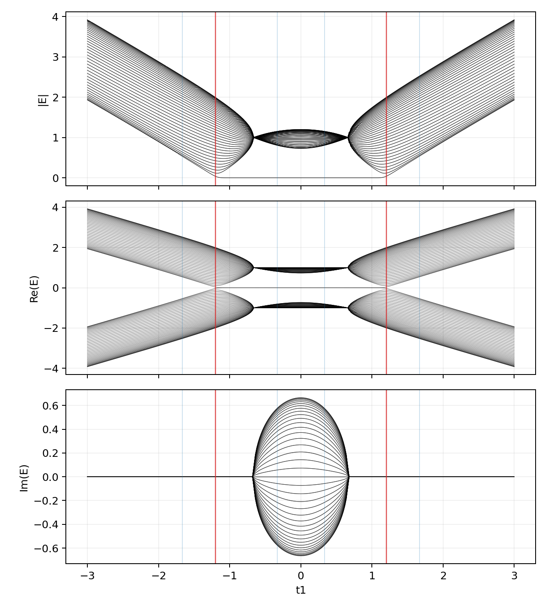
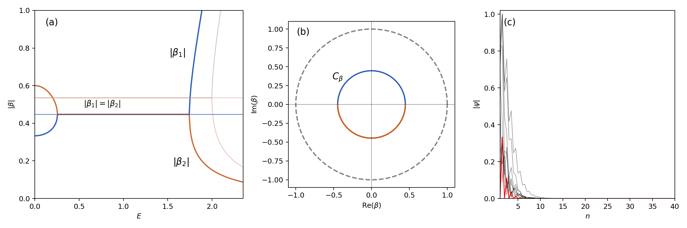
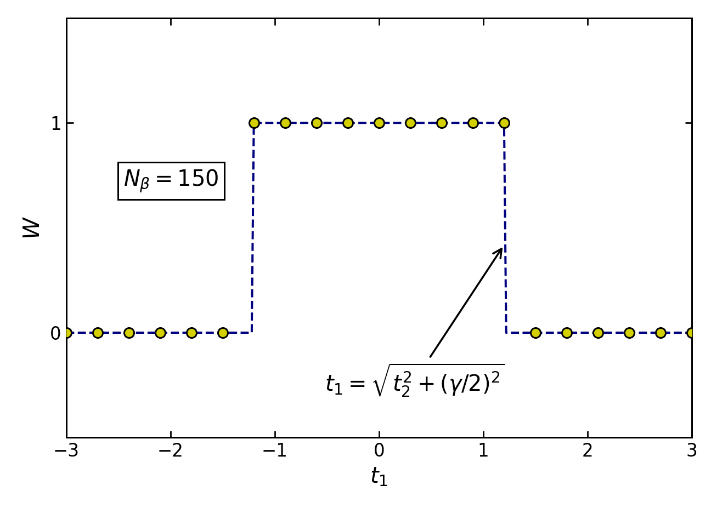
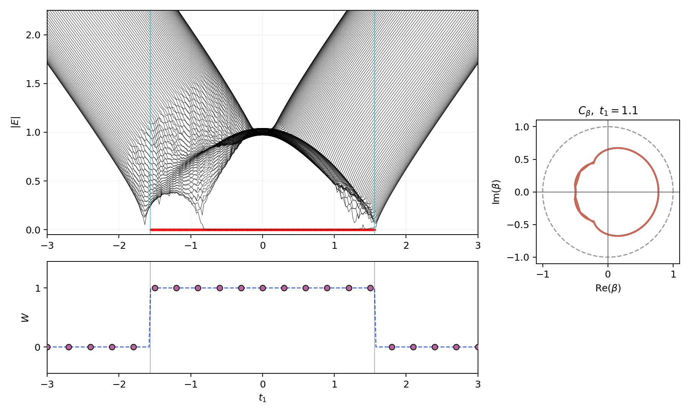

# 1803.01876: Edge states and topological invariants of non-Hermitian systems

Preprint: [arXiv:1803.01876 — Edge states and topological invariants of non-Hermitian systems](https://arxiv.org/abs/1803.01876)

Published as: [Edge States and Topological Invariants of Non-Hermitian Systems](https://doi.org/10.1103/PhysRevLett.121.086803)

Formal citation: Physical Review Letters 121, 086803 (2018) · DOI `10.1103/PhysRevLett.121.086803` · Locator `086803`

Public status: **Paper-parameter complete reproduction** · Audit score: **94.00/100**

Reproduces the open-boundary spectrum, generalized Brillouin zone, skin profiles, non-Bloch winding, and the nonzero-t3 extension.

## Start Here / 从这里开始

- [中文复现 Note](note/reproduction-note.zh-CN.md)
- [English reproduction note](note/reproduction-note.en.md)
- [Code and run commands](code/README.md)
- [Machine-readable scorecard](outputs/checks/similarity_scorecard.json)
- [Numerical methods](docs/NUMERICAL_METHODS.md)
- [Lessons learned](docs/LESSONS_LEARNED.md)

## Main Reproduced Results

| Paper item | Reproduced result | Figure | Check |
| --- | --- | --- | --- |
| Fig. 2 | Open-boundary spectrum and zero-mode interval | [PNG](outputs/figures/fig2_open_spectrum.png) | [JSON](outputs/checks/fig2_open_spectrum.json) |
| Fig. 3 | Beta roots, generalized Brillouin zone, and skin profiles | [PNG](outputs/figures/fig3_beta_skin.png) | [JSON](outputs/checks/fig3_beta_skin.json) |
| Fig. 4 | Non-Bloch winding plateau | [PNG](outputs/figures/fig4_winding.png) | [JSON](outputs/checks/fig4_winding.json) |
| Fig. 5 | Paper-parameter nonzero-t3 spectrum, winding, and noncircular GBZ | [PNG](outputs/figures/fig5_t3.png) | [JSON](outputs/checks/fig5_t3.json) |

## Paper Reference vs Independent Reproduction

The left column in each panel is a limited excerpt from Yao and Wang, [Physical Review Letters 121, 086803 (2018)](https://doi.org/10.1103/PhysRevLett.121.086803); the right column is generated independently from this case. These comparisons validate physical structure and key numerical features, not author-data-level or point-for-point equivalence.

### Fig. 2 comparison



### Fig. 3 comparison



### Fig. 4 comparison



### Fig. 5 comparison



### Fig. 2: Open-boundary spectrum and zero-mode interval



### Fig. 3: Beta roots, generalized Brillouin zone, and skin profiles



### Fig. 4: Non-Bloch winding plateau



### Fig. 5: Paper-parameter nonzero-t3 spectrum, winding, and noncircular GBZ



## Quick Run

```bash
python -m venv .venv
source .venv/bin/activate
pip install -r requirements.txt
pip install mpmath
cd cases/1803.01876/code
python scripts/run_fig2_open_spectrum.py
python scripts/run_fig3_beta_skin.py
python scripts/run_fig4_winding.py
python scripts/run_fig5_t3.py
```

Generated files are kept under [data](outputs/data/), [figures](outputs/figures/), and [checks](outputs/checks/).

## Reproduction Boundary

This public case includes paper-derived code, generated data, generated figures, public validation checks, explanatory notes, and 4 limited comparison panels. Those panels use the minimum paper excerpts needed for validation and clearly separate the paper reference from the independent result. The case does not redistribute the paper PDF, arXiv source archive, standalone original figures, EPS paths, digitized source curves, or source-derived point sets.

Remaining limitation: Author plotting data are unavailable; digitized source references were used internally for validation but are not redistributed.

Final-parameter rule: final public figures use the paper parameters when feasible. Any reduced-scale, subset, proxy, or blocked target must be labeled explicitly and cannot be presented as a complete reproduction.
