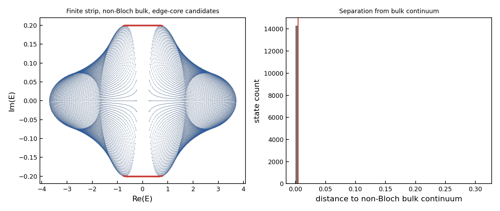
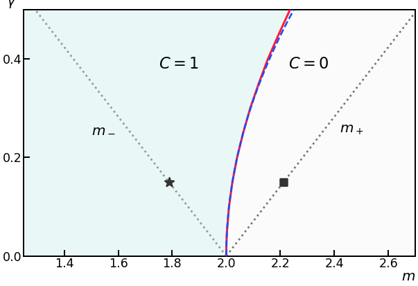
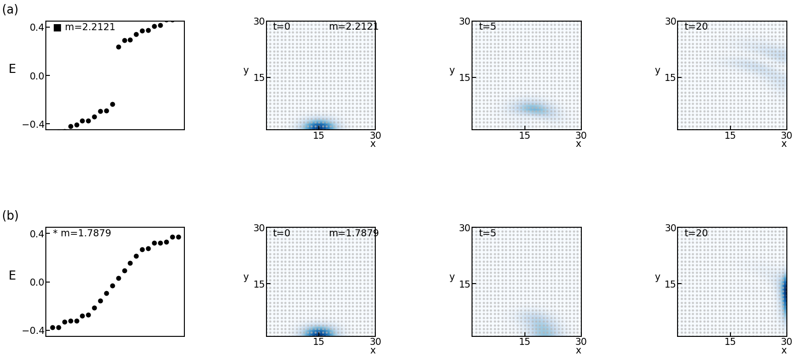
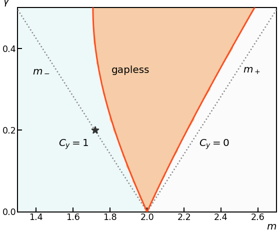
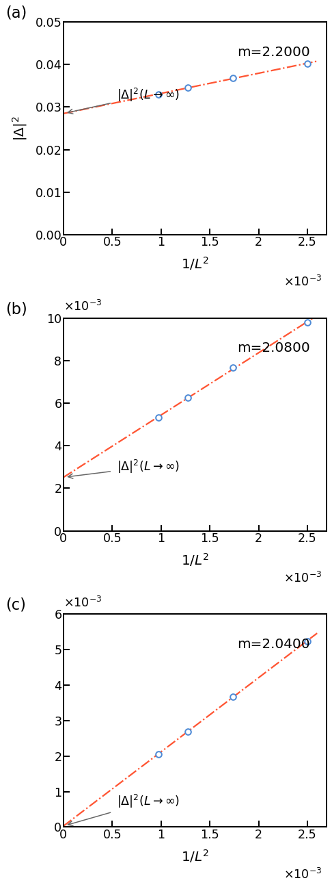
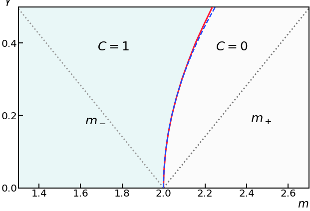
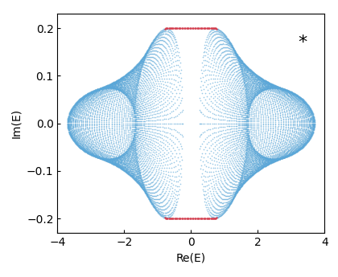

# 1804.04672: Non-Hermitian Chern bands

Preprint: [arXiv:1804.04672 — Non-Hermitian Chern bands](https://arxiv.org/abs/1804.04672)

Published as: [Non-Hermitian Chern Bands](https://doi.org/10.1103/PhysRevLett.121.136802)

Formal citation: Physical Review Letters 121, 136802 (2018) · DOI `10.1103/PhysRevLett.121.136802` · Locator `136802`

Public status: **Feature-level reproduction** · Audit score: **80.18/100**

Reproduces open-boundary and cylinder phase structure, square dynamics, complex spectra, and finite-size checks.

## Start Here / 从这里开始

- [中文复现 Note](note/reproduction-note.zh-CN.md)
- [English reproduction note](note/reproduction-note.en.md)
- [Code and run commands](code/README.md)
- [Machine-readable scorecard](outputs/checks/similarity_scorecard.json)
- [Numerical methods](docs/NUMERICAL_METHODS.md)
- [Lessons learned](docs/LESSONS_LEARNED.md)

## Quick Run

```bash
python -m venv .venv
source .venv/bin/activate
pip install -r requirements.txt
cd cases/1804.04672/code
python scripts/run_first_target.py
python scripts/run_open_boundary_phase_diagram.py
python scripts/run_square_dynamics.py
python scripts/run_cylinder_phase_diagram.py
python scripts/run_gap_scaling.py
python scripts/run_disk_phase_diagram.py
```

Generated files are kept under [data](outputs/data/), [figures](outputs/figures/), and [checks](outputs/checks/).

## Reproduction Boundary

This public case includes paper-derived code, generated data, generated figures, public validation checks, and explanatory notes. It does not redistribute the paper PDF, arXiv source archive, original figures, EPS paths, digitized source curves, source-derived point sets, or source-vs-generated composite panels.

Remaining limitation: Some phase-boundary and panel-level comparisons remain paper-subset or source-table validations rather than full independent finite-size reruns.

Final-parameter rule: final public figures use the paper parameters when feasible. Any reduced-scale, subset, proxy, or blocked target must be labeled explicitly and cannot be presented as a complete reproduction.

## Generated Figures














