# 2005.12667: Circuit Quantum Electrodynamics

Preprint: [arXiv:2005.12667 — Circuit Quantum Electrodynamics](https://arxiv.org/abs/2005.12667)

Published as: [Circuit Quantum Electrodynamics](https://doi.org/10.1103/RevModPhys.93.025005)

Formal citation: Reviews of Modern Physics 93, 025005 (2021) · DOI `10.1103/RevModPhys.93.025005` · Locator `025005`

Public status: **Full formula derivation and numerical-feature reproduction** · Audit score: **90.28/100**

Reproduces the full executable theory chain of the circuit-QED review: 30 formula families spanning main-text Eqs. (1)-(164) and Appendices A-C, plus 18 independent numerical or tabular targets. All formula gates and target checks pass. The package includes step-by-step derivations, runnable public code, structured data, generated figures, limited reference comparisons, and a complete Chinese PDF report.

## Start Here / 从这里开始

- [中文复现 Note](note/reproduction-note.zh-CN.md)
- [English reproduction note](note/reproduction-note.en.md)
- [Full step-by-step derivation trace](docs/DERIVATION_TRACE.md)
- [Formula verification report](docs/FORMULA_VERIFICATION.md)
- [Consistency and source-version audit](docs/CONSISTENCY_REPORT.md)
- [Code and run commands](code/README.md)
- [Machine-readable scorecard](outputs/checks/similarity_scorecard.json)
- [中文复现 Note PDF](note/reproduction-note.zh-CN.pdf)
- [Derivation (equations)](docs/DERIVATION.md)
- [Numerical methods](docs/NUMERICAL_METHODS.md)
- [Lessons learned](docs/LESSONS_LEARNED.md)

## Main Reproduced Results

| Paper item | Reproduced result | Figure | Check |
| --- | --- | --- | --- |
| Sec. II / Figs. 5-6 | Transmon phase wavefunctions and exponential charge-dispersion suppression | [PNG](outputs/figures/fig6_transmon_charge_dispersion.png) | [JSON](outputs/checks/section2_checks.json) |
| Sec. III / Fig. 8 | Jaynes-Cummings doublets with exact 2g sqrt(n) splitting | [PNG](outputs/figures/fig8_jaynes_cummings_spectrum.png) | [JSON](outputs/checks/chapter3_checks.json) |
| Sec. IV / Eqs. 66-75 | Hermitian bath coupling, thermal Lindblad dynamics, and passive one-port input-output response | [PNG](outputs/figures/eq66_75_open_system_validation.png) | [JSON](outputs/checks/open_system_checks.json) |
| Sec. V / Figs. 18-19 | Dispersive measurement pointer trajectories and cavity pull | [PNG](outputs/figures/fig18_readout_phase_space.png) | [JSON](outputs/checks/section5_checks.json) |
| Sec. VI / Figs. 20-26 | Strong-coupling crossover, vacuum-Rabi splitting, avoided crossing, and spectroscopy | [PNG](outputs/figures/fig20_coupling_regimes.png) | [JSON](outputs/checks/section6_checks.json) |
| Sec. VII / Table I and Fig. 31 | DRAG control, amplitude-damping code contracts, and cat-code Wigner functions | [PNG](outputs/figures/fig31_cat_code_wigner.png) | [JSON](outputs/checks/section7_checks.json) |
| Sec. VIII / Figs. 32-33 | Fock-superposition and squeezed-state Wigner functions | [PNG](outputs/figures/fig33_squeezing.png) | [JSON](outputs/checks/section8_checks.json) |

## Paper Reference vs Independent Reproduction

Each board contains a limited paper excerpt used only to identify the target's physical structure, beside an independently generated equation-driven result. These boards audit features, invariants, and declared parameter scope; they do not claim author-data-level pointwise equivalence.

### Fig. 8 comparison

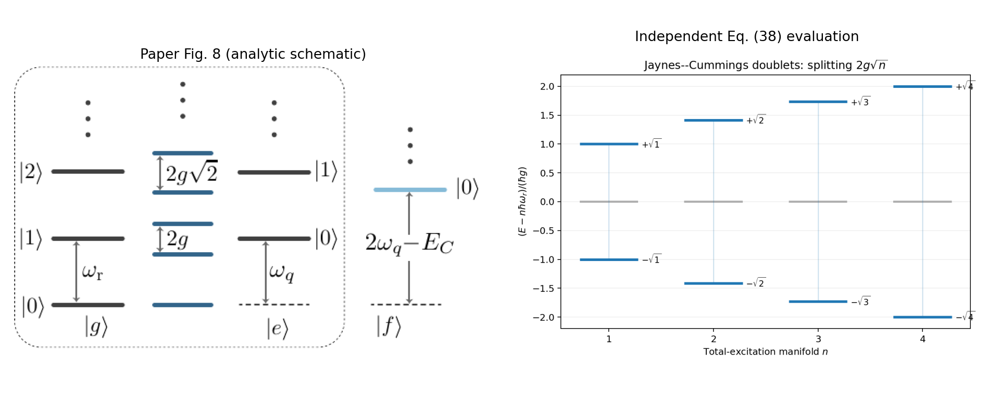

### Fig. 9 comparison

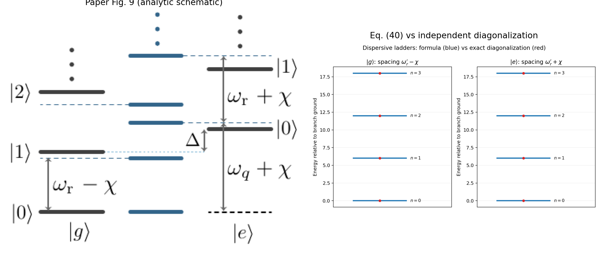

### Fig. 2(c) / T005 comparison

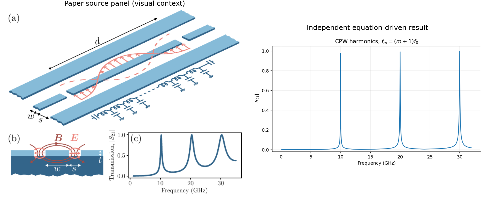

### Fig. 5(a) / T006 comparison

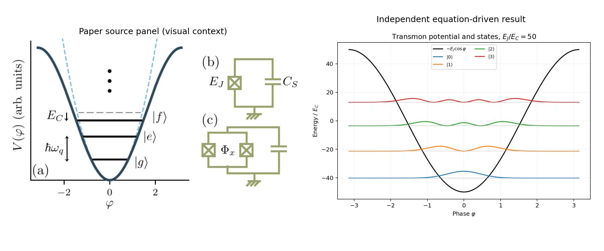

### Fig. 6 / T007 comparison

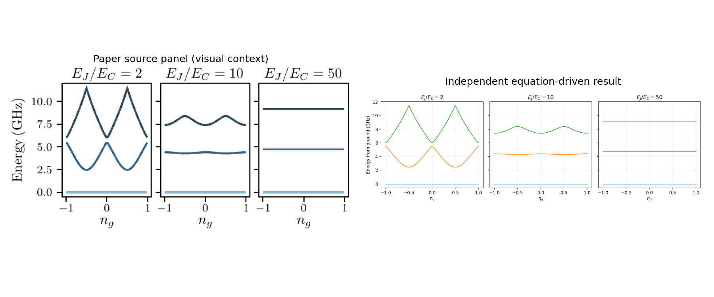

### Fig. 18 / T008 comparison

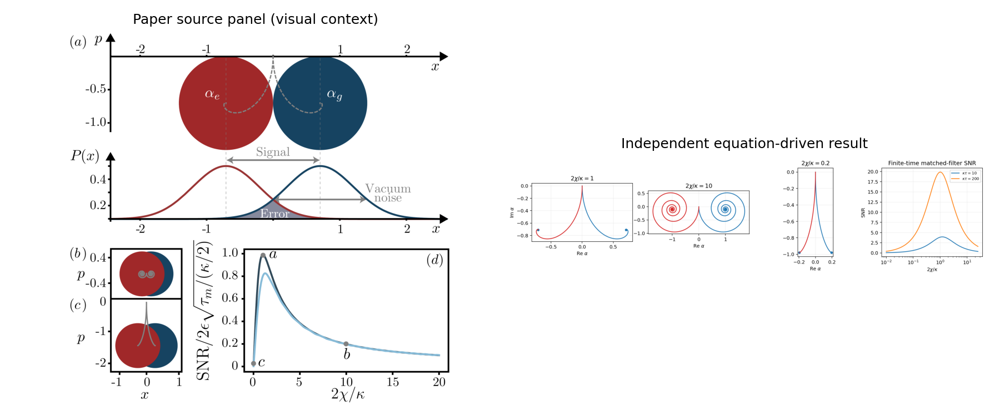

### Fig. 19 / T009 comparison

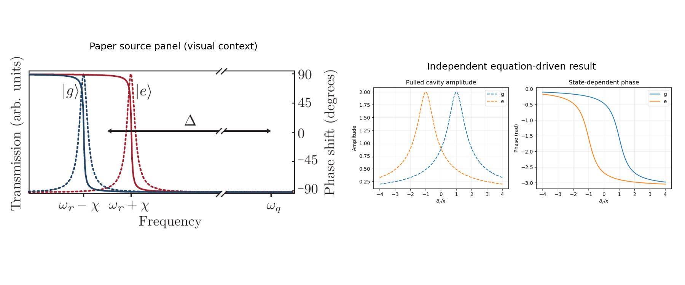

### Fig. 20 / T010 comparison

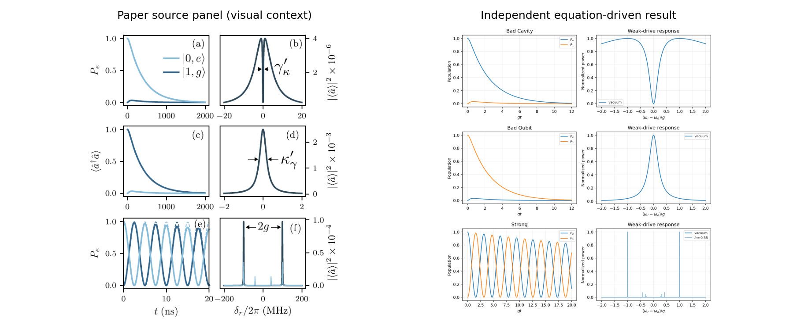

### Fig. 21 theory / T011 comparison

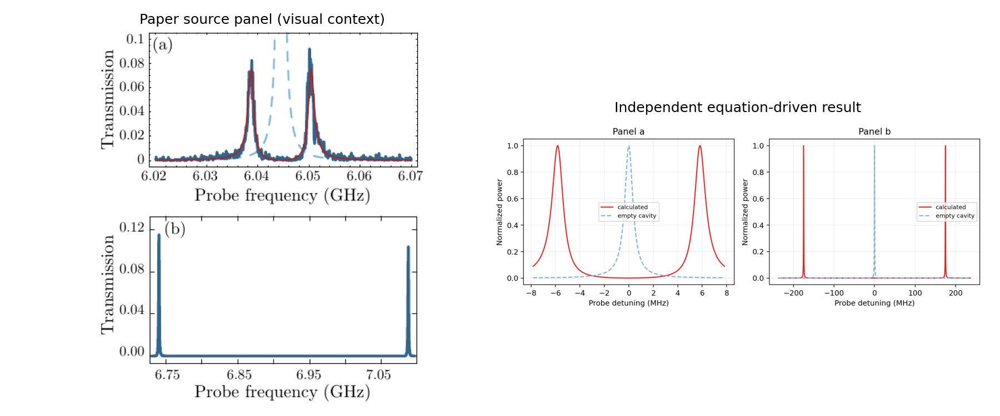

### Fig. 22 / T012 comparison

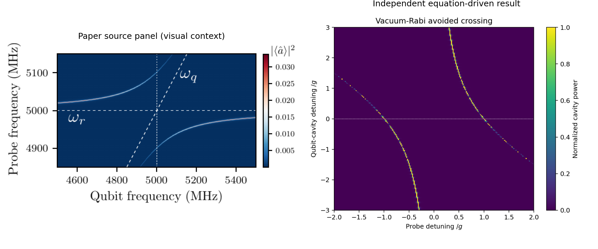

### Fig. 24 / T013 comparison

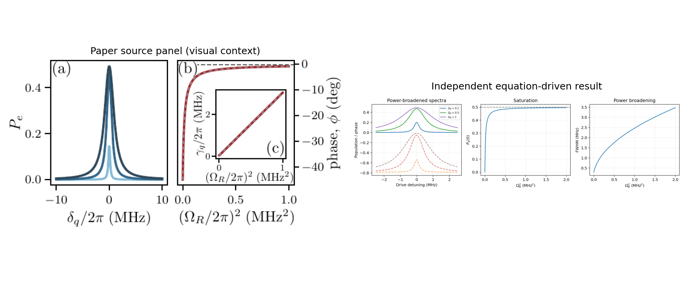

### Fig. 25 / T014 comparison

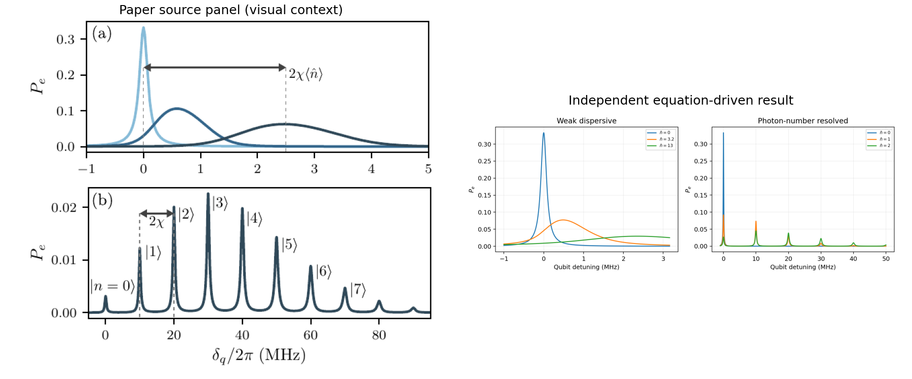

### Fig. 26 / T015 comparison

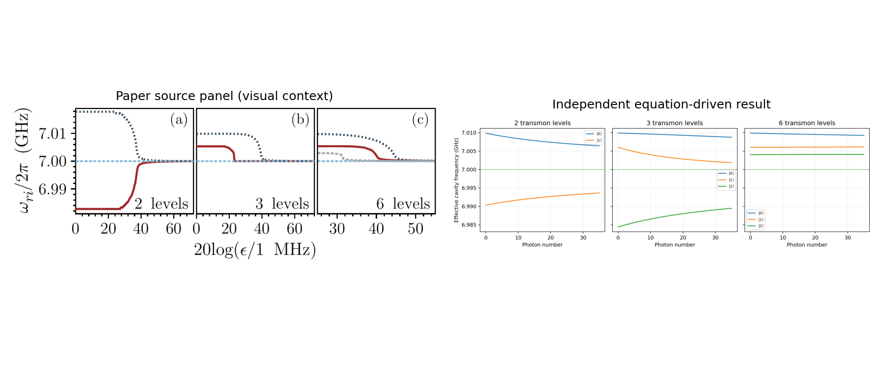

### Fig. 28 simulation / T016 comparison

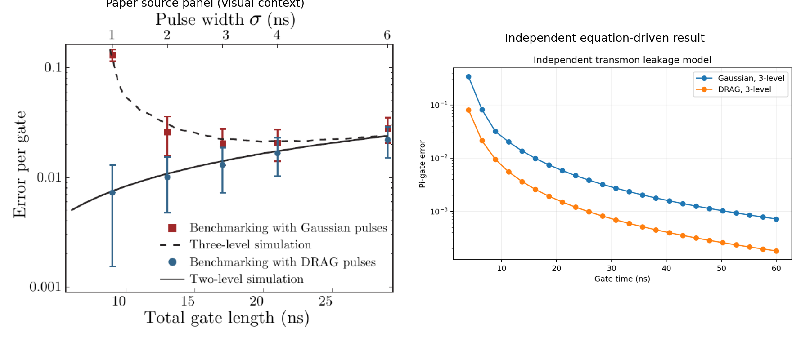

### Fig. 31 / T018 comparison

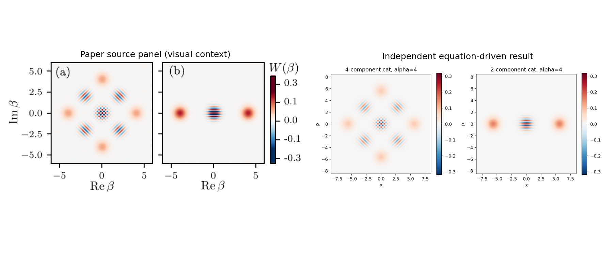

### Fig. 32 theory / T019 comparison

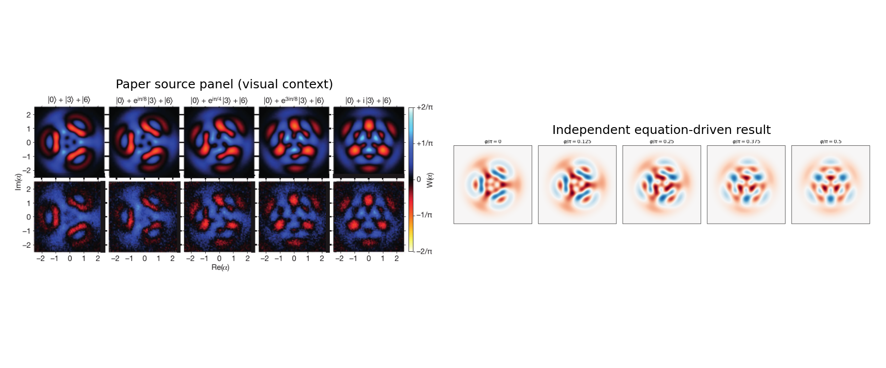

### Fig. 33(a,b) / T020 comparison

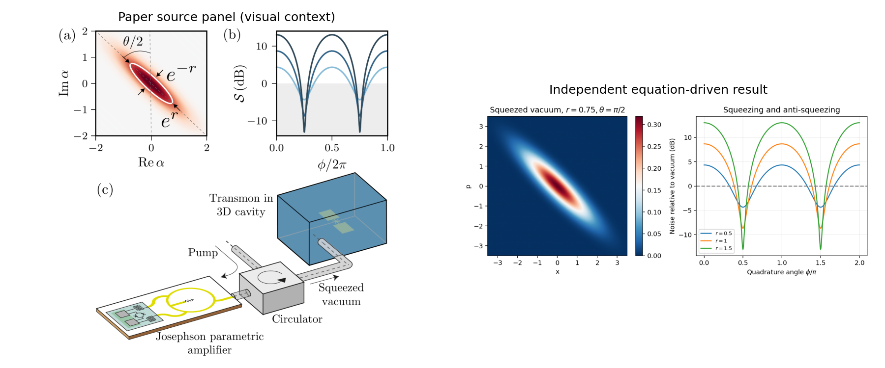

### Sec. II / Figs. 5-6: Transmon phase wavefunctions and exponential charge-dispersion suppression

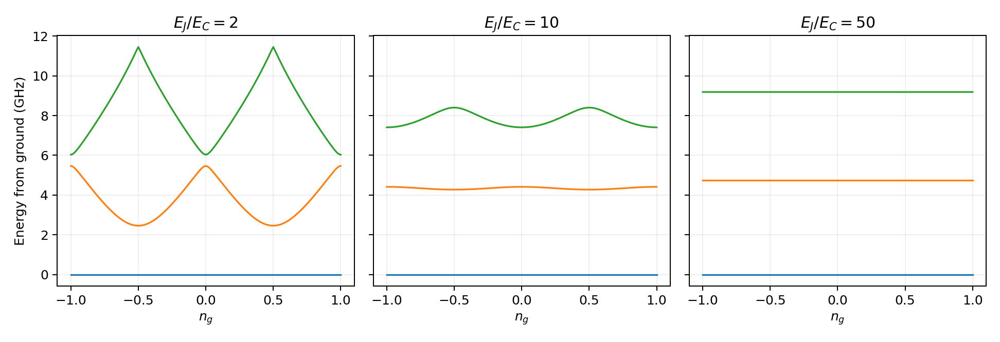

### Sec. III / Fig. 8: Jaynes-Cummings doublets with exact 2g sqrt(n) splitting


### Sec. IV / Eqs. 66-75: Hermitian bath coupling, thermal Lindblad dynamics, and passive one-port input-output response


### Sec. V / Figs. 18-19: Dispersive measurement pointer trajectories and cavity pull

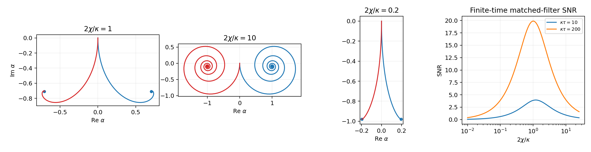

### Sec. VI / Figs. 20-26: Strong-coupling crossover, vacuum-Rabi splitting, avoided crossing, and spectroscopy


### Sec. VII / Table I and Fig. 31: DRAG control, amplitude-damping code contracts, and cat-code Wigner functions


### Sec. VIII / Figs. 32-33: Fock-superposition and squeezed-state Wigner functions

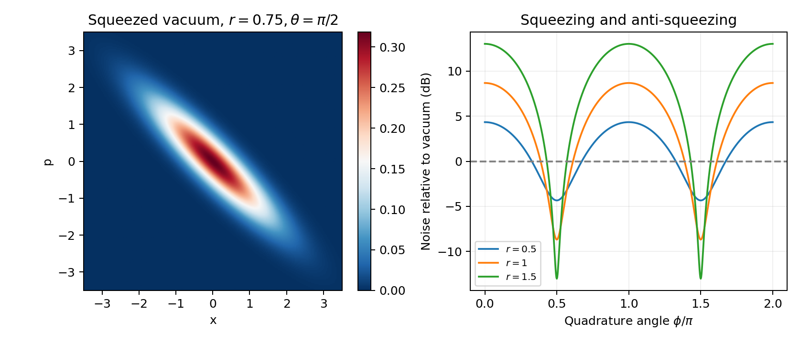

## Quick Run

```bash
python -m venv .venv
source .venv/bin/activate
pip install -r requirements.txt
cd cases/2005.12667/code
python scripts/run_reproduction.py
python scripts/run_full_rmp_reproduction.py
```

Generated files are kept under [data](outputs/data/), [figures](outputs/figures/), and [checks](outputs/checks/).

## Reproduction Boundary

This public case includes paper-derived code, generated data, generated figures, public validation checks, explanatory notes, and 17 limited comparison panels. Those panels use the minimum paper excerpts needed for validation and clearly separate the paper reference from the independent result. The case does not redistribute the paper PDF, arXiv source archive, standalone original figures, EPS paths, digitized source curves, or source-derived point sets.

Remaining limitation: Full review means all theory recoverable from public equations and parameters, not unavailable author evidence. Fig. 4(b-e) remains blocked by the missing COMSOL project; the experimental panels of Figs. 21, 28, and 32 require author-level raw data and calibration. Targets with incomplete absolute parameters are explicitly labeled paper-subset or analytic-reference rather than exact.

Final-parameter rule: final public figures use the paper parameters when feasible. Any reduced-scale, subset, proxy, or blocked target must be labeled explicitly and cannot be presented as a complete reproduction.
