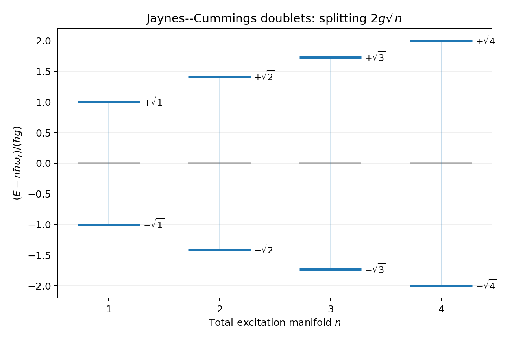
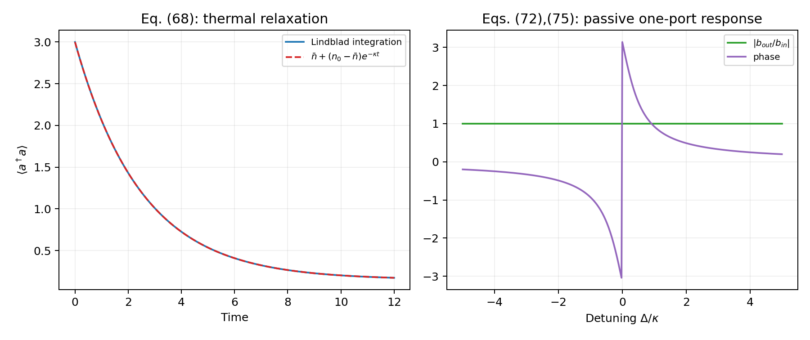
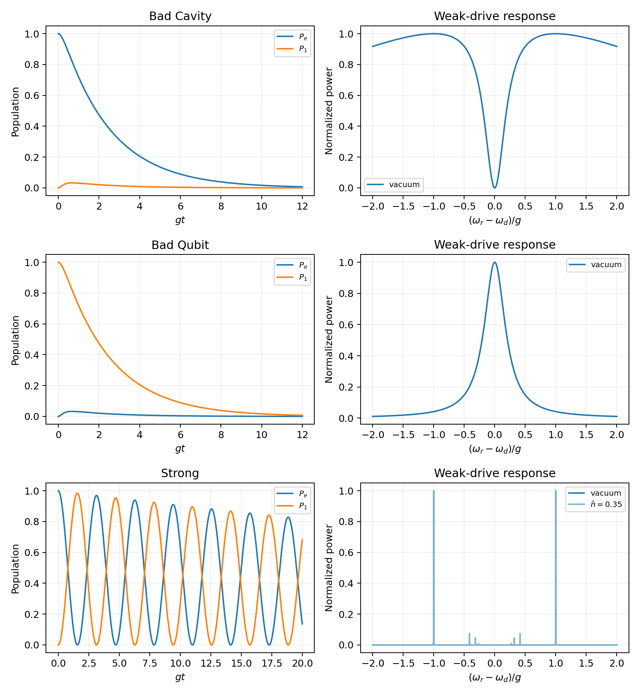
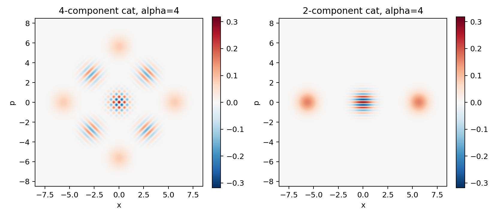

<!--
RTP 公众号发布包
主标题：我们把 164 个公式真正跑了一遍：一篇电路 QED 综述的整篇复现
备选标题 1：从电路量子化到猫态：我们复现了整篇 Circuit QED RMP
备选标题 2：论文公式能不能真的运行？我们拿电路 QED 的 164 个公式试了一次
摘要：RunThePaper 完整复现 Circuit Quantum Electrodynamics：30 个公式族、18 个数值目标、40 页中文推导，以及四处会直接影响代码实现的版本问题。
封面短句：164 个公式，真正跑一遍
建议封面图：outputs/figures/fig31_cat_code_wigner.png；主视觉保留猫态 Wigner 图，叠加标题，不使用论文原图。
-->

# 我们把 164 个公式真正跑了一遍：一篇电路 QED 综述的整篇复现

一篇综述里的公式，究竟有多少能直接变成代码？

如果把每一步近似、每一个符号约定和每一项数值检查都摊开，它们还能首尾一致吗？

这一次，RunThePaper 选了一篇几乎绕不开的电路量子电动力学综述：Blais、Grimsmo、Girvin 与 Wallraff 的 *Circuit Quantum Electrodynamics*。

我们没有只复现其中一张经典图，也没有停在“看懂了推导”。我们把范围扩展到了正文 Eq. (1)–(164)、附录 A–C，以及论文中能由公开公式和参数独立重建的全部理论数值目标。

最后得到的是：

- 30 个公式族，30 个全部通过公式门禁；
- 18 个独立数值或表格目标，18 个全部通过机器检查；
- 24 个开发期单元测试通过；
- 结构化 CSV、机器可读 JSON、18 张独立生成图；
- 一份 40 页的中文完整推导与数值报告；
- 综合审计分数 90.28/100，等级为 `numerical_feature_reproduction`。

但比“全部通过”更有价值的，是我们在真正把公式写成代码时，看见了论文阅读中很容易被忽略的四个问题。

## 这篇 RMP 为什么值得整篇复现？

电路 QED 并不是一组彼此孤立的公式。

从 LC 电路、传输线谐振器和 transmon 出发，它逐步形成 Jaynes–Cummings 模型、色散哈密顿量、开放系统、输入输出理论、量子测量、强耦合谱、微波控制、玻色编码与参量量子光学。

整篇综述实际上可以压缩成一条连续的模型链：

\[
\text{电路量子化}
\rightarrow \text{Duffing--Rabi}
\rightarrow \text{Jaynes--Cummings / 色散模型}
\rightarrow \text{开放端口与量子测量}
\rightarrow \text{控制、编码与微波量子光学}.
\]

这条链特别适合检验一种更严格的论文复现方法：不能只看最后一张图像不像，而要检查每次模型变换有没有破坏最基本的物理不变量。

我们给整个 case 固定了四条底线：

1. 哈密顿量必须厄米；
2. 封闭系统能谱必须为实数；
3. 主方程必须保迹并保持密度矩阵正性；
4. 无内部损耗的单端口散射必须满足 \(|r|=1\)。

它们既是数值验收条件，也是校勘公式版本的工具。

## 真正写成代码后，四个公式问题浮了出来

### 1. 一个负号会让谐振器能谱失去下界

arXiv v1 的 Eq. (29) 在谐振器能量前给出了负号。形式上继续推导并不困难，但在解耦极限下，它对应一个没有下界的谐振子能谱。

正式发表的 RMP 在对应 Eq. (31) 中将其改为正号。我们的实现采用正式版，并把“解耦后是否回到正能谐振子”作为独立检查，而不是默默替换公式。

### 2. Kerr 系数里多出的二分之一

arXiv v1 Eq. (51) 的自 Kerr 系数比正式版多一个 \(1/2\)。

我们没有仅凭“正式版更新了”来决定，而是从变换后的四次项重新计算组合因子，再与有限维对角化的低能谱交叉验证。结果支持正式发表版本的系数。

### 3. 浴耦合项必须先过厄米性检查

arXiv v1 Eq. (67) 的字面形式，在实耦合常数下是反厄米的。正式 RMP 的对应公式恢复为厄米形式。

这类错误人工阅读时很容易被大脑自动“修正”，但矩阵实现不会替作者补全物理。我们直接构造有限维算符，计算 \(\|H-H^\dagger\|\)，让问题以机器检查的方式暴露出来。

### 4. 输入输出公式的相位约定不能各自独立照抄

Eq. (72) 与 Eq. (75) 若按字面符号直接组合，会使无损单端口响应出现 \(|r|\neq1\)。

这不是说输入输出理论失效，而是端口场的相位约定没有被充分写明。我们固定了一套等价且自洽的约定，使被动性恢复，并把这条公式保留为 `reconstructed`，而不是伪装成无歧义的逐字复现。

这四处问题共同说明了一件事：

**公式复现不是把 LaTeX 翻译成 Python，而是让符号约定、近似条件和物理不变量在同一个系统里闭环。**

## 从 \(2g\sqrt n\) 到 thermal Lindblad：数值是否真的对得上？

第三章的 Jaynes–Cummings 模型给出了最经典的检验对象之一。

在每个守恒激发数子空间中，解析能级必须呈现 \(2g\sqrt n\) 劈裂。我们一边计算解析表达式，一边独立构造矩阵并对角化。所有激发子空间的最大残差为：

\[
5.8\times10^{-15}.
\]

这已经处在浮点机器精度范围内。

在色散区，我们又构造了四能级 transmon 与十维腔模组成的 40 维 Duffing–JC 哈密顿量。二阶色散表达式与完整对角化的最大能量差为 \(2.96\times10^{-6}\)，最小裸态重叠为 0.99298。

这一步很重要：它不只说明公式在“小参数看起来很小”时大概成立，而是直接量化了被忽略高阶项留下的误差。

第四章的开放系统检查则更严格。

thermal Lindblad 数值积分与解析平均光子数的最大偏差为 \(4.98\times10^{-11}\)。同时，密度矩阵的迹、厄米性与正性全部通过；单端口输入输出响应的被动性误差为 \(3.33\times10^{-16}\)。

换句话说，我们并不是看到一条衰减曲线“长得合理”就接受它，而是同时检查动力学和量子态空间的结构是否被数值算法保留下来。

## 整篇复现，不等于把每一张实验图都重新画一遍

从 Sec. II 到 Sec. VIII，公开代码还重算了：

- CPW 模式与 transmon 波函数；
- transmon 电荷色散的指数压低；
- 测量指针态、腔拉移与 SNR 最优条件；
- 强耦合、真空 Rabi 劈裂与避免交叉；
- 光子数分裂、非线性腔拉移与 DRAG 控制；
- 幅度阻尼码、cat code 与 Fock 叠加态；
- squeezed-state Wigner 函数与压缩分贝恒等式。

其中一些数字很有代表性：

- 当 \(E_J/E_C\) 从 2 增加到 50，transmon 电荷色散压低比达到 \(3.30\times10^{-6}\)；
- 真空 Rabi 谱在共振处给出严格的 \(2g\) 劈裂；
- DRAG 在短门区间将中位误差改善 3.83 倍；
- binomial code 的一阶光子损失条件达到 \(10^{-15}\) 量级；
- squeezed-state 的压缩 dB 恒等式误差为 \(1.78\times10^{-15}\) dB。

不过，“整篇复现”在这里有一个明确边界：它指的是能由公开公式和参数独立重建的理论内容。

Fig. 4(b–e) 的场模需要原始 COMSOL 几何、材料栈和边界条件；Figs. 21、28、32 的实验部分需要作者级原始数据与校准链。我们重算了相应理论或 simulation panel，但没有把它们包装成“实验数据复现”。

这一边界不是附注，而是复现结果的一部分。

## 90.28 分，究竟是什么意思？

RTP 的 90.28 分不是“图片像素相似度 90.28%”。

它描述的是证据强度：公式是否通过门禁，数值是否有结构化数据，物理不变量是否通过，参数是否来自论文，以及一个目标究竟是 paper-exact、paper-subset，还是只验证了解析特征。

18 个计分目标中：

- 9 个使用论文完整参数；
- 5 个使用论文可恢复的参数子集；
- 4 个属于没有绝对绘图参数的解析目标。

所有目标的数据支撑率和产物通过率都是 100%。总分没有到 100，不是因为已有物理检查失败，而是因为缺失的实验数据、校准参数和 FEM 工程不能被代码凭空制造。

这也是 RunThePaper 想坚持的复现标准：

**能精确的地方精确，只有特征级证据的地方就明确写特征级，缺数据的地方保留 blocker。**

## 一份复现 case，应该让读者拿到什么？

这次公开的不只是结论。

RTP case 中包括：

- 从 Eq. (1) 到 Eq. (164)、附录 A–C 的逐步推导；
- 两个可以直接运行的数值入口；
- 每张生成图对应的 CSV；
- 公式、章节和全篇目标的 JSON 检查；
- 公开参数配置；
- 40 页中文 PDF；
- 对无法完成部分的明确说明。

读者可以只看中文报告，也可以沿着“公式卡 → 代码函数 → CSV → 图 → JSON 检查”的路径逐层审计。

完整公开 case：

https://github.com/xi-zhao/runthepaper/tree/main/cases/2005.12667

40 页中文 PDF：

https://github.com/xi-zhao/runthepaper/blob/main/cases/2005.12667/note/reproduction-note.zh-CN.pdf

论文：

- arXiv: https://arxiv.org/abs/2005.12667
- RMP: https://doi.org/10.1103/RevModPhys.93.025005

如果你正在学习 circuit QED，可以把它当成一份带数值检查的公式地图；如果你正在做科研 Agent，也可以把它当成一个更具体的问题：

**一个 Agent 什么时候才算真正“读懂并复现”了一篇论文？**

我们的答案是：当它不仅能解释公式，还能让公式运行、接受检查，并诚实地说出自己缺少什么。

— RunThePaper
