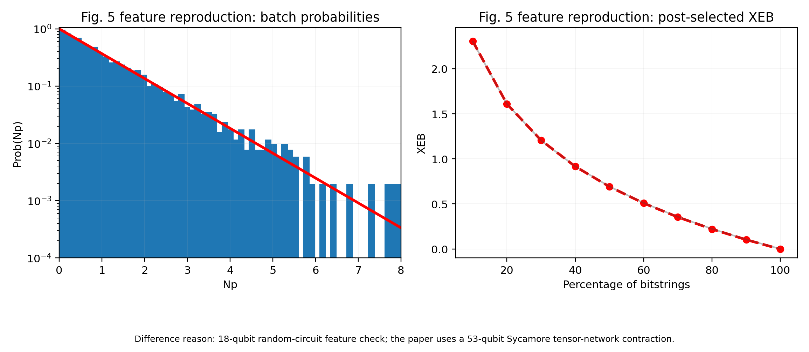
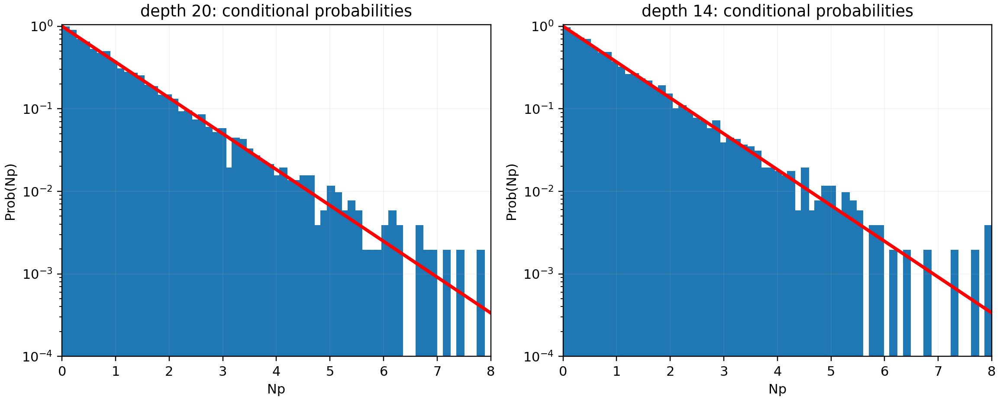
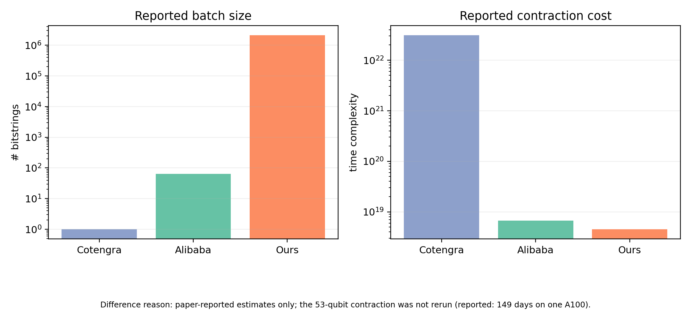

# 2103.03074: Simulating the Sycamore quantum supremacy circuits

Paper: [Simulating the Sycamore quantum supremacy circuits](https://arxiv.org/abs/2103.03074)

Public status: **Reduced-scale feature reproduction** · Audit score: **70.00/100**

Reproduces batch-probability, post-selection XEB, conditional-probability, and complexity-table features.

## Start Here / 从这里开始

- [中文复现 Note](note/reproduction-note.zh-CN.md)
- [English reproduction note](note/reproduction-note.en.md)
- [Code and run commands](code/README.md)
- [Machine-readable scorecard](outputs/checks/similarity_scorecard.json)
- [Numerical methods](docs/NUMERICAL_METHODS.md)
- [Lessons learned](docs/LESSONS_LEARNED.md)

## Quick Run

```bash
python -m venv .venv
source .venv/bin/activate
pip install -r requirements.txt
cd cases/2103.03074/code
python scripts/run_reproduction.py
python scripts/plot_reproduction.py
```

Generated files are kept under [data](outputs/data/), [figures](outputs/figures/), and [checks](outputs/checks/).

## Reproduction Boundary

This public case includes paper-derived code, generated data, generated figures, public validation checks, and explanatory notes. It does not redistribute the paper PDF, arXiv source archive, original figures, EPS paths, digitized source curves, source-derived point sets, or source-vs-generated composite panels.

Remaining limitation: Exact 53-qubit tensor contractions and paper-scale amplitude recomputation require external compute.

Final-parameter rule: final public figures use the paper parameters when feasible. Any reduced-scale, subset, proxy, or blocked target must be labeled explicitly and cannot be presented as a complete reproduction.

## Generated Figures







