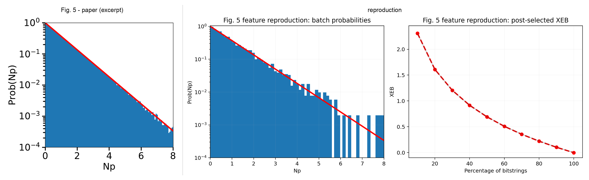
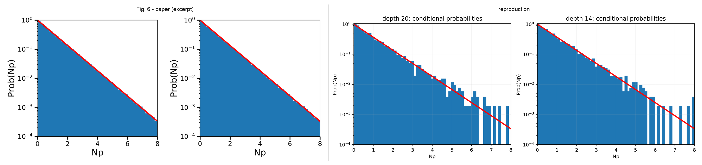

# 2103.03074: Simulating the Sycamore quantum supremacy circuits

Preprint: [arXiv:2103.03074 — Simulating the Sycamore quantum supremacy circuits](https://arxiv.org/abs/2103.03074)

Published as: [Simulation of Quantum Circuits Using the Big-Batch Tensor Network Method](https://doi.org/10.1103/PhysRevLett.128.030501)

Formal citation: Physical Review Letters 128, 030501 (2022) · DOI `10.1103/PhysRevLett.128.030501` · Locator `030501`

Public status: **Compute-bounded feature reproduction** · Audit score: **70.00/100**

Reproduces batch-probability, post-selection XEB, conditional-probability, and complexity-table features.

## Start Here / 从这里开始

- [中文复现 Note](note/reproduction-note.zh-CN.md)
- [English reproduction note](note/reproduction-note.en.md)
- [Code and run commands](code/README.md)
- [Machine-readable scorecard](outputs/checks/similarity_scorecard.json)
- [Machine-readable completion boundary](outputs/checks/completion_assessment.json)
- [Derivation (equations)](docs/DERIVATION.md)
- [Numerical methods](docs/NUMERICAL_METHODS.md)
- [Lessons learned](docs/LESSONS_LEARNED.md)

## Paper Reference vs Independent Reproduction

The left column in each panel is a limited excerpt from Pan and Zhang, [Physical Review Letters 128, 030501 (2022)](https://doi.org/10.1103/PhysRevLett.128.030501); the right column is generated independently from this case. These comparisons validate physical structure and key numerical features, not author-data-level or point-for-point equivalence.

### Fig. 2 comparison


### Fig. 5 comparison



### Fig. 6 comparison



## Quick Run

```bash
python -m venv .venv
source .venv/bin/activate
pip install -r requirements.txt
cd cases/2103.03074/code
python scripts/run_reproduction.py
python scripts/plot_reproduction.py
```

Generated files are kept under [data](outputs/data/), [figures](outputs/figures/), and [checks](outputs/checks/).

## Reproduction Boundary

This public case includes paper-derived code, generated data, generated figures, public validation checks, explanatory notes, and 3 limited comparison panels. Those panels use the minimum paper excerpts needed for validation and clearly separate the paper reference from the independent result. The case does not redistribute the paper PDF, arXiv source archive, standalone original figures, EPS paths, digitized source curves, or source-derived point sets.

Remaining limitation: The exact 53-qubit contraction is not launched: the paper reports 4.51e18 head-contraction operations and 149 days on one A100, while a direct complex128 statevector would require 128 PiB. The public case also lacks the original circuit, contraction path, slicing configuration, and validation-amplitude bundle.

Final-parameter rule: final public figures use the paper parameters when feasible. Any reduced-scale, subset, proxy, or blocked target must be labeled explicitly and cannot be presented as a complete reproduction.

## Generated Figures


