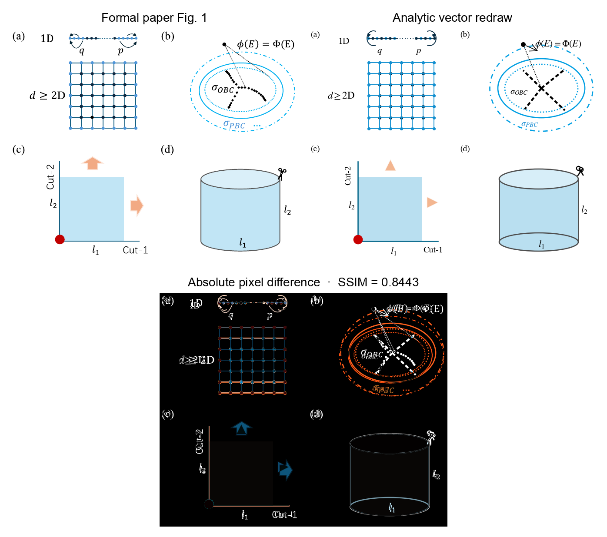
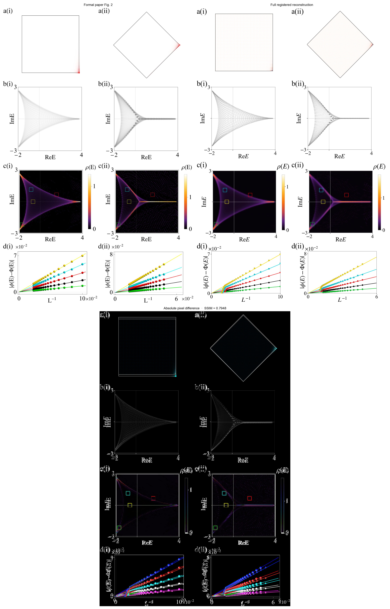
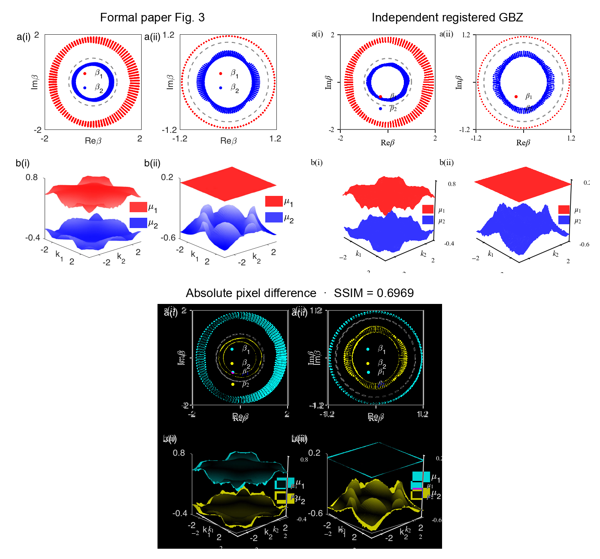
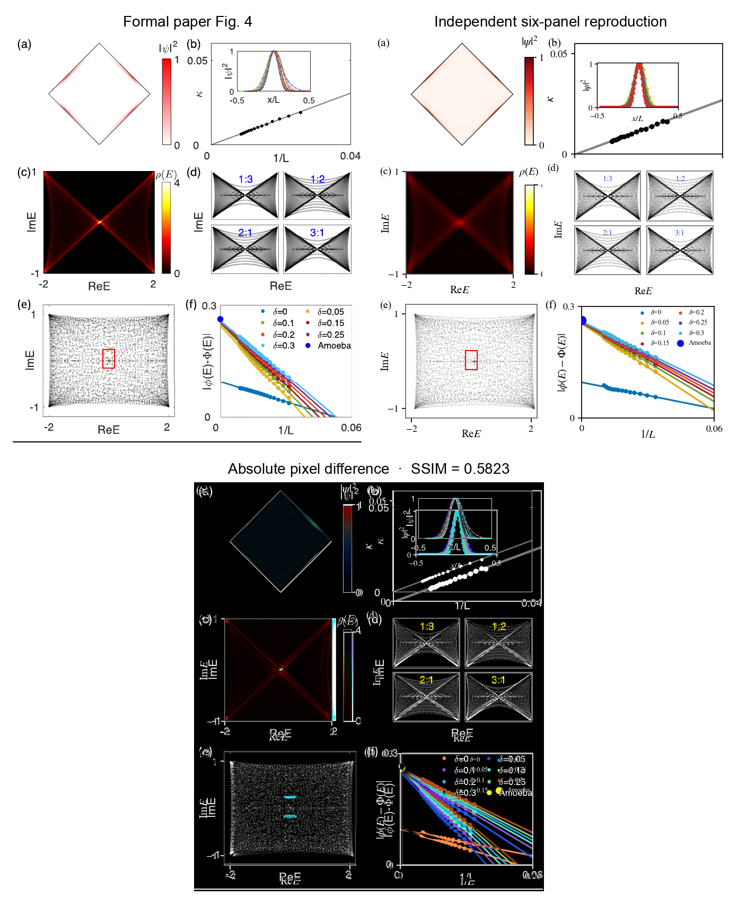
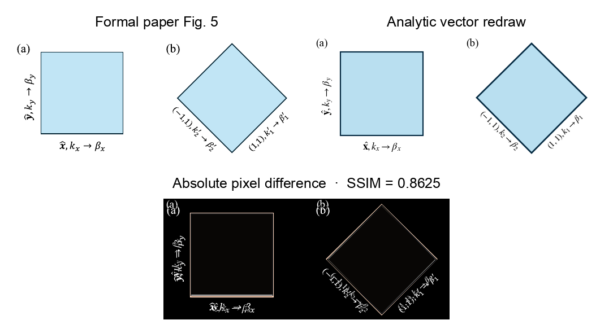
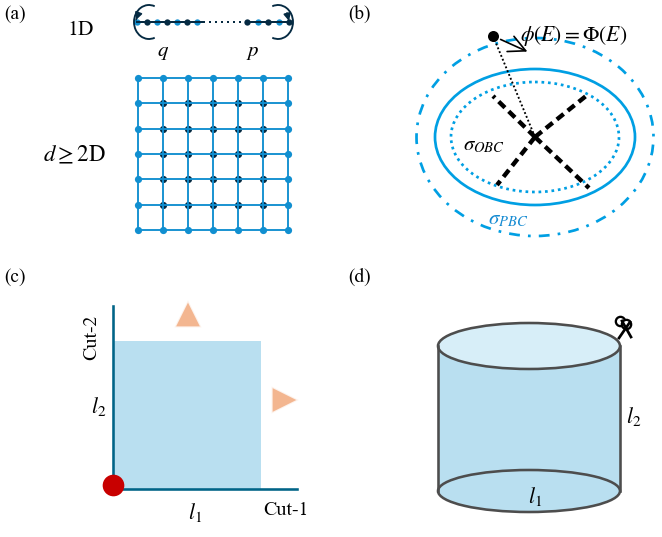
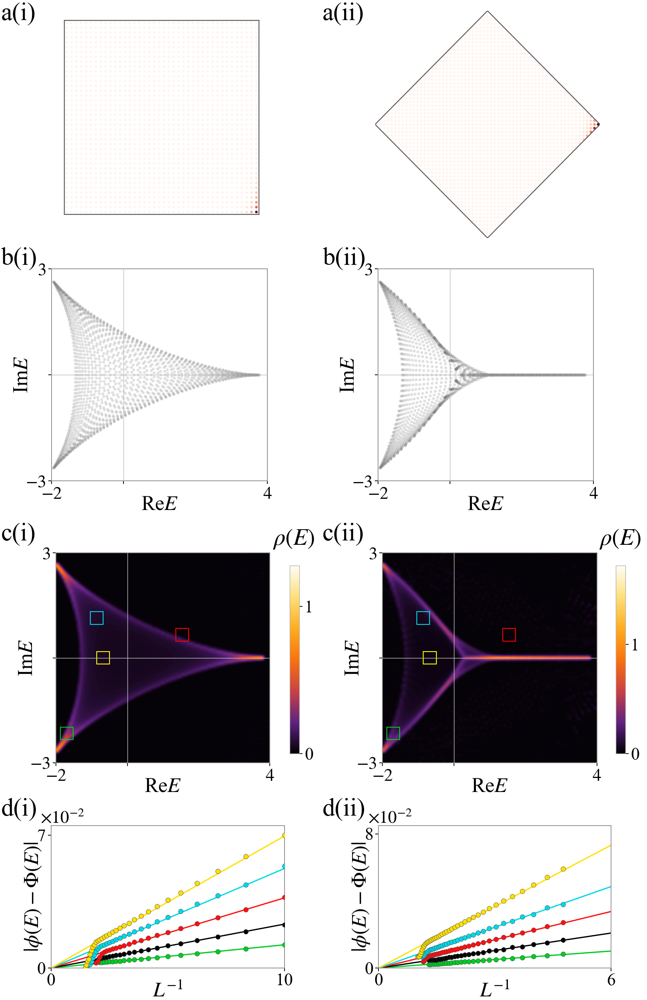
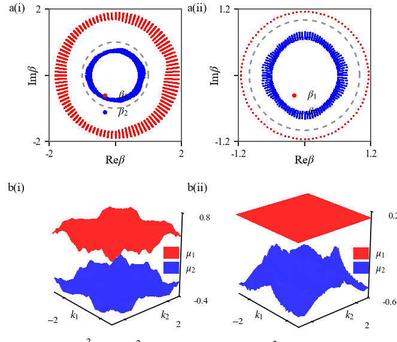
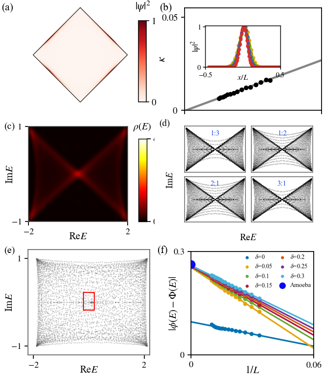
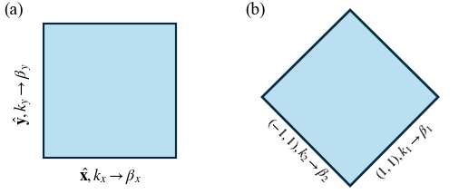

# 2407.01296: Geometry-adaptive formulation of non-Bloch bands in arbitrary dimensions and spectral instability

Preprint: [arXiv:2407.01296 — Non-Hermitian skin effect in arbitrary dimensions: non-Bloch band theory and classification](https://arxiv.org/abs/2407.01296)

Published as: [Geometry-adaptive formulation of non-Bloch bands in arbitrary dimensions and spectral instability](https://doi.org/10.1038/s42005-026-02546-2)

Formal citation: Communications Physics 9, 127 (2026) · DOI `10.1038/s42005-026-02546-2` · Locator `Article 127`

Public status: **Main-text scientific reproduction; pixel-registered, not identical** · Audit score: **88.39/100**

Completes the main-text scientific evidence chain for Figs. 1-5. Figs. 2(a-c), 3, and 4(a-f) are independently recomputed; Fig. 2(d) is author-data-assisted; Figs. 1 and 5 are analytic redraws. Every formal canvas is registered, while strict SSIM 0.95 pixel identity is explicitly not claimed.

## Start Here / 从这里开始

- [中文复现 Note](note/reproduction-note.zh-CN.md)
- [English reproduction note](note/reproduction-note.en.md)
- [Code and run commands](code/README.md)
- [Machine-readable scorecard](outputs/checks/similarity_scorecard.json)
- [Machine-readable completion boundary](outputs/checks/completion_assessment.json)
- [Numerical methods](docs/NUMERICAL_METHODS.md)
- [Lessons learned](docs/LESSONS_LEARNED.md)

## Main Reproduced Results

| Paper item | Reproduced result | Figure | Check |
| --- | --- | --- | --- |
| Fig. 1 | Analytic geometry-adaptive spectral-potential schematic | [PNG](outputs/figures/fig1_pixel_registered.png) | [JSON](outputs/checks/main_schematic_pixel_similarity.json) |
| Fig. 2 | Geometry-dependent spectra, skin density, potential, and finite-size convergence | [PNG](outputs/figures/fig2_full_pixel_registered.png) | [JSON](outputs/checks/fig2_full_pixel_similarity.json) |
| Fig. 3 | Geometry-dependent generalized Brillouin zones with corrected projection and view | [PNG](outputs/figures/fig3_gbz_pixel_registered.png) | [JSON](outputs/checks/fig3_gbz_pixel_similarity.json) |
| Fig. 4(a-f) | Critical boundary modes and spectral instability across all six panels | [PNG](outputs/figures/fig4_full_pixel_registered.png) | [JSON](outputs/checks/fig4_full_pixel_similarity.json) |
| Fig. 5 | Analytic basis-transformation schematic | [PNG](outputs/figures/fig5_pixel_registered.png) | [JSON](outputs/checks/main_schematic_pixel_similarity.json) |

## Paper Reference vs Independent Reproduction

Each board contains a limited attributed excerpt from the formal paper beside the independently generated registered result. The excerpts are used only for presentation audit; no reference pixels enter numerical computation. The boards demonstrate remaining differences and do not assert pixel identity.

### Fig. 1 comparison



### Fig. 2 comparison



### Fig. 3 comparison



### Fig. 4 comparison



### Fig. 5 comparison



### Fig. 1: Analytic geometry-adaptive spectral-potential schematic



### Fig. 2: Geometry-dependent spectra, skin density, potential, and finite-size convergence



### Fig. 3: Geometry-dependent generalized Brillouin zones with corrected projection and view



### Fig. 4(a-f): Critical boundary modes and spectral instability across all six panels



### Fig. 5: Analytic basis-transformation schematic



## Quick Run

```bash
python -m venv .venv
source .venv/bin/activate
pip install -r requirements.txt
cd cases/2407.01296/code
python scripts/run_reproduction_smoke.py
```

Generated files are kept under [data](outputs/data/), [figures](outputs/figures/), and [checks](outputs/checks/).

## Reproduction Boundary

This public case includes paper-derived code, generated data, generated figures, public validation checks, explanatory notes, and 5 limited comparison panels. Those panels use the minimum paper excerpts needed for validation and clearly separate the paper reference from the independent result. The case does not redistribute the paper PDF, arXiv source archive, standalone original figures, EPS paths, digitized source curves, or source-derived point sets.

Remaining limitation: Supplementary Figs. S2 and S4-S7 are not independently complete. Fig. 2(d) uses author-released ED tables, and unreported state selection, integer boundary vertices, random seeds, probe grids, three-dimensional projection, and renderer details limit pixel identity in Fig. 3 and several Fig. 4 panels.

Final-parameter rule: final public figures use the paper parameters when feasible. Any reduced-scale, subset, proxy, or blocked target must be labeled explicitly and cannot be presented as a complete reproduction.
