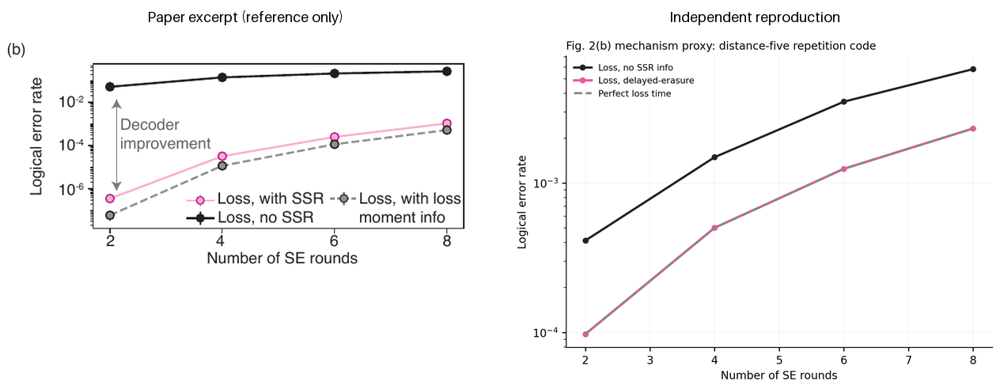
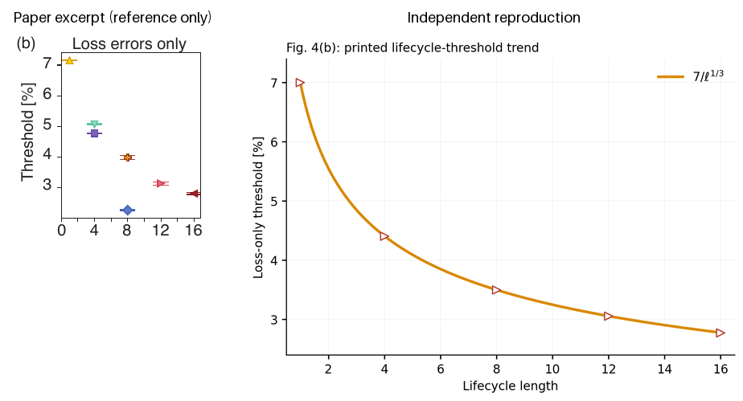
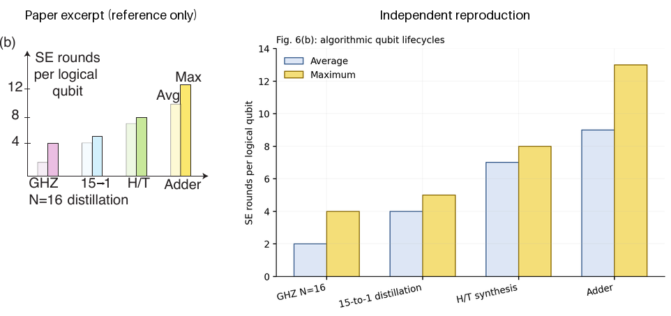
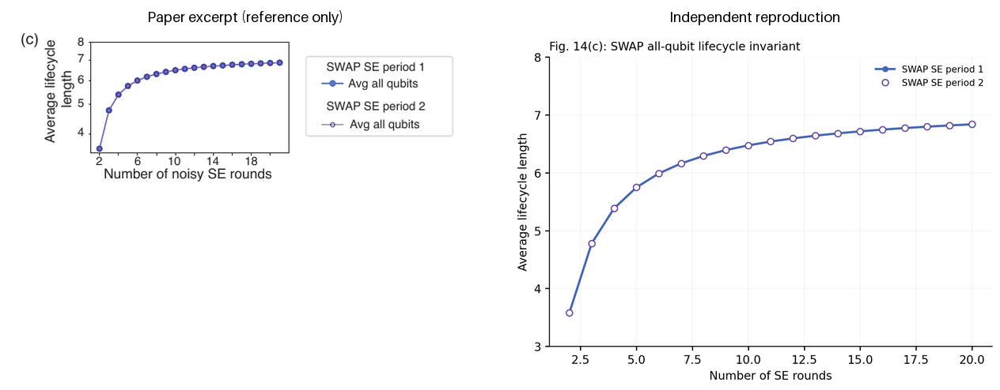
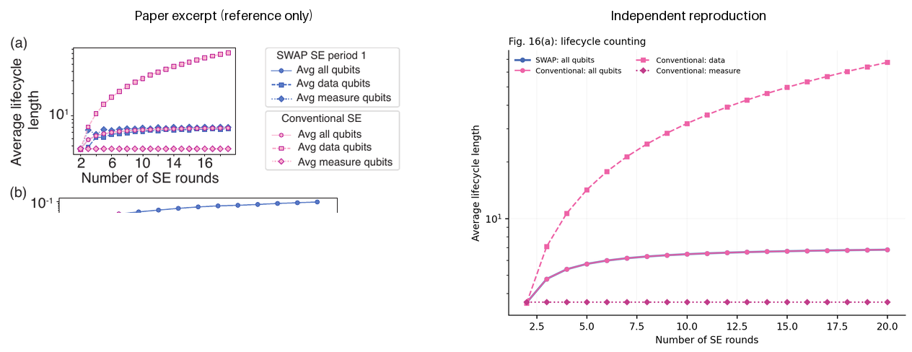
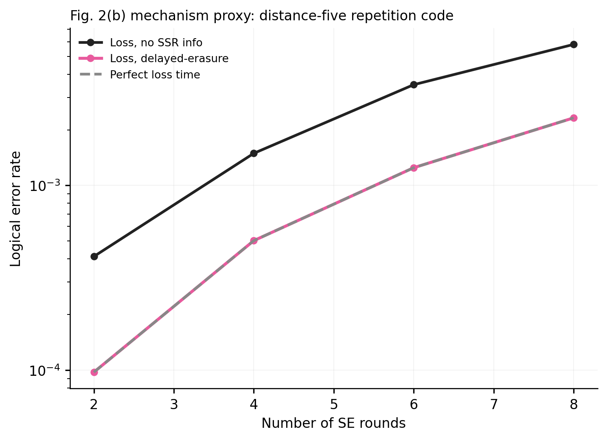
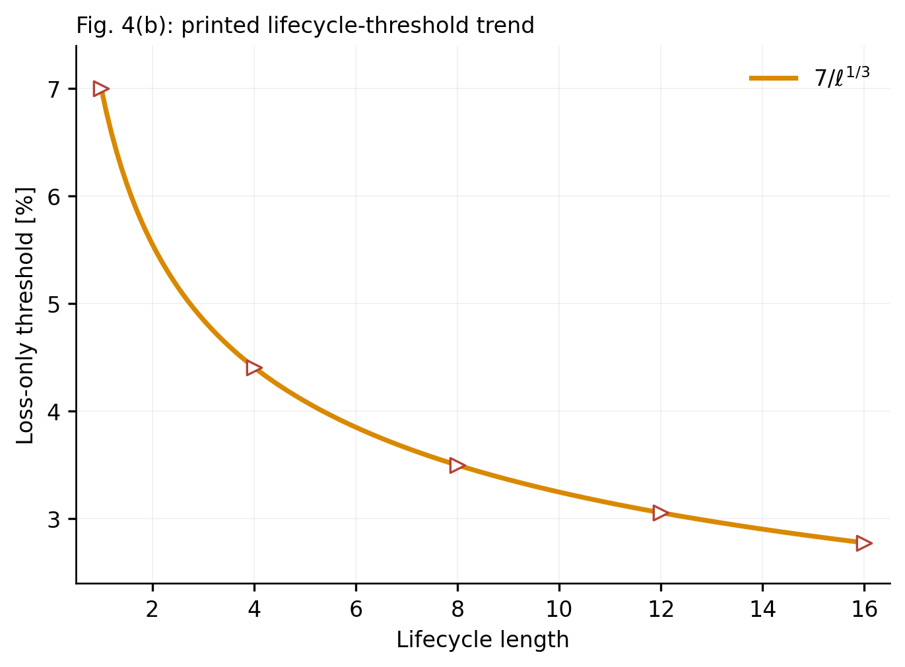
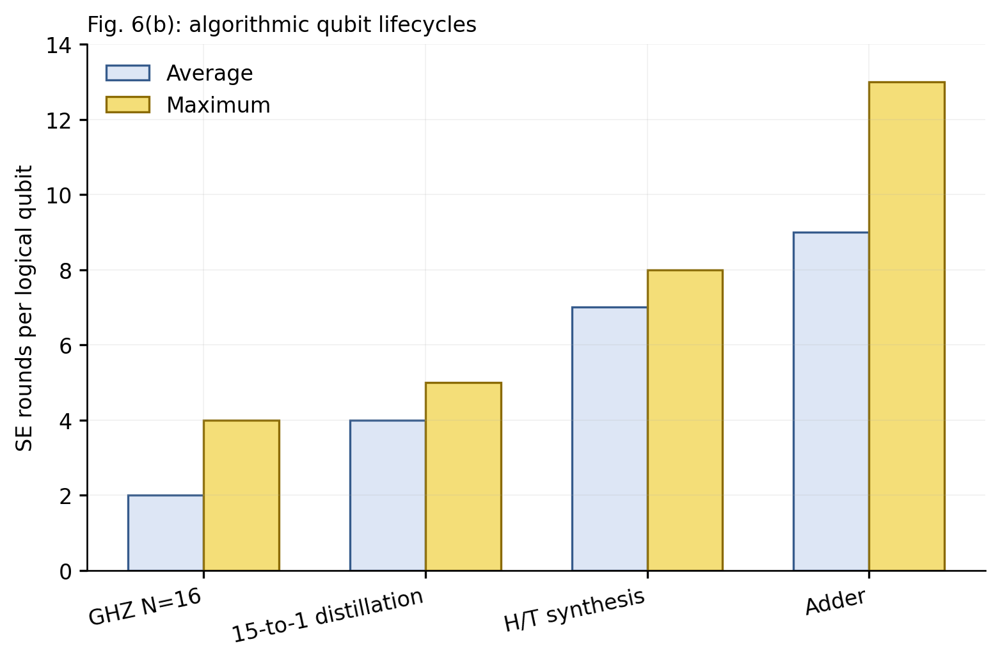
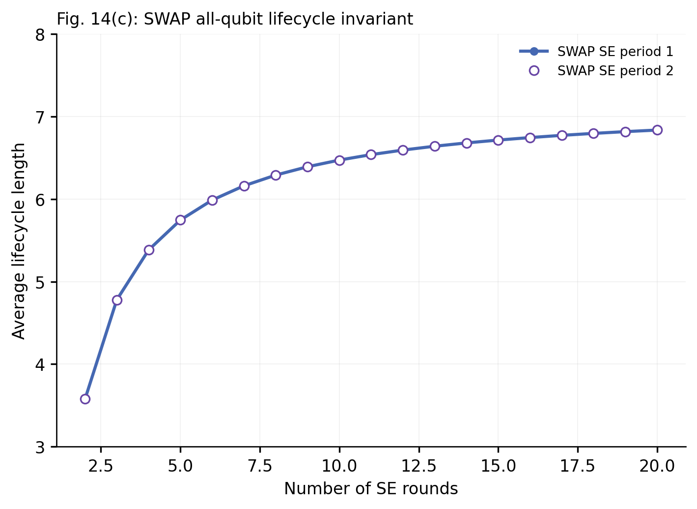
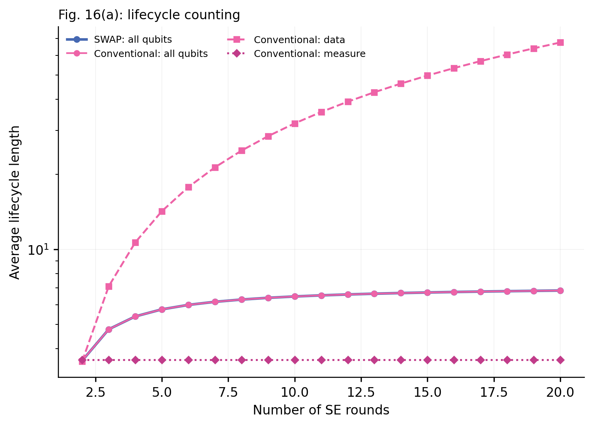

# 2502.20558: Leveraging Qubit Loss Detection in Fault-Tolerant Quantum Algorithms

Preprint: [arXiv:2502.20558 — Leveraging Qubit Loss Detection in Fault-Tolerant Quantum Algorithms](https://arxiv.org/abs/2502.20558)

Published as: [Leveraging Qubit Loss Detection in Fault-Tolerant Quantum Algorithms](https://doi.org/10.1103/ycwc-3myc)

Formal citation: Physical Review X 16, 011002 (2026) · DOI `10.1103/ycwc-3myc` · Locator `011002`

Public status: **Mixed analytic and mechanism feature reproduction** · Audit score: **74.22/100**

Independently generates five figure targets and the analytic rows of Table I. The printed Fig. 4(b) lifecycle-threshold relation, the complete Fig. 6(b) lifecycle bar panel, and Table-I lifecycle/overhead rows are paper-exact targets; Figs. 2(b), 14(c), and 16(a) remain explicitly labeled mechanism or paper-subset reproductions.

## Start Here / 从这里开始

- [中文复现 Note](note/reproduction-note.zh-CN.md)
- [English reproduction note](note/reproduction-note.en.md)
- [Table I analytic rows (CSV)](outputs/data/table_i_analytic_rows.csv)
- [Code and run commands](code/README.md)
- [Machine-readable scorecard](outputs/checks/similarity_scorecard.json)
- [Derivation (equations)](docs/DERIVATION.md)
- [Numerical methods](docs/NUMERICAL_METHODS.md)
- [Lessons learned](docs/LESSONS_LEARNED.md)

## Main Reproduced Results

| Paper item | Reproduced result | Figure | Check |
| --- | --- | --- | --- |
| Fig. 2(b) | Delayed-erasure information advantage in a clearly labeled distance-five proxy | [PNG](outputs/figures/fig2b_proxy.png) | [JSON](outputs/checks/fig2b_proxy.json) |
| Fig. 4(b) | Paper-exact printed lifecycle-threshold relation; finite-size markers excluded | [PNG](outputs/figures/fig4b_lifecycle_threshold.png) | [JSON](outputs/checks/fig4b_lifecycle_threshold.json) |
| Fig. 6(b) | Complete paper-exact algorithm lifecycle bar panel | [PNG](outputs/figures/fig6b_algorithm_lifecycles.png) | [JSON](outputs/checks/fig6b_algorithm_lifecycles.json) |
| Fig. 14(c) | Paper-subset SWAP all-qubit lifecycle invariant | [PNG](outputs/figures/fig14c_swap_lifecycles.png) | [JSON](outputs/checks/fig14c_swap_lifecycles.json) |
| Fig. 16(a) | Conventional role split and all-qubit lifecycle invariant | [PNG](outputs/figures/fig16a_lifecycle_comparison.png) | [JSON](outputs/checks/fig16a_lifecycle_comparison.json) |

## Paper Reference vs Independent Reproduction

Each left panel is a limited excerpt from Baranes et al., Physical Review X 16, 011002 (2026); each right panel is generated independently. These boards validate structure and declared features only. In particular, the Fig. 2(b) right panel is a repetition-code mechanism proxy and does not claim author-data-level, surface-code, or point-for-point equivalence.

### Fig. 2(b) comparison



### Fig. 4(b) comparison



### Fig. 6(b) comparison



### Fig. 14(c) comparison



### Fig. 16(a) comparison



### Fig. 2(b): Delayed-erasure information advantage in a clearly labeled distance-five proxy



### Fig. 4(b): Paper-exact printed lifecycle-threshold relation; finite-size markers excluded



### Fig. 6(b): Complete paper-exact algorithm lifecycle bar panel



### Fig. 14(c): Paper-subset SWAP all-qubit lifecycle invariant



### Fig. 16(a): Conventional role split and all-qubit lifecycle invariant



## Quick Run

```bash
python -m venv .venv
source .venv/bin/activate
pip install -r requirements.txt
cd cases/2502.20558/code
python scripts/run_reproduction.py
```

Generated files are kept under [data](outputs/data/), [figures](outputs/figures/), and [checks](outputs/checks/).

## Reproduction Boundary

This public case includes paper-derived code, generated data, generated figures, public validation checks, explanatory notes, and 5 limited comparison panels. Those panels use the minimum paper excerpts needed for validation and clearly separate the paper reference from the independent result. The case does not redistribute the paper PDF, arXiv source archive, standalone original figures, EPS paths, digitized source curves, or source-derived point sets.

Remaining limitation: The released materials contain vector figures but no surface-code circuit generator, correlated MLE implementation, raw samples, shots, seeds, complete grids, or fit windows. Fig. 2(b) is therefore a repetition-code information-mechanism proxy rather than an absolute surface-code result, and 19 numeric panel/table groups remain deferred.

Final-parameter rule: final public figures use the paper parameters when feasible. Any reduced-scale, subset, proxy, or blocked target must be labeled explicitly and cannot be presented as a complete reproduction.
