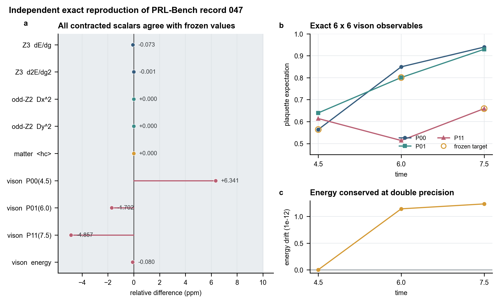

# 2503.20566: Accurate Gauge-Invariant Tensor Network Simulations for Abelian Lattice Gauge Theory in (2+1)D: ground state and real-time dynamics

Preprint: [arXiv:2503.20566 — Accurate Gauge-Invariant Tensor Network Simulations for Abelian Lattice Gauge Theory in (2+1)D: ground state and real-time dynamics](https://arxiv.org/abs/2503.20566)

Published as: [Accurate Gauge-Invariant Tensor Network Simulations for Abelian Lattice Gauge Theory in (2+1)D: Ground State and Real-Time Dynamics](https://doi.org/10.1103/3m3j-ds18)

Formal citation: Physical Review Letters 135, 130401 (2025) · DOI `10.1103/3m3j-ds18` · Locator `130401`

Public status: **Complete PRL-Bench target reproduction; partial paper coverage** · Audit score: **100.00/100**

Independently reproduces all four frozen benchmark targets using exact gauge-invariant bases for odd Z2, pure Z2, Z2 matter, and Z3 dynamics. The generated comparison consolidates the A100 numerical evidence and analytic checks.

## Start Here / 从这里开始

- [中文复现 Note](note/reproduction-note.zh-CN.md)
- [English reproduction note](note/reproduction-note.en.md)
- [Formula verification](docs/FORMULA_VERIFICATION.md)
- [Benchmark gold audit](docs/GOLD_AUDIT.md)
- [Source identity audit](docs/SOURCE_AUDIT.md)
- [Code and run commands](code/README.md)
- [Machine-readable scorecard](outputs/checks/similarity_scorecard.json)
- [Derivation (equations)](docs/DERIVATION.md)
- [Numerical methods](docs/NUMERICAL_METHODS.md)
- [Lessons learned](docs/LESSONS_LEARNED.md)

## Main Reproduced Results

| Paper item | Reproduced result | Figure | Check |
| --- | --- | --- | --- |
| PRL-Bench idx 47 Tasks 1-4 | Odd-Z2, pure-Z2, Z2-matter, and Z3 benchmark comparison | [PNG](outputs/figures/idx47_benchmark_comparison.png) | [JSON](outputs/checks/similarity_scorecard.json) |

### PRL-Bench idx 47 Tasks 1-4: Odd-Z2, pure-Z2, Z2-matter, and Z3 benchmark comparison



## Quick Run

```bash
python -m venv .venv
source .venv/bin/activate
pip install -r requirements.txt
pip install cupy-cuda12x
cd cases/2503.20566/code
python scripts/render_idx47_benchmark_comparison.py
```

### Full paper-scale rerun

The full benchmark rerun requires an NVIDIA CUDA GPU and a compatible CuPy installation. The four numerical scripts checkpoint their JSON outputs before the summary render.

```bash
cd cases/2503.20566/code
python scripts/run_odd_z2_vbs_a100.py
python scripts/run_z2_vison_a100.py
python scripts/run_z2_matter_bulk_a100.py
python scripts/run_z3_derivatives_a100.py
python scripts/render_idx47_benchmark_comparison.py
```

Generated files are kept under [data](outputs/data/), [figures](outputs/figures/), and [checks](outputs/checks/).

## Reproduction Boundary

This public case includes paper-derived code, generated data, generated figures, public validation checks, and explanatory notes. It does not redistribute the paper PDF, arXiv source archive, original figures, EPS paths, digitized source curves, source-derived point sets, or source-vs-generated composite panels.

Remaining limitation: The four benchmark targets are complete, but the source paper's wider tensor-network figure set is not fully reproduced. Full numerical reruns require CUDA and CuPy; the default public command regenerates the summary figure from included data.

Final-parameter rule: final public figures use the paper parameters when feasible. Any reduced-scale, subset, proxy, or blocked target must be labeled explicitly and cannot be presented as a complete reproduction.
