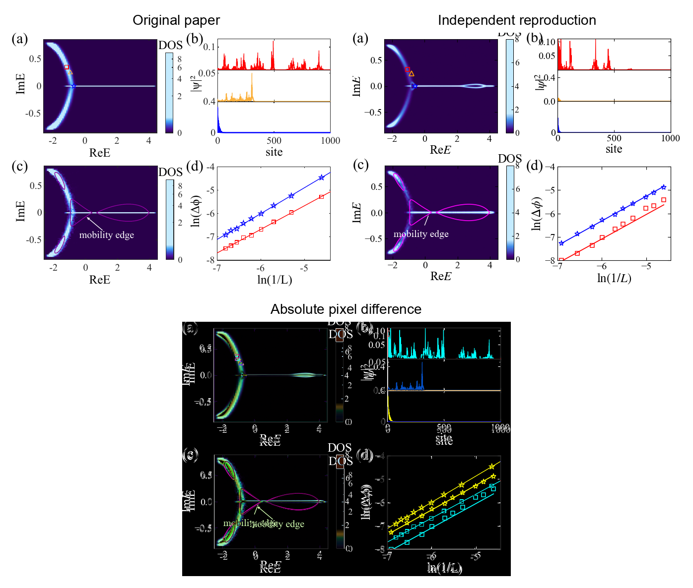
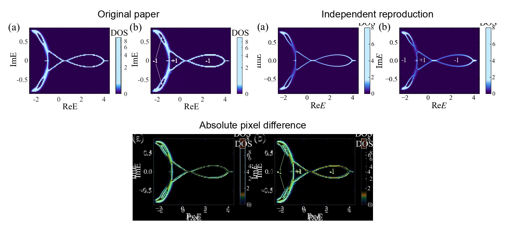
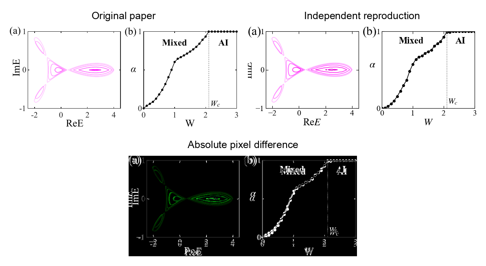
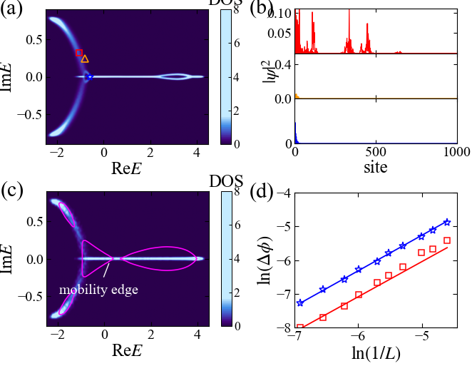
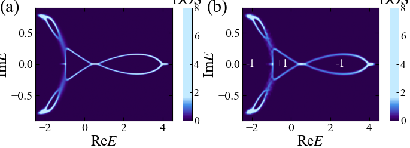
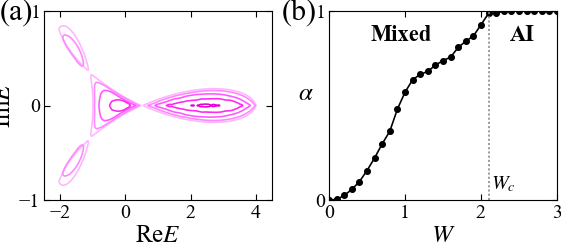

# 2507.09447: Lyapunov formulation of band theory for disordered non-Hermitian systems

Preprint: [arXiv:2507.09447 — Lyapunov formulation of band theory for disordered non-Hermitian systems](https://arxiv.org/abs/2507.09447)

Published as: [Universal Thouless relations for disordered non–Hermitian systems in one dimension](https://doi.org/10.1016/j.scib.2026.05.055)

Formal citation: Science Bulletin (2026), online ahead of print · DOI `10.1016/j.scib.2026.05.055` · Locator `PII S2095-9273(26)00583-9`

Public status: **Paper-scale feature reproduction** · Audit score: **89.00/100**

Reproduces Figs. 3–5 with an L=1000, 3200-realization spectral ensemble, Lyapunov grids, state profiles, winding sectors, and the W_c=2.1 transition.

## Start Here / 从这里开始

- [中文复现 Note](note/reproduction-note.zh-CN.md)
- [English reproduction note](note/reproduction-note.en.md)
- [Code and run commands](code/README.md)
- [Machine-readable scorecard](outputs/checks/similarity_scorecard.json)
- [Machine-readable completion boundary](outputs/checks/completion_assessment.json)
- [中文复现 Note PDF](note/reproduction-note.zh-CN.pdf)
- [Derivation (equations)](docs/DERIVATION.md)
- [Numerical methods](docs/NUMERICAL_METHODS.md)
- [Lessons learned](docs/LESSONS_LEARNED.md)

## Main Reproduced Results

| Paper item | Reproduced result | Figure | Check |
| --- | --- | --- | --- |
| Fig. 3 | OBC spectral density, state profiles, mobility edge, and scaling | [PNG](outputs/figures/fig3_paper_exact.png) | [JSON](outputs/checks/paper_scientific_similarity.json) |
| Fig. 4 | PBC spectral density and winding sectors | [PNG](outputs/figures/fig4_paper_exact.png) | [JSON](outputs/checks/paper_scientific_similarity.json) |
| Fig. 5 | Mobility-contour shrinkage and the skin–Anderson transition | [PNG](outputs/figures/fig5_paper_exact.png) | [JSON](outputs/checks/paper_scientific_similarity.json) |

## Paper Reference vs Independent Reproduction

The left column in each panel is a limited excerpt from Sun and Hu, [Science Bulletin (2026), online ahead of print](https://doi.org/10.1016/j.scib.2026.05.055); the right column is generated independently from this case. These comparisons validate physical structure and key numerical features, not author-data-level or point-for-point equivalence.

### Fig. 3 comparison



### Fig. 4 comparison



### Fig. 5 comparison



### Fig. 3: OBC spectral density, state profiles, mobility edge, and scaling



### Fig. 4: PBC spectral density and winding sectors



### Fig. 5: Mobility-contour shrinkage and the skin–Anderson transition



## Quick Run

```bash
python -m venv .venv
source .venv/bin/activate
pip install -r requirements.txt
cd cases/2507.09447/code
python scripts/plot_paper_exact.py
python scripts/qa_paper_exact.py
```

### Full paper-scale rerun

The full L=1000, 3200-realization rerun is resumable but computationally expensive; the quick commands regenerate figures and scientific checks from the published generated data.

```bash
cd cases/2507.09447/code
python scripts/run_paper_exact.py
```

Generated files are kept under [data](outputs/data/), [figures](outputs/figures/), and [checks](outputs/checks/).

## Reproduction Boundary

This public case includes paper-derived code, generated data, generated figures, public validation checks, explanatory notes, and 3 limited comparison panels. Those panels use the minimum paper excerpts needed for validation and clearly separate the paper reference from the independent result. The case does not redistribute the paper PDF, arXiv source archive, standalone original figures, EPS paths, digitized source curves, or source-derived point sets.

Remaining limitation: Author seeds, state-selection windows, transfer/grid details, and final artwork are unavailable; all scientific gates pass, but source-pixel identity is not claimed. This is an author-protocol boundary, not a compute boundary, so no further large campaign is scheduled.

Final-parameter rule: final public figures use the paper parameters when feasible. Any reduced-scale, subset, proxy, or blocked target must be labeled explicitly and cannot be presented as a complete reproduction.
