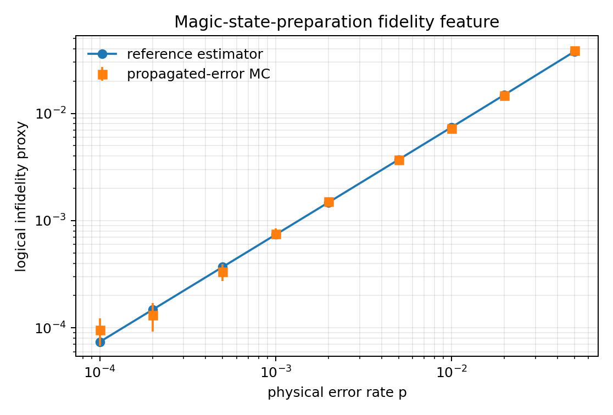
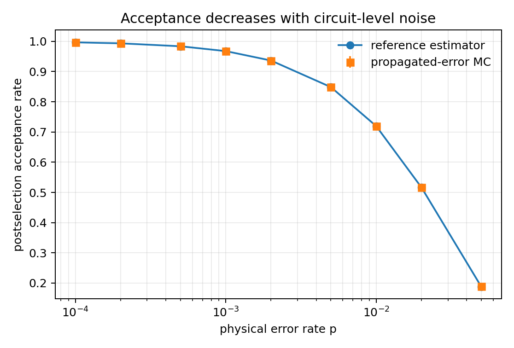
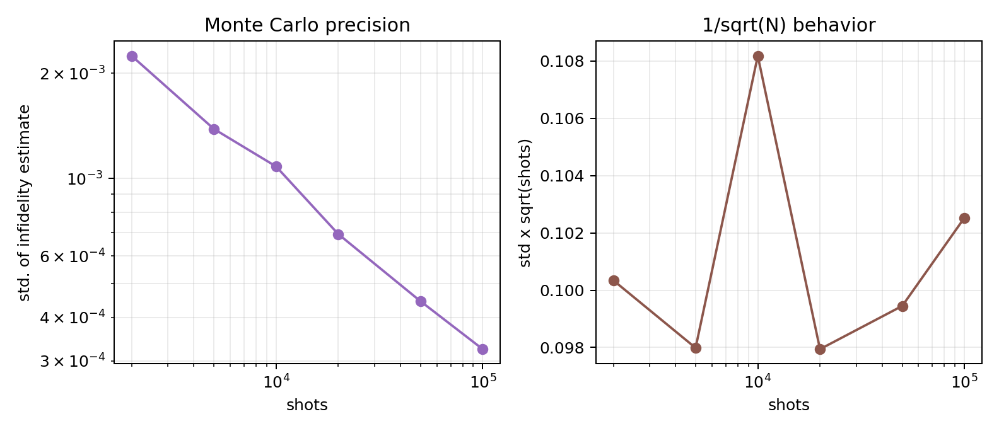
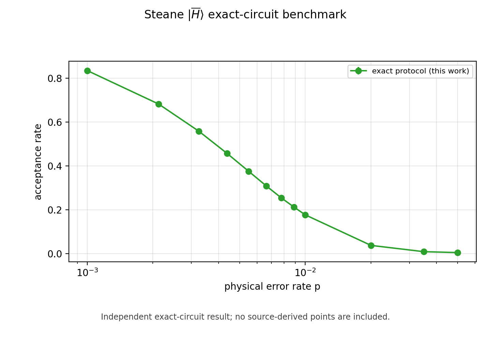
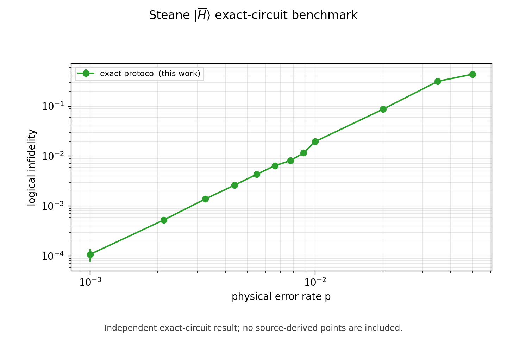

# 2512.23799: Efficient simulation of logical magic state preparation protocols

Preprint: [arXiv:2512.23799 — Efficient simulation of logical magic state preparation protocols](https://arxiv.org/abs/2512.23799)

Published as: [Efficient Simulation of Logical Magic State Preparation Protocols](https://doi.org/10.1103/fby6-xjbm)

Formal citation: PRX Quantum 7, 020329 (2026) · DOI `10.1103/fby6-xjbm` · Locator `020329`

Public status: **Exact-circuit partial reproduction** · Audit score: **73.00/100**

Reconstructs the exact Steane [[7,1,3]] logical-H circuit and evaluates acceptance, logical infidelity, runtime, and sampling precision.

## Start Here / 从这里开始

- [中文复现 Note](note/reproduction-note.zh-CN.md)
- [English reproduction note](note/reproduction-note.en.md)
- [Code and run commands](code/README.md)
- [Machine-readable scorecard](outputs/checks/similarity_scorecard.json)
- [Machine-readable completion boundary](outputs/checks/completion_assessment.json)
- [Numerical methods](docs/NUMERICAL_METHODS.md)
- [Lessons learned](docs/LESSONS_LEARNED.md)

## Quick Run

```bash
python -m venv .venv
source .venv/bin/activate
pip install -r requirements.txt
cd cases/2512.23799/code
python scripts/run_reproduction.py
python scripts/plot_reproduction.py
python scripts/run_steane_exact_benchmark.py --profile smoke
python scripts/plot_steane_exact_comparison.py
```

### Full paper-scale rerun

The paper profile evaluates all 12 physical-error points with the larger Monte Carlo shot budget used by the published case output.

```bash
cd cases/2512.23799/code
python scripts/run_steane_exact_benchmark.py --profile paper
```

Generated files are kept under [data](outputs/data/), [figures](outputs/figures/), and [checks](outputs/checks/).

## Reproduction Boundary

This public case includes paper-derived code, generated data, generated figures, public validation checks, and explanatory notes. It does not redistribute the paper PDF, arXiv source archive, original figures, EPS paths, digitized source curves, source-derived point sets, or source-vs-generated composite panels.

Remaining limitation: Exact-circuit acceptance matches all 12 validated points, while mid-range logical infidelity remains 0.42-0.68x of the paper curve because the panel-(c) gate/idle schedule is reconstructed and the author implementation is unavailable. Runtime remains proxy timing; digitized source point sets are not redistributed.

Final-parameter rule: final public figures use the paper parameters when feasible. Any reduced-scale, subset, proxy, or blocked target must be labeled explicitly and cannot be presented as a complete reproduction.

## Generated Figures













