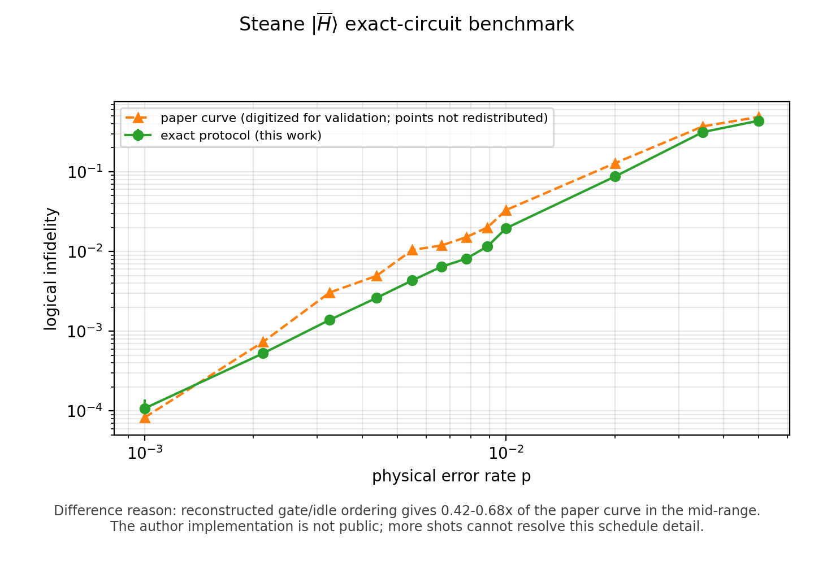
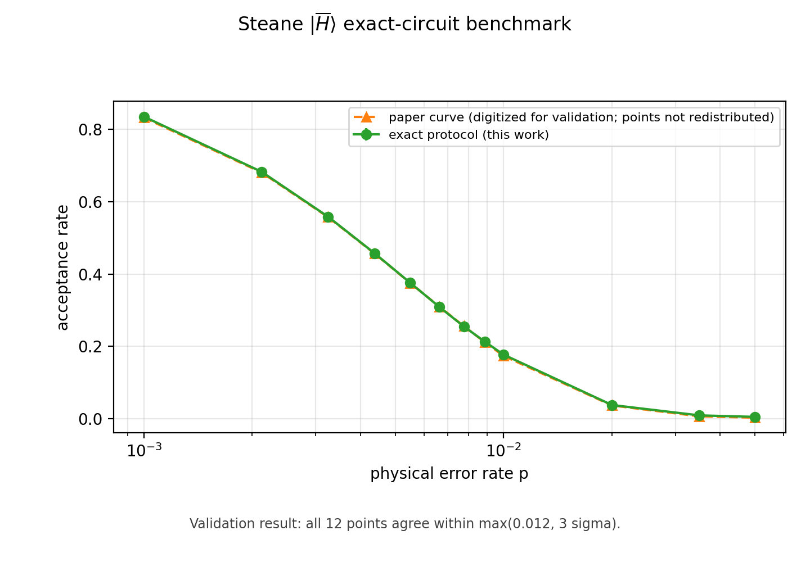
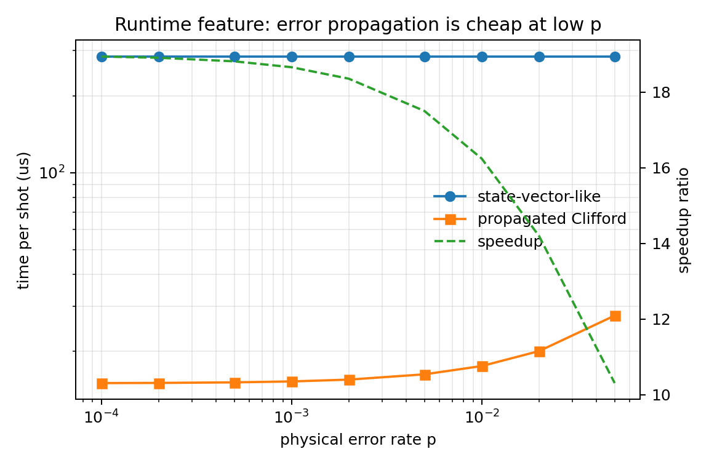

# 2512.23799 复现 Note：逻辑魔态制备的高效模拟

## 一句话结论

这个 case 已经从 proxy 模型升级为完整 Steane `[[7,1,3]]` `|H̄⟩` 制备电路的态矢量 Monte Carlo：覆盖论文的 12 个物理错误率、共 790,000 shots。Acceptance 曲线 12/12 点通过内部数字化验证；logical infidelity 的趋势和两端吻合，但中段仍为论文曲线的 `0.42–0.68×`，因此结论是“精确电路的部分复现”，不是完整逐点复现。

## 当前状态

- Current level: `exact_circuit_partial_reproduction`
- Audit score: `73.00/100`
- T001 infidelity: exact circuit，带明确中段残差
- T002 acceptance: exact circuit，12/12 点通过
- T003 runtime: 仍是本机 proxy timing，不能冒充作者 wall-clock
- T004 formula/sampling: 公式、稳定子和采样检查通过

## 核心模型

论文把 noisy magic-state preparation 的 Pauli 错误传播到电路末端，再用 Clifford/Pauli 结构估计逻辑保真度。这个 case 实现了论文 benchmark 的三部分电路：

1. 非容错 Steane `|H̄⟩` 编码；
2. 带 flag 的 transversal logical `H̄` 测量；
3. 一轮六个 Steane stabilizer 的互旗测量和 postselection。

噪声模型覆盖初始化错误、二比特门后 depolarizing、时隙 idle 错误和测量前翻转。通过 postselection 后，再用理想 Steane decoder 计算 logical fidelity。

结构验证包括：

- noiseless protocol 确定性接受；
- 编码态是 logical `H̄` 的 `+1` 本征态；
- 六个 stabilizer 全部为 `+1`；
- Hamming syndrome 唯一定位每个单比特 Pauli 错误；
- ideal decoder 对全部 21 个单比特 `X/Y/Z` 错误恢复到单位保真度。

## 论文曲线与独立复现

下面的橙色曲线来自论文已发表 PNG 的内部数字化，仅用于验证。数字化点集不随仓库发布，比较图不属于仓库开放内容许可，也不代表取得了作者原始数据。论文来源：[PRX Quantum 7, 020329 (2026)](https://doi.org/10.1103/fby6-xjbm)。

### T001：Logical infidelity



- What matches: 二次增长趋势、低错误率端和高错误率饱和端均与论文一致。
- 差异原因: 在 `p≈0.003–0.025`，独立结果只有论文的 `0.42–0.68×`。Acceptance 已逐点吻合，因此这不是一阶噪声强度错误；剩余差异来自 panel (c) 未公开的 gate/idle 排序对二阶 damaging-pair 组合数的影响。继续增加 shots 只会缩小误差条，不能恢复作者未公开的 schedule。
- Status: `numerical_feature_reproduction_with_known_residual`
- Evidence: `../outputs/data/steane_exact_benchmark.csv`, `../outputs/checks/steane_exact_benchmark.json`

### T002：Postselection acceptance



- What matches: 12 个论文 `p` 点全部落在 `max(0.012, 3σ)` 容差内；最大绝对差约 `0.00339`。
- 差异原因: 没有接受为科学残差的数值差异；仍保留的边界是 panel (a)/(c) 的精确时隙结构由论文图重建，而不是作者代码确认。
- Status: `numerical_feature_reproduction`
- Evidence: `../outputs/data/steane_exact_benchmark.csv`, `../outputs/checks/steane_exact_benchmark.json`

### T003：Average time per shot



- What matches: propagated Clifford 路径在低 `p` 明显快于 state-vector 路径，机制与论文一致。
- 差异原因: wall-clock 依赖作者硬件、Stim/Cirq 版本、编译器和 benchmark harness；当前图是明确标注的本机 proxy，不做作者时间逐点复现声明。
- Status: `proxy_timing_only`

## 算力与停止判断

这个 case 当前的主要残差不是缺算力：

- 790,000-shot exact state-vector campaign 已经完成；
- 增加 shots 能降低 Monte Carlo 误差，但不能识别未公开的门序和 idle 规则；
- infidelity 中段标记为 `author_implementation_detail_required`；
- 作者 wall-clock 标记为 `author_environment_required`。

所以本轮不再消耗 A100 强行加 shots。机器可读判定见 `../outputs/checks/completion_assessment.json`。

## 运行方法

快速电路检查，不覆盖已发布的 full-run 数据：

```bash
cd cases/2512.23799/code
python scripts/run_steane_exact_benchmark.py --profile smoke
```

完整 12 点 campaign：

```bash
python scripts/run_steane_exact_benchmark.py --profile paper
python scripts/plot_steane_exact_comparison.py
```

完整 profile 在 CPU 上可能需要数小时。公开 runner 只生成独立数值；内部数字化 reference 不随仓库分发。

## 最终结论

Acceptance benchmark 已达到精确电路的数值复现；infidelity 已达到趋势与端点复现，但中段保留一个可量化、可解释且不隐藏的残差。这个 case 不再是 proxy-only，也不能标记为完整复现。
