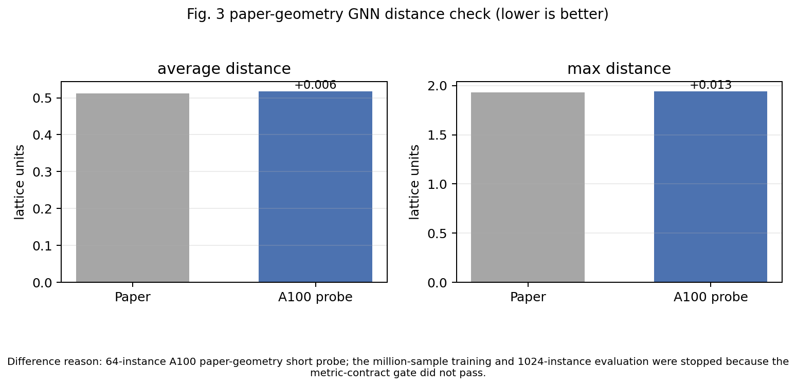
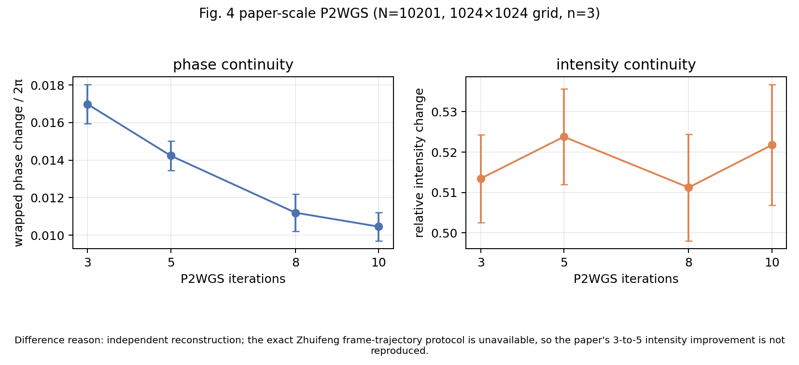

# 2604.08669 复现说明

## 一句话结果

这个 case 已经从“小尺寸 proxy”推进到论文几何的部分复现：GNN 数据与短训练探针在 A100-SXM4-80GB 上使用 `127×127 → 101×101` 几何；P2WGS 使用论文尺度 `N=10201` 和 `1024×1024` 网格。完整 million-scale GNN 训练、GPU-parallel auction decoder 和硬件实测时延仍未完成。

当前公开状态：**paper-geometry partial reproduction**。审计分数：**61.60/100**。

## 核心模型

论文的产品流程由三个对象串起来：

1. GNN 为原子—目标边打分并生成一对一分配；
2. P2WGS 根据移动轨迹生成连续全息帧；
3. pipeline timing model 估算路径规划、帧生成、SLM 刷新和传输延迟的总装配时间。

公开实现保留这条主链，但缺失目标不计为完成。

## Fig. 3：A100 论文几何 GNN 探针

A100 campaign 已生成 256 个训练池样本和 64 个独立验证样本，几何参数为 `initial_side=127`、`target_side=101`、`k=128`。最佳 `val64` 短探针得到：

- 平均移动距离 `0.51798`，论文参考 `0.512`，差 `+0.00598`；
- 最大移动距离 `1.94310`，论文参考 `1.93`，差 `+0.01310`；
- `rank1_rate=0.7763`。



差异原因：这是 64-instance 的论文几何短探针，不是论文的 million-sample 训练和 1024-instance 评测；当前 squared-distance 标签在平均距离 gate 上失败，而 Euclidean 标签会恶化最大距离尾部，所以先停止扩训。

## Fig. 4：paper-scale P2WGS

P2WGS 已按 `N=10201`、目标边长 `101`、`1024×1024` 网格、`3/5/8/10` 次迭代和 3 个随机装载实例运行。phase continuity 始终低于 `2% × 2π` 并随迭代改善，这一主特征通过；论文中 3→5 次迭代的 intensity improvement 没有在误差内分辨出来。



差异原因：公开 arXiv 材料没有给出 Zhuifeng 的精确 frame-trajectory 协议；独立重建可以复现 phase 约束，但不足以复刻 intensity 的 3→5 细节。

## Fig. 5：pipeline timing


差异原因：这张图是透明的 analytic pipeline model，不是论文 RTX 5090 或当前 A100 上的硬件实测。A100 测量也不能冒充 RTX 5090 benchmark。

## 为什么停止

- 完整 GNN 训练：论文报告 4 张 A40、288 GPU-hours；当前 metric-contract gate 尚未通过，继续扩到百万样本缺少可靠验收信号，因此不硬跑。
- GPU decoder：作者的 GPU-parallel kernel 不在公开材料中。CPU modified-auction 只验证分配逻辑，不能支持 GPU timing claim。
- P2WGS intensity 细节：缺少作者的轨迹/帧协议，不是增加样本就能唯一解决。
- 硬件 timing：目标硬件是 RTX 5090；A100 不是同一 benchmark。

机器可读边界见 `../outputs/checks/completion_assessment.json`。A100 汇总见 `../outputs/checks/a100_paper_geometry_campaign.json`。

## 可运行命令

```bash
cd cases/2604.08669/code
python scripts/run_reduced_pilot.py
python scripts/run_reduced_p2wgs_pilot.py
python scripts/plot_reduced_outputs.py
python scripts/plot_completion_summary.py
python scripts/run_paper_scale_gnn_training.py --profile paper_target --dry-run
```

最后一条只写出配置，不会启动 million-sample training。
