# 2605.25398: Boson Sampling as a Probe of Chaotic and Integrable Quantum Dynamics

Preprint: [arXiv:2605.25398 — Boson Sampling as a Probe of Chaotic and Integrable Quantum Dynamics in a Photonic Chip](https://arxiv.org/abs/2605.25398)

Formal publication: **Not recorded as of 2026-07-14**

Public status: **Feature-level reproduction** · Audit score: **79.36/100**

Reproduces Porter-Thomas distance, entropy, spectral-form-factor, OTOC, participation-ratio, and scaling features.

## Start Here / 从这里开始

- [中文复现 Note](note/reproduction-note.zh-CN.md)
- [English reproduction note](note/reproduction-note.en.md)
- [Code and run commands](code/README.md)
- [Machine-readable scorecard](outputs/checks/similarity_scorecard.json)
- [Derivation (equations)](docs/DERIVATION.md)
- [Numerical methods](docs/NUMERICAL_METHODS.md)
- [Lessons learned](docs/LESSONS_LEARNED.md)

## Paper Reference vs Independent Reproduction

The left column in each panel is a limited excerpt from Zhan et al., [arXiv:2605.25398](https://arxiv.org/abs/2605.25398); the right column is generated independently from this case. These comparisons validate physical structure and key numerical features, not author-data-level or point-for-point equivalence.

### Fig. 2 (g,h) comparison

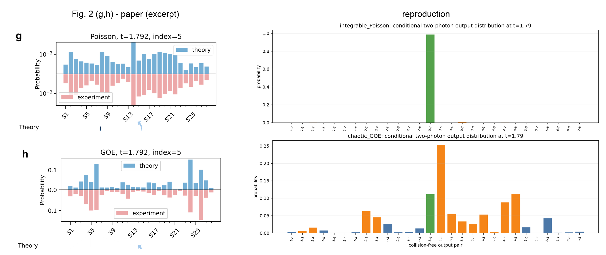

### Fig. 3 comparison

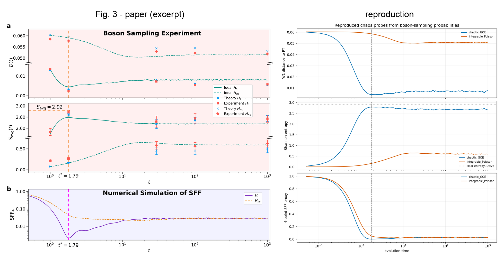

### Fig. 4 comparison

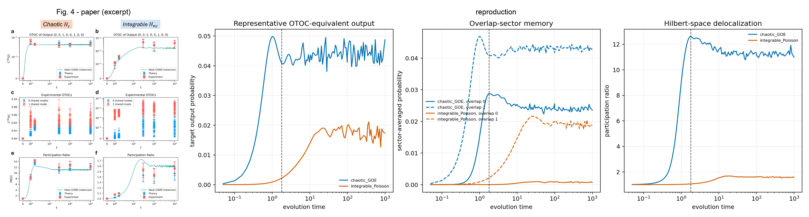

### Fig. S1 comparison

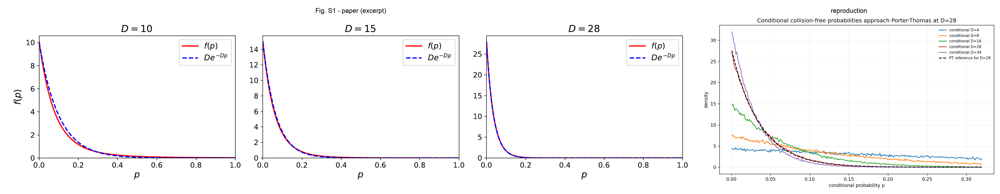

### Fig. S4 comparison

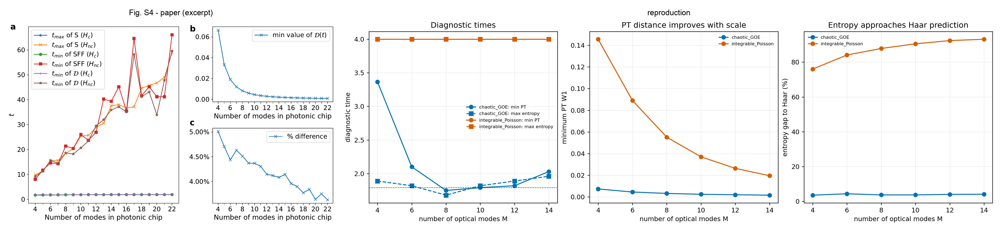

### Fig. S5 comparison

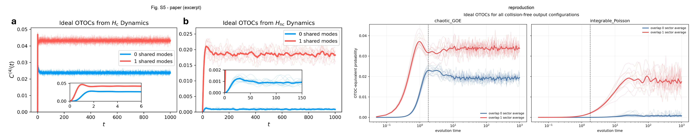

### Fig. S6 comparison

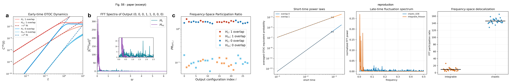

## Quick Run

```bash
python -m venv .venv
source .venv/bin/activate
pip install -r requirements.txt
cd cases/2605.25398/code
python scripts/run_reproduction.py
python scripts/plot_reproduction.py
```

Generated files are kept under [data](outputs/data/), [figures](outputs/figures/), and [checks](outputs/checks/).

## Reproduction Boundary

This public case includes paper-derived code, generated data, generated figures, public validation checks, explanatory notes, and 7 limited comparison panels. Those panels use the minimum paper excerpts needed for validation and clearly separate the paper reference from the independent result. The case does not redistribute the paper PDF, arXiv source archive, standalone original figures, EPS paths, digitized source curves, or source-derived point sets.

Remaining limitation: Several figures use paper-parameter subsets or local random-matrix instances rather than the full experimental setting.

Final-parameter rule: final public figures use the paper parameters when feasible. Any reduced-scale, subset, proxy, or blocked target must be labeled explicitly and cannot be presented as a complete reproduction.

## Generated Figures

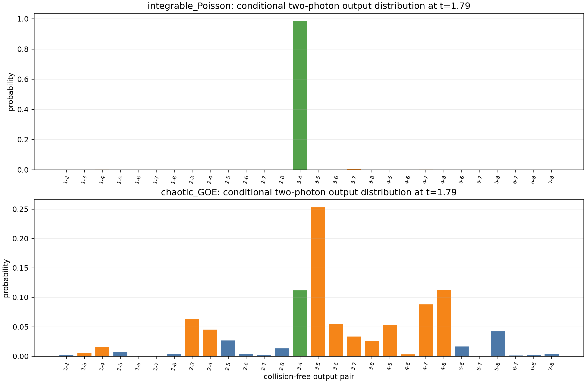

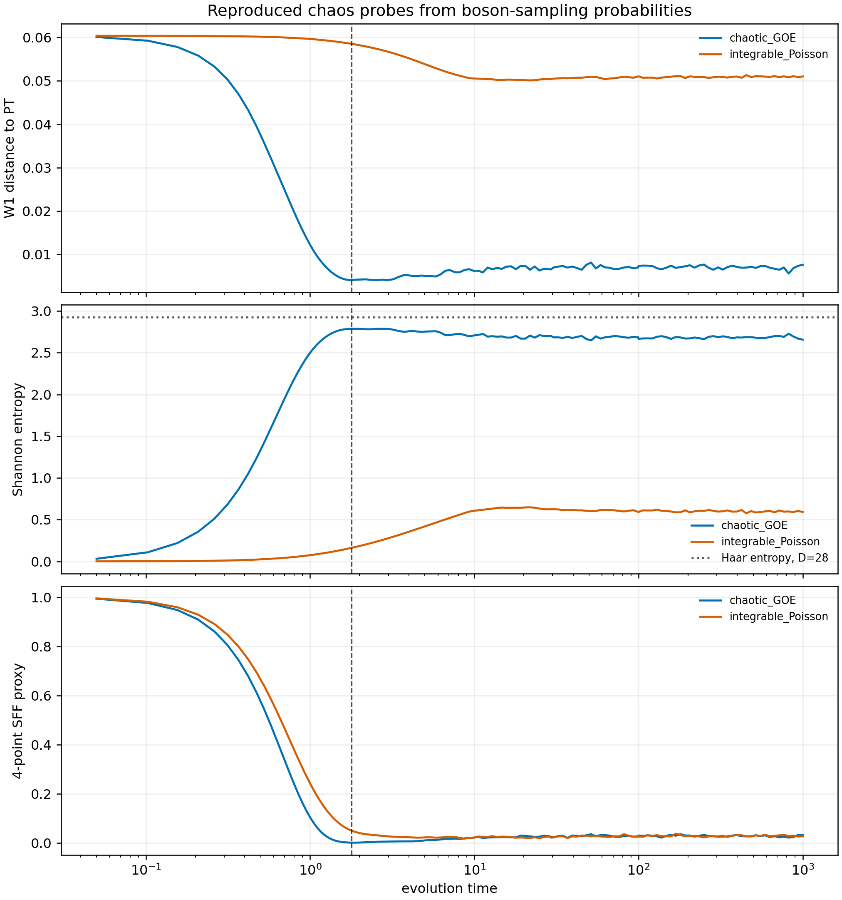

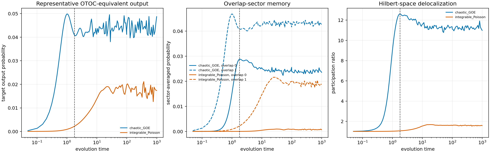

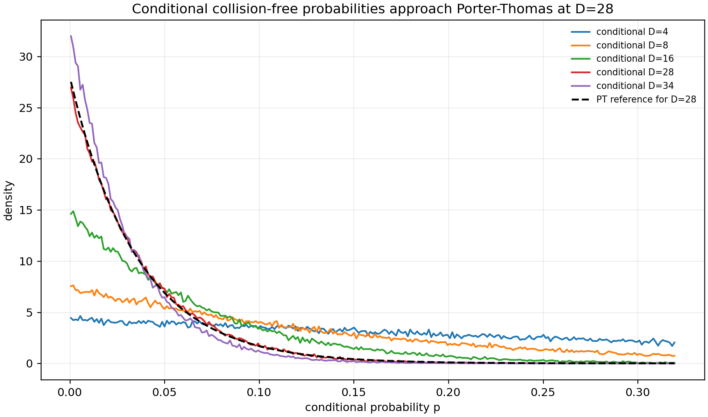

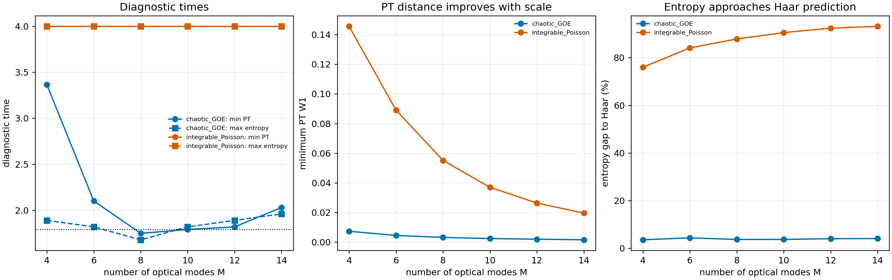

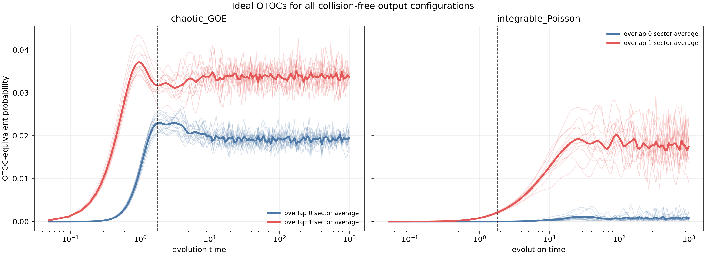

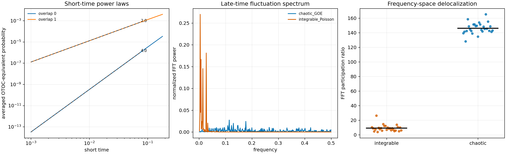
