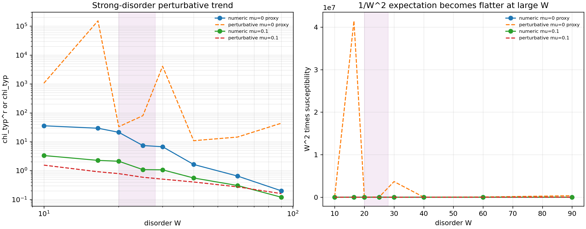
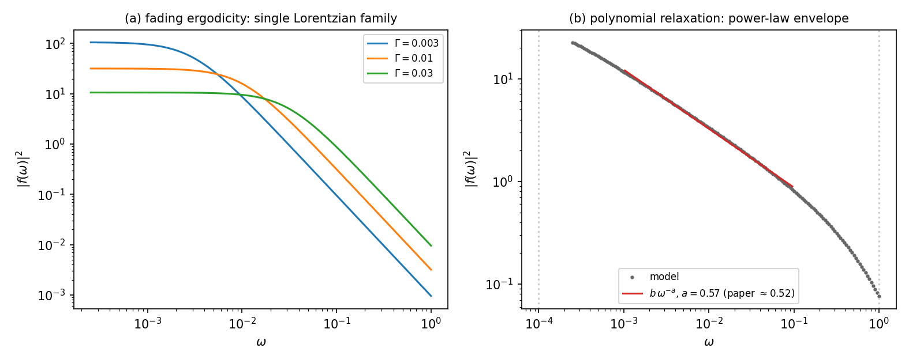
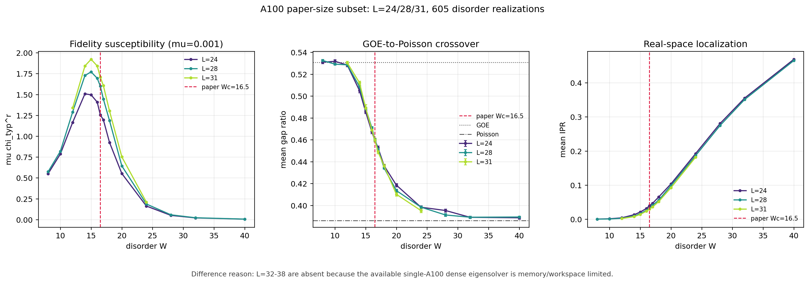
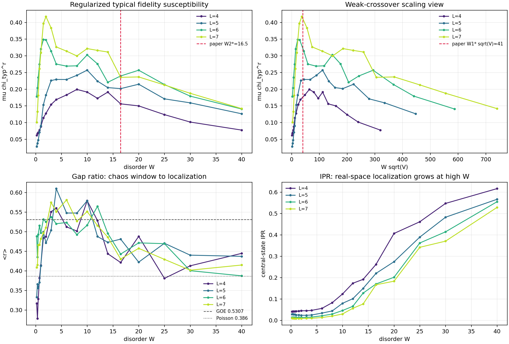
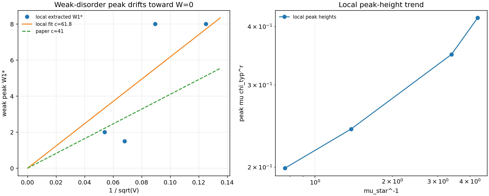
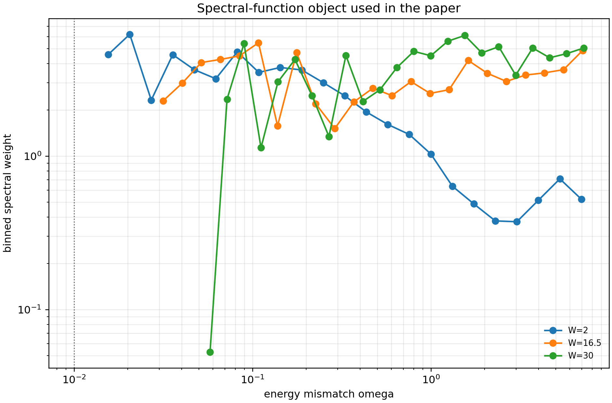
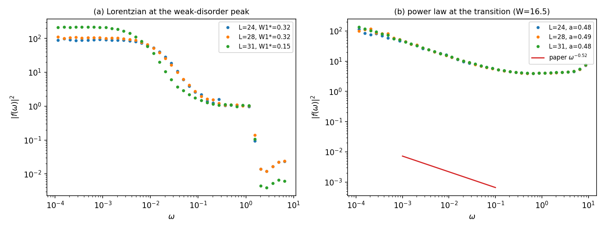
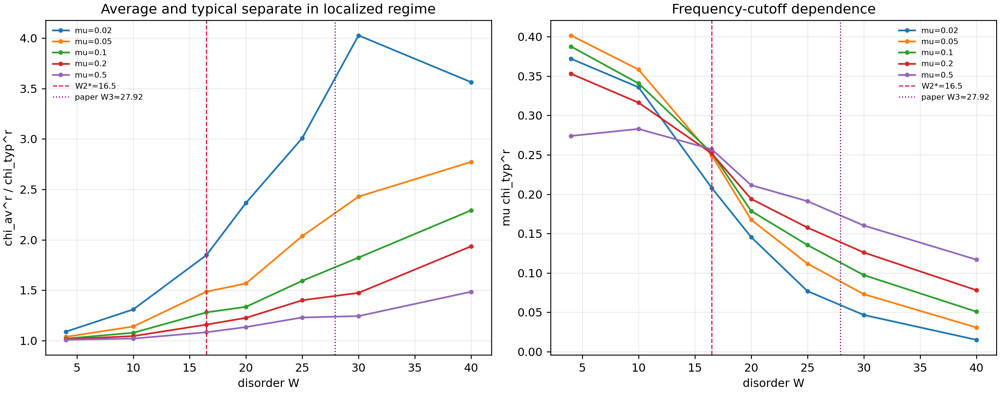
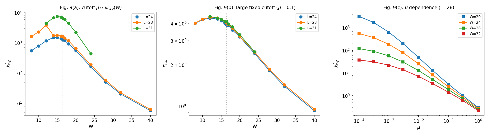

# 2605.25594: Sensitivity to perturbations in the three-dimensional Anderson model

Preprint: [arXiv:2605.25594 — Sensitivity to perturbations in the three-dimensional Anderson model](https://arxiv.org/abs/2605.25594)

Formal publication: **Not recorded as of 2026-07-14**

Public status: **Paper-scale subset reproduction** · Audit score: **67.49/100**

Reproduces disorder sensitivity, gap-ratio, IPR, susceptibility separation, and phenomenological strong-disorder trends, including an A100 campaign at L=24,28,31 with 605 disorder realizations.

## Start Here / 从这里开始

- [中文复现 Note](note/reproduction-note.zh-CN.md)
- [English reproduction note](note/reproduction-note.en.md)
- [Code and run commands](code/README.md)
- [Machine-readable scorecard](outputs/checks/similarity_scorecard.json)
- [Machine-readable completion boundary](outputs/checks/completion_assessment.json)
- [Derivation (equations)](docs/DERIVATION.md)
- [Numerical methods](docs/NUMERICAL_METHODS.md)
- [Lessons learned](docs/LESSONS_LEARNED.md)

## Quick Run

```bash
python -m venv .venv
source .venv/bin/activate
pip install -r requirements.txt
cd cases/2605.25594/code
python scripts/run_reproduction.py
python scripts/plot_reproduction.py
python scripts/run_fig11_phenomenological_model.py
```

Generated files are kept under [data](outputs/data/), [figures](outputs/figures/), and [checks](outputs/checks/).

## Reproduction Boundary

This public case includes paper-derived code, generated data, generated figures, public validation checks, and explanatory notes. It does not redistribute the paper PDF, arXiv source archive, original figures, EPS paths, digitized source curves, source-derived point sets, or source-vs-generated composite panels.

Remaining limitation: The paper's L=32-38 targets were not forced through the current dense eigensolver: L=32 hit a 32-bit workspace failure and L=38 exceeds the practical single-A100 memory path. The T and randomized-site n operator panels remain outside the completed subset and are not replaced by proxy data.

Final-parameter rule: final public figures use the paper parameters when feasible. Any reduced-scale, subset, proxy, or blocked target must be labeled explicitly and cannot be presented as a complete reproduction.

## Generated Figures


















