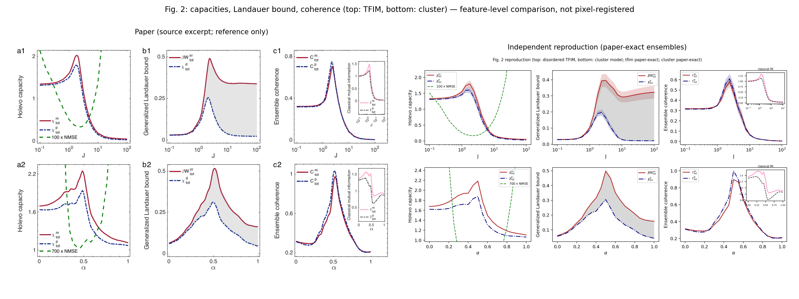
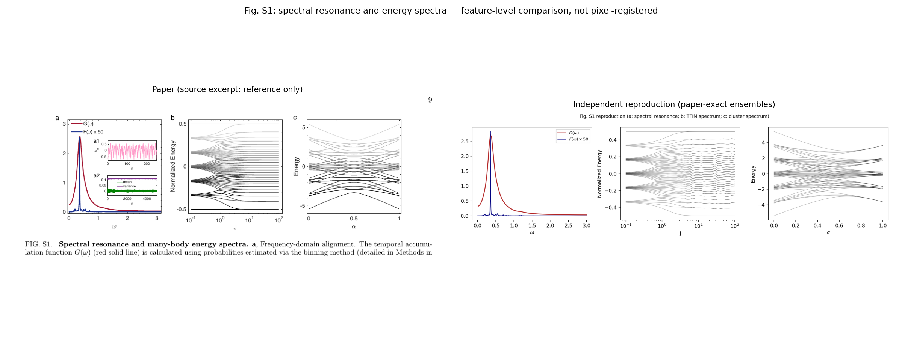
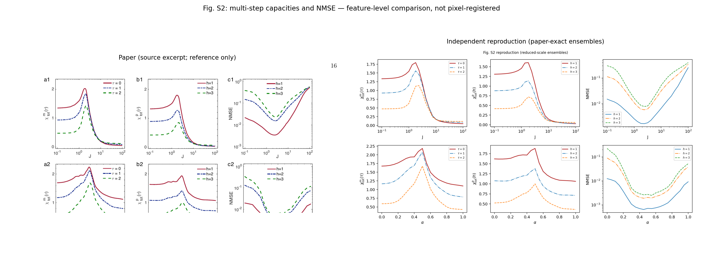
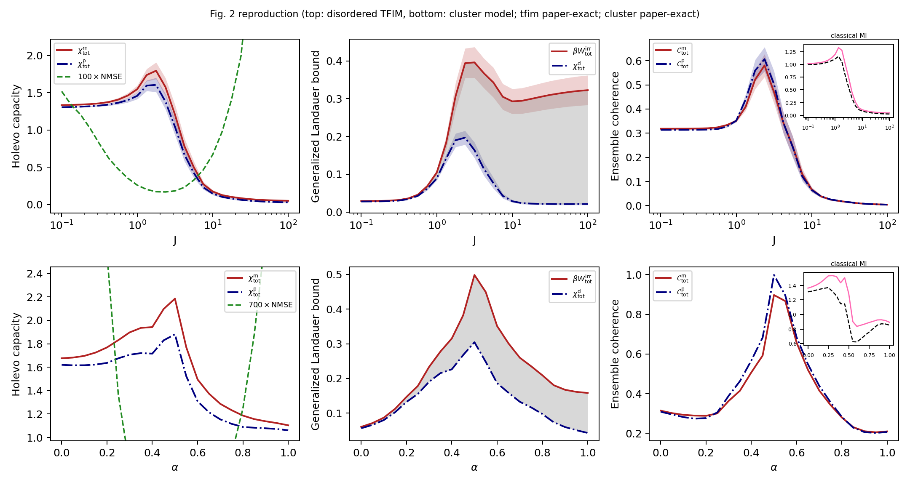
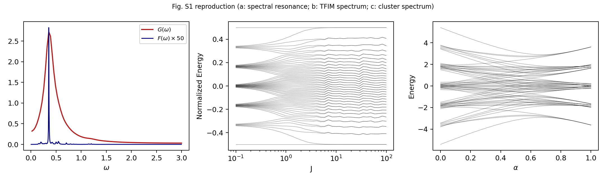
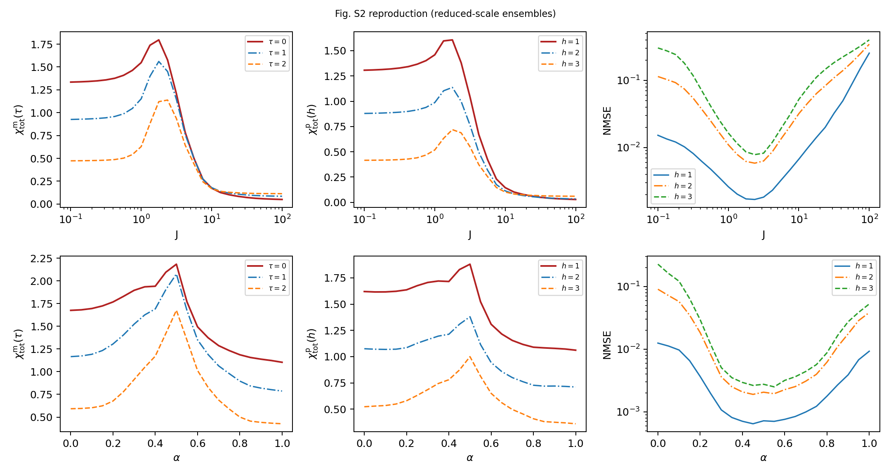

# 2607.02157: Thermodynamics of Quantum Reservoir Computing

Preprint: [arXiv:2607.02157 — Thermodynamics of Quantum Reservoir Computing](https://arxiv.org/abs/2607.02157)

Formal publication: **Not recorded as of 2026-07-20**

Public status: **Feature-level reproduction (paper-exact ensembles)** · Audit score: **79.18/100**

Independently reproduces all three numerical figures of Ding & Qiu's thermodynamics of quantum reservoir computing at the paper's full ensemble sizes: the memory/predictive Holevo capacities, generalized Landauer bound, and coherence decomposition (Fig. 2, both TFIM and cluster architectures), the drive spectral resonance G(omega) and reservoir spectra (Fig. S1), and the multi-step capacities with forecasting error (Fig. S2). The central identity beta*W_irr = chi^d (Eq. 13) holds at machine precision across all runs, and the capacity peaks and NMSE minima coincide inside the quantum critical regions.

## Start Here / 从这里开始

- [中文复现 Note](note/reproduction-note.zh-CN.md)
- [English reproduction note](note/reproduction-note.en.md)
- [Code and run commands](code/README.md)
- [Machine-readable scorecard](outputs/checks/similarity_scorecard.json)
- [Derivation (equations)](docs/DERIVATION.md)
- [Numerical methods](docs/NUMERICAL_METHODS.md)
- [Lessons learned](docs/LESSONS_LEARNED.md)

## Main Reproduced Results

| Paper item | Reproduced result | Figure | Check |
| --- | --- | --- | --- |
| Fig. 2 | Holevo capacities, generalized Landauer bound, coherence decomposition; TFIM and cluster, paper-exact ensembles | [PNG](outputs/figures/fig2_reproduction.png) | [JSON](outputs/checks/fig2_figS2_feature_contract.json) |
| Fig. S1 | Drive resonance G(omega) peak and TFIM/cluster reservoir spectra | [PNG](outputs/figures/figS1_reproduction.png) | [JSON](outputs/checks/figS1_features.json) |
| Fig. S2 | Multi-step memory/predictive capacities and full-Pauli NMSE minima | [PNG](outputs/figures/figS2_reproduction.png) | [JSON](outputs/checks/fig2_figS2_feature_contract.json) |

## Paper Reference vs Independent Reproduction

The left column in each panel is a limited excerpt from Ding and Qiu, [arXiv:2607.02157](https://arxiv.org/abs/2607.02157); the right column is generated independently from this case. These comparisons validate physical structure and key numerical features, not author-data-level or point-for-point equivalence.

### Fig. 2 comparison



### Fig. S1 comparison



### Fig. S2 comparison



### Fig. 2: Holevo capacities, generalized Landauer bound, coherence decomposition; TFIM and cluster, paper-exact ensembles



### Fig. S1: Drive resonance G(omega) peak and TFIM/cluster reservoir spectra



### Fig. S2: Multi-step memory/predictive capacities and full-Pauli NMSE minima



## Quick Run

```bash
python -m venv .venv
source .venv/bin/activate
pip install -r requirements.txt
cd cases/2607.02157/code
python scripts/run_scan.py
python scripts/run_nmse.py
python scripts/run_figS1.py
python scripts/plot_figures.py
python scripts/adjudicate_pooling.py
python scripts/verify_formulas.py
```

Generated files are kept under [data](outputs/data/), [figures](outputs/figures/), and [checks](outputs/checks/).

## Reproduction Boundary

This public case includes paper-derived code, generated data, generated figures, public validation checks, explanatory notes, and 3 limited comparison panels. Those panels use the minimum paper excerpts needed for validation and clearly separate the paper reference from the independent result. The case does not redistribute the paper PDF, arXiv source archive, standalone original figures, EPS paths, digitized source curves, or source-derived point sets.

Remaining limitation: Comparison is a feature contract against the paper's raster panels (no author data or tables); score is bound at 80 because the paper releases no numerical data and we decline to digitize its curves. The disorder-ensemble aggregation convention (per-realization vs pooled) was adjudicated to resolve a TFIM peak ambiguity; three unspecified conventions (Mackey-Glass normalization, cluster boundary condition, F(omega) normalization) are documented as questions for the authors.

Final-parameter rule: final public figures use the paper parameters when feasible. Any reduced-scale, subset, proxy, or blocked target must be labeled explicitly and cannot be presented as a complete reproduction.
