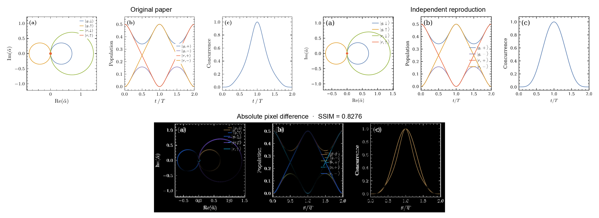
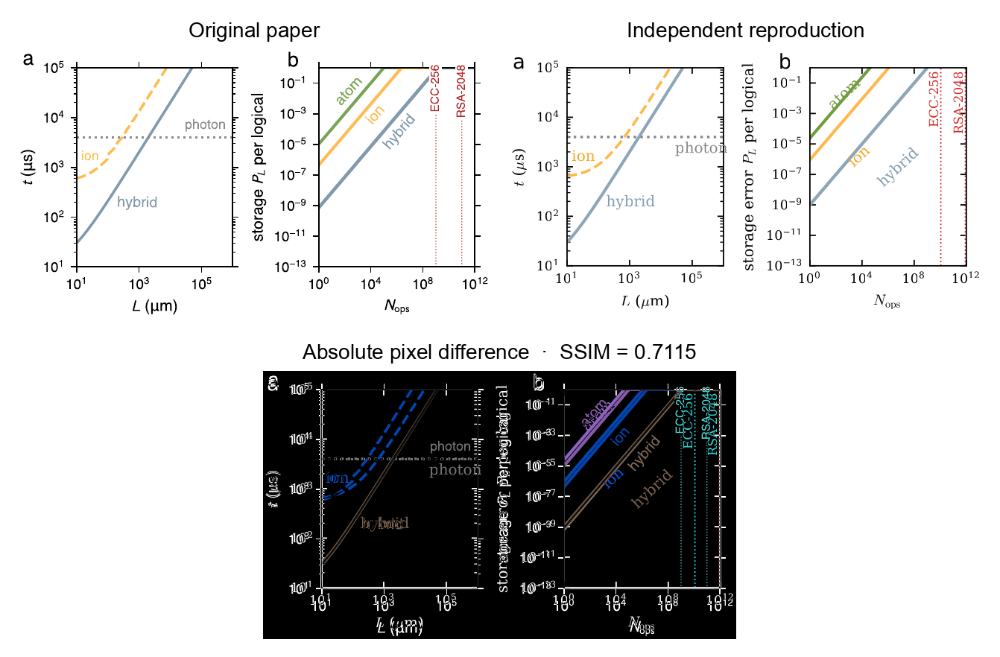
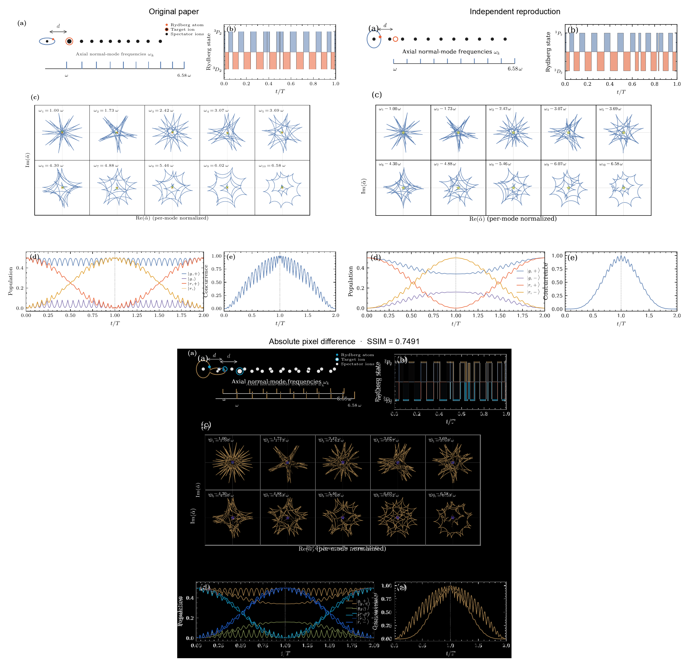
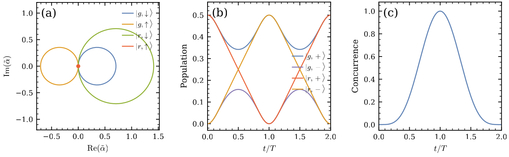
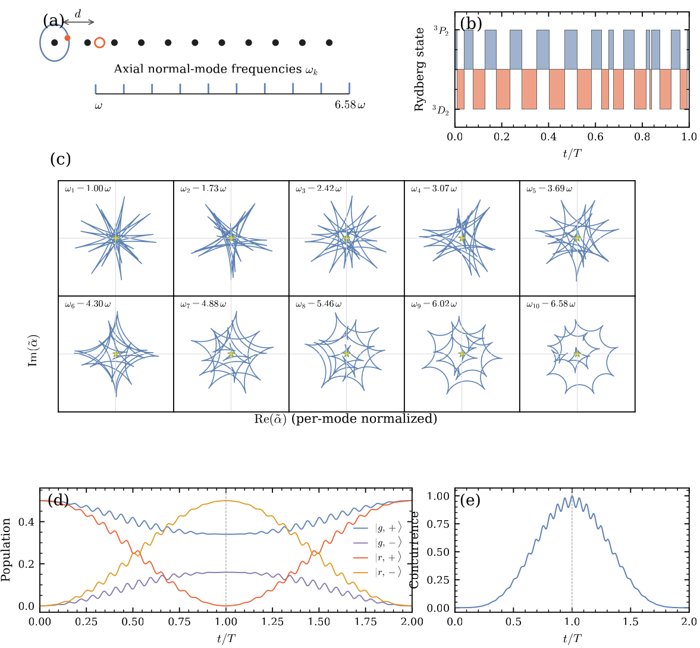
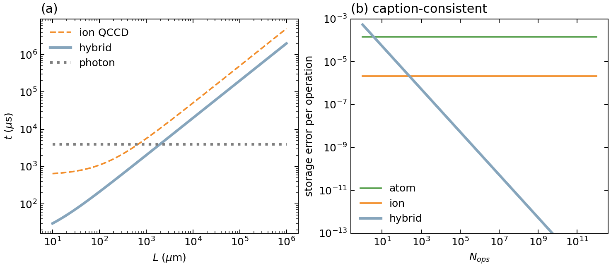
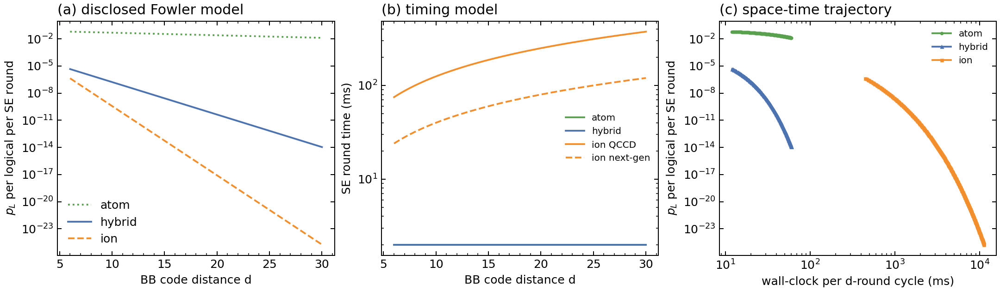

# 2607.15597: Deterministic atom-shuttle interconnects via ultrafast atom-ion entangling gate

Preprint: [arXiv:2607.15597 — Deterministic atom-shuttle interconnects via ultrafast atom-ion entangling gate](https://arxiv.org/abs/2607.15597)

Formal publication: **Not recorded as of 2026-07-23**

Public status: **Numerical feature reproduction with pixel-registered figures** · Audit score: **75.21/100**

Independently reconstructs the single-ion geometric CZ gate, exact operating-point and decay tables, ten-ion axial modes with a deterministic 25-segment closure sequence, the approximately 2 mm interconnect crossover, disclosed qLDPC projections, and circular-state feature models. Eight generated figures are also registered to the paper canvas; all dimensions match exactly, while strict full-image pixel identity is explicitly not claimed.

## Start Here / 从这里开始

- [中文复现 Note](note/reproduction-note.zh-CN.md)
- [English reproduction note](note/reproduction-note.en.md)
- [Full human-readable derivation trace](docs/DERIVATION_TRACE.md)
- [Formula verification summary](outputs/checks/formula_verification.json)
- [Pixel-registration metrics](outputs/checks/pixel_metrics.json)
- [Code and run commands](code/README.md)
- [Machine-readable scorecard](outputs/checks/similarity_scorecard.json)
- [Derivation (equations)](docs/DERIVATION.md)
- [Numerical methods](docs/NUMERICAL_METHODS.md)
- [Lessons learned](docs/LESSONS_LEARNED.md)

## Main Reproduced Results

| Paper item | Reproduced result | Figure | Check |
| --- | --- | --- | --- |
| Fig. 2 | Closed branch trajectories, CZ populations, and concurrence at the paper operating point | [PNG](outputs/figures/fig2_pixel_registered.png) | [JSON](outputs/checks/reproduction_result.json) |
| Fig. S1 | Ten-ion axial spectrum and independently optimized simultaneous mode closure | [PNG](outputs/figures/figs1_multimode_pixel_registered.png) | [JSON](outputs/checks/reproduction_result.json) |
| Fig. 4 | Approximately 2 mm interconnect crossover and caption-consistent passive-memory amortization | [PNG](outputs/figures/fig4_reproduction.png) | [JSON](outputs/checks/source_consistency.json) |
| Fig. S5 | Disclosed Fowler qLDPC projections and architecture timing | [PNG](outputs/figures/figs5_qldpc_projection_reproduction.png) | [JSON](outputs/checks/reproduction_result.json) |

## Paper Reference vs Independent Reproduction

Each board uses a limited attributed figure excerpt from Mu Qiao, arXiv:2607.15597, beside an independently generated pixel-registered render and an absolute-difference panel. Reference pixels are used only after rendering for presentation diagnostics; they do not enter the numerical model or generated image. The boards do not establish author-data-level or pixel-exact equivalence.

### Fig. 2 comparison



### Fig. 4 comparison



### Fig. S1 comparison



### Fig. 2: Closed branch trajectories, CZ populations, and concurrence at the paper operating point



### Fig. S1: Ten-ion axial spectrum and independently optimized simultaneous mode closure



### Fig. 4: Approximately 2 mm interconnect crossover and caption-consistent passive-memory amortization



### Fig. S5: Disclosed Fowler qLDPC projections and architecture timing



## Quick Run

```bash
python -m venv .venv
source .venv/bin/activate
pip install -r requirements.txt
cd cases/2607.15597/code
python scripts/run_reproduction.py
```

Generated files are kept under [data](outputs/data/), [figures](outputs/figures/), and [checks](outputs/checks/).

## Reproduction Boundary

This public case includes paper-derived code, generated data, generated figures, public validation checks, explanatory notes, and 3 limited comparison panels. Those panels use the minimum paper excerpts needed for validation and clearly separate the paper reference from the independent result. The case does not redistribute the paper PDF, arXiv source archive, standalone original figures, EPS paths, digitized source curves, or source-derived point sets.

Remaining limitation: Author curve points and optimized Fig. 3 schedules are unavailable; the thermal and circular figures use labelled analytic feature models rather than the full QuTiP/Lindblad workflow; MQDT and qLDPC Monte Carlo require unpublished scientific inputs and run metadata. Pixel registration reaches best SSIM 0.8297 and 0 of 8 images meet the strict 0.95 threshold.

Final-parameter rule: final public figures use the paper parameters when feasible. Any reduced-scale, subset, proxy, or blocked target must be labeled explicitly and cannot be presented as a complete reproduction.
