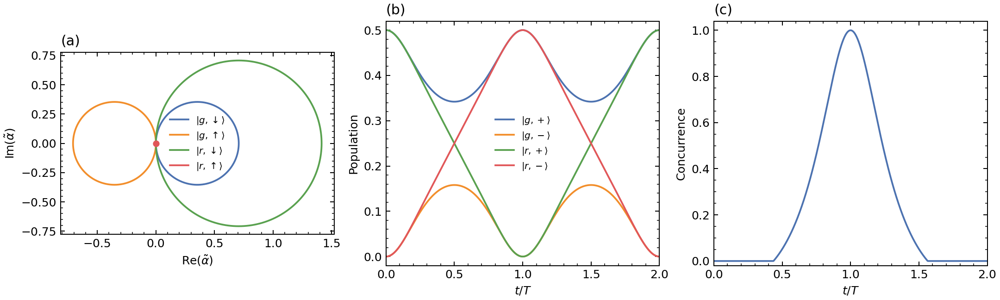
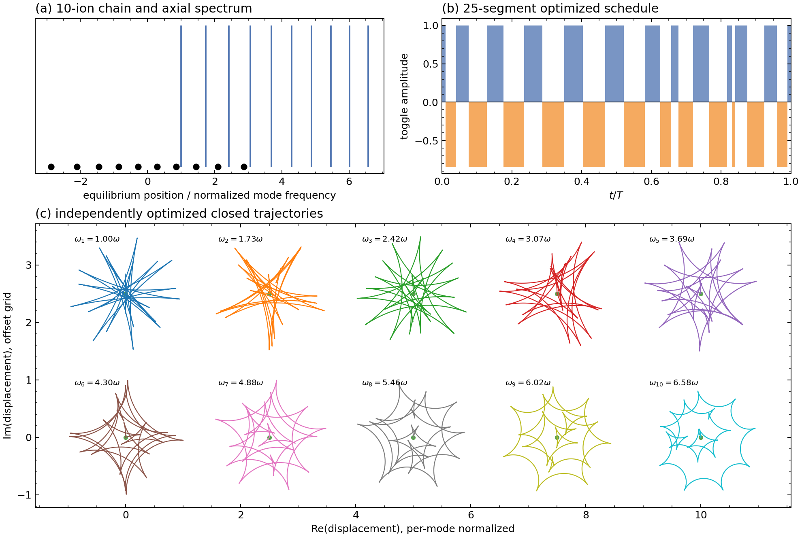

<!--
RTP 公众号发布包
主标题：把原子变成量子“摆渡车”：我们复现了一种微秒级原子—离子纠缠门
备选标题 1：5 kHz 的量子摆渡车：一个原子怎样连接两座离子处理器？
备选标题 2：轨迹走一圈，运动归零，相位留下：复现一种超快原子—离子 CZ 门
摘要：RunThePaper 独立重建原子—离子几何 CZ 门、十离子多模闭合与混合互连时序：一个陷阱周期后位移残差为 1.73×10⁻¹⁶、concurrence 接近 1，并验证约 2 mm 的互连交点，同时明确标出未公开仿真输入和像素复现边界。
封面短句：让原子替离子“送”纠缠
建议封面图：outputs/figures/fig2_pixel_registered.png；主视觉保留四条相空间闭合轨迹与 concurrence 曲线，叠加标题，不使用论文原图。
-->

# 把原子变成量子“摆渡车”：我们复现了一种微秒级原子—离子纠缠门

如果未来的量子计算机由不同类型的量子芯片共同组成，怎样把量子信息快速、确定地从一种平台送到另一种平台？

中性原子阵列适合大规模并行操控，离子晶体则以高保真门和超长相干时间见长。两者很互补，却缺少一个足够快的确定性接口。

这一次，RunThePaper 复现了 Mu Qiao 的预印本 *Deterministic atom-shuttle interconnects via ultrafast atom-ion entangling gate*。

论文提出一个很有画面感的方案：用光镊抓住一个中性原子，让它在不同离子模块之间移动。原子到达离子附近后，在几微秒内完成一次 CZ 纠缠门，再带着量子关联去往下一站。

原子不只是计算单元，也成了一辆可以移动的量子“摆渡车”。

我们从公开公式和参数出发，独立重建了核心几何门、多离子模式闭合、互连时序和可计算的误差预算。最后得到的是：

- 单离子门在一个陷阱周期后的最大位移残差为 \(1.73\times10^{-16}\)；
- 同一时刻的 concurrence 为 \(0.9999999999999997\)；
- 10 个离子轴向模由一组独立优化的 25 段序列同时闭合，最大残差为 \(1.06\times10^{-14}\)；
- 混合互连与 250 Hz 光子链路的时序交点为 1995 μm，重现论文“约 2 mm”的判断；
- 17 份结构化 CSV、8 张独立科学图和 8 张像素配准图；
- 综合审计分数 75.21/100，等级为 `numerical_feature_reproduction`。

不过，比这些数字更值得讨论的是：为什么运动轨迹回到起点以后，量子门需要的相位却能留下？

## 为什么需要一辆量子“摆渡车”？

不同量子平台很像分工不同的计算硬件。

中性原子可以组成大规模二维阵列，重排灵活、并行度高，适合快速计算。离子则具有非常长的相干时间，适合保存量子信息，并能提供成熟的高保真局域操作。

论文设想的混合架构可以压缩成：

\[
\text{中性原子并行计算}
\rightarrow \text{写入离子晶体}
\rightarrow \text{被动长期存储}
\rightarrow \text{读回原子阵列}.
\]

真正的瓶颈是原子与离子之间必须发生快速、可控的纠缠。已有方案往往依赖较慢的碰撞或绝热过程，时间尺度可到数百微秒甚至毫秒。论文希望把这个接口压缩到一个离子陷阱周期，也就是几微秒。

论文进一步估算：在约 100 μm 的短距离上，原子搬运加两次门操作可以给出约 5 kHz 的纠缠分发速率；在约 2 mm 以内，它可能快于所比较的 QCCD 离子搬运和 250 Hz 光子链路。

## 轨迹走一圈，运动归零，相位留下

整个门可以压缩成一个“分支条件受迫谐振子”的模型。

离子带电，它产生的电场会极化附近处于 Rydberg 态的中性原子，形成电荷—诱导偶极势：

\[
V=-\frac{C_4}{d^4}.
\]

原子只有进入 Rydberg 态 \(\lvert r\rangle\) 时，才会感受到足够强的吸引力。论文同时给离子施加一个依赖离子自旋的光学 Magnus 力。

两种力叠加后，四个逻辑分支得到不同的运动：有的向左绕圈，有的向右绕圈，有的位移加倍，还有一个分支保持静止。

对于恒力驱动的谐振子，位移和几何相位为：

\[
\alpha_f=f(1-e^{i\theta}),\qquad
\phi_f=f^2(\theta-\sin\theta),\qquad \theta=\omega t.
\]

当 \(t=T=2\pi/\omega\) 时，所有位移都回到零，但轨迹围成的面积不会消失，它会留下几何相位。四个逻辑分支的条件相位组合为：

\[
\Phi_{CZ}=-8\pi(\omega_g/\omega)^2.
\]

取 \(\omega_g/\omega=1/(2\sqrt2)\)，即可得到 \(\Phi_{CZ}=-\pi\)。残余的单比特相位是确定性的，可以用局域 Z 旋转移除。

这个机制漂亮的地方在于：它不要求运动始终静止，而是允许不同分支在相空间中走不同路径；只要最后同时闭合，运动信息就不会残留在逻辑量子比特里。

## 我们怎样确认它不是“画得像”？

我们没有从论文图中描曲线，而是从公式和参数重新计算：

- 四个逻辑分支的原子与离子受力；
- 两个运动模的复位移和 Magnus 几何相位；
- 消去运动自由度后的两比特约化密度矩阵；
- 旋转基布居与 Wootters concurrence。

独立数值给出的工作点为：

- \(\omega_g/2\pi=70.71\) kHz；
- 离子零点长度 \(\ell_i=12.16\) nm；
- CZ 工作距离 \(d_{CZ}=11.44\) μm；
- \(t=T\) 时最大位移残差为 \(1.73\times10^{-16}\)；
- \(t=T\) 时 concurrence 接近 1；
- \(t=2T\) 时 concurrence 回到 0。

真正的验收信号不是图形相似，而是三个结构条件同时成立：密度矩阵迹为 1、状态保持半正定、运动在门结束时闭合。只有这些检查通过，“高纠缠”才不是绘图或归一化错误制造出来的假象。

## 一颗离子容易，十颗离子的共同运动怎么办？

真实的离子处理器不是一颗孤立离子，而是一条具有多个集体振动模的晶体。

只对其中一个离子施力，会同时激发很多 spectator modes。若任何一个模没有闭合，逻辑态就会与残余运动纠缠，门保真度随之下降。

论文提出在吸引与排斥的 Rydberg 态之间切换，让不同时间段的力相互抵消。复现中，我们从十离子库仑晶体的平衡位置和 Hessian 独立求出十个轴向模，再优化一个包含 25 个正持续时间的确定性切换序列，使十个复残差同时接近零。

最高归一化模频率为 \(6.57575\,\omega\)，全部十个模的最大闭合残差为 \(1.06\times10^{-14}\)。

这验证了论文所需的“多模同时闭合”机制。但论文没有公开其具体优化脉冲，因此我们得到的是一组独立可行解，不是作者控制序列的还原。

## 从一个门到 5 kHz 量子互连

门本身只回答“原子与离子能否快速纠缠”。把它变成互连，还需要加入原子搬运时间。

论文考虑一个被光镊捕获的原子：它先与模块 A 中的离子做 CZ，再以约 0.5 μm/μs 的速度移动到模块 B，完成第二次 CZ，最后测量原子，从而在两个远距离离子之间建立纠缠。

对 100 μm 距离，单程搬运约 200 μs，再加微秒级门时间，循环频率约为 5 kHz。我们按公开时序公式计算，混合链路与 250 Hz 光子链路的交点为 1995 μm。

复现还发现了一个源内矛盾。论文图注把混合存储的单次操作误差写成：

\[
p_{hybrid/op}=\frac{2p_T}{N_{ops}}.
\]

写入和读出各付一次代价，因此当算法操作数 \(N_{ops}\) 增加时，单次操作分摊到的误差理应下降。但论文 Fig. 4(b) 的栅格曲线视觉上却向上增长。

我们的科学复现选择遵循公式，并把图像方向冲突单独记录，而不是为了“画得像”去反转公式。

这也是论文复现的价值之一：它不仅验证结论，也会暴露文本、图注和绘图之间的内部不一致。

## 像素级复现，究竟到了什么程度？

在科学复现之外，我们还做了一条独立的展示层管线：从生成数据重新绘制矢量 PDF，再按论文源图相同的栅格化路径输出 PNG。

8 张数值图全部达到与论文原图完全一致的画布尺寸。全图指标为：

- 画布尺寸完全一致：8/8；
- 平均 SSIM：0.7524；
- 最佳 SSIM：0.8297；
- 严格阈值 SSIM ≥ 0.95：0/8。

因此准确的说法是 `pixel-registered`，不是 `pixel-exact`。

字体、未公开曲线点、绘图软件版本和编辑器后处理都会影响全图像素。复制论文原图当然能得到更高分，但那不是复现。

更重要的是，像素相似度只用于诊断展示层，不能提升科学证据等级。

## 75.21 分，究竟是什么意思？

RTP 的 75.21 分不是“物理只对了 75.21%”，也不是“图片像素相似度 75.21%”。

它描述的是证据强度：公式是否通过门禁，结果是否有结构化数据，参数是否来自论文，一个目标究竟使用 paper-exact、paper-subset 还是 proxy model，以及它是否有足够强的原始参考。

13 个计分目标中，四个达到最终复现门槛：单离子 CZ 动力学、Table S1、Table S2 和 Table S7。其余目标保持特征级或探索级，主要原因不是已有检查失败，而是作者运行输入没有随预印本公开。

目前明确没有完成的部分包括：

- MQDT/Stark map 缺少精确基组、能窗和逐点态跟踪数据；
- qLDPC 电路级 Monte Carlo 缺少 BB/APM 矩阵、完整电路生成器、解码器设置和随机种子；
- 热态与循环 Rydberg 曲线目前使用公开公式的特征模型，尚未替代为完整 QuTiP/Lindblad/Fock-space 扫描；
- Fig. 3 的中间链长门时间没有公开完整优化向量。

这也是 RunThePaper 想坚持的复现标准：

**能精确的地方精确，只有特征级证据的地方就明确写特征级，缺数据的地方保留 blocker。**

## 一份复现 case，应该让读者拿到什么？

这次公开的不只是结论。

RTP case 中包括：

- 从条件力、强迫谐振子到 CZ 相位的完整推导；
- 可以直接运行的 Python 入口；
- 17 份结构化 CSV；
- 8 张科学复现图和 8 张像素配准图；
- 公式、来源一致性、科学证据与像素指标 JSON；
- 中英文复现讲义；
- 对无法完成部分的明确说明。

读者可以沿着“公式卡 → 代码函数 → CSV → 图 → JSON 检查”的路径逐层审计。

完整公开 case：

https://github.com/xi-zhao/runthepaper/tree/main/cases/2607.15597

论文：

https://arxiv.org/abs/2607.15597

如果你正在研究混合量子架构，可以把它当成一份从微观几何门通向互连时序的可运行模型；如果你正在做科研 Agent，也可以把它当成一个更具体的问题：

**一个 Agent 什么时候才算真正“复现”了一篇论文？**

我们的答案是：当它不仅能解释公式，还能让公式运行、接受检查，并诚实地说出自己缺少什么。

— RunThePaper
