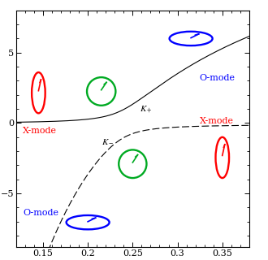

# prlb-f37350e-000: Polarized X-Ray Emission from Magnetized Neutron Stars: Signature of Strong-Field Vacuum Polarization

Preprint: [arXiv:astro-ph/0303596 — Polarized X-Ray Emission from Magnetized Neutron Stars: Signature of Strong-Field Vacuum Polarization](https://arxiv.org/abs/astro-ph/0303596)

Published as: [Polarized X-Ray Emission from Magnetized Neutron Stars: Signature of Strong-Field Vacuum Polarization](https://doi.org/10.1103/PhysRevLett.91.071101)

Formal citation: Physical Review Letters 91, 071101 (2003) · DOI `10.1103/PhysRevLett.91.071101` · Locator `071101`

Public status: **Paper-figure feature reproduction and PRL-Bench gold audit** · Audit score: **84.00/100**

Recomputes the vacuum-resonance density, adiabatic threshold, Landau-Zener conversion, polarization branches, and a paper-exact reconstruction of PRL Fig. 1. The audit also identifies one exponent error and two underdetermined polarization answers in the frozen benchmark.

## Start Here / 从这里开始

- [中文复现 Note](note/reproduction-note.zh-CN.md)
- [English reproduction note](note/reproduction-note.en.md)
- [Formula verification](docs/FORMULA_VERIFICATION.md)
- [Benchmark gold audit](docs/GOLD_AUDIT.md)
- [Source identity audit](docs/SOURCE_AUDIT.md)
- [Code and run commands](code/README.md)
- [Machine-readable scorecard](outputs/checks/similarity_scorecard.json)
- [Derivation (equations)](docs/DERIVATION.md)
- [Numerical methods](docs/NUMERICAL_METHODS.md)
- [Lessons learned](docs/LESSONS_LEARNED.md)

## Main Reproduced Results

| Paper item | Reproduced result | Figure | Check |
| --- | --- | --- | --- |
| PRL Fig. 1 | Paper-parameter ellipticity branches across the vacuum resonance | [PNG](outputs/figures/prl_fig1_reproduced.png) | [JSON](outputs/checks/gold_audit_check.json) |

### PRL Fig. 1: Paper-parameter ellipticity branches across the vacuum resonance



## Quick Run

```bash
python -m venv .venv
source .venv/bin/activate
pip install -r requirements.txt
cd cases/prlb-f37350e-000/code
python scripts/run_gold_audit.py
python scripts/render_prl_fig1.py
python scripts/render_idx0_audit.py
```

Generated files are kept under [data](outputs/data/), [figures](outputs/figures/), and [checks](outputs/checks/).

## Reproduction Boundary

This public case includes paper-derived code, generated data, generated figures, public validation checks, and explanatory notes. It does not redistribute the paper PDF, arXiv source archive, original figures, EPS paths, digitized source curves, source-derived point sets, or source-vs-generated composite panels.

Remaining limitation: Only PRL Fig. 1 is independently reconstructed. The benchmark record is outside the declared 2025-2026 PRL window, and source Figs. 3-4 require atmosphere-model arrays and implementation details that are not public.

Final-parameter rule: final public figures use the paper parameters when feasible. Any reduced-scale, subset, proxy, or blocked target must be labeled explicitly and cannot be presented as a complete reproduction.
