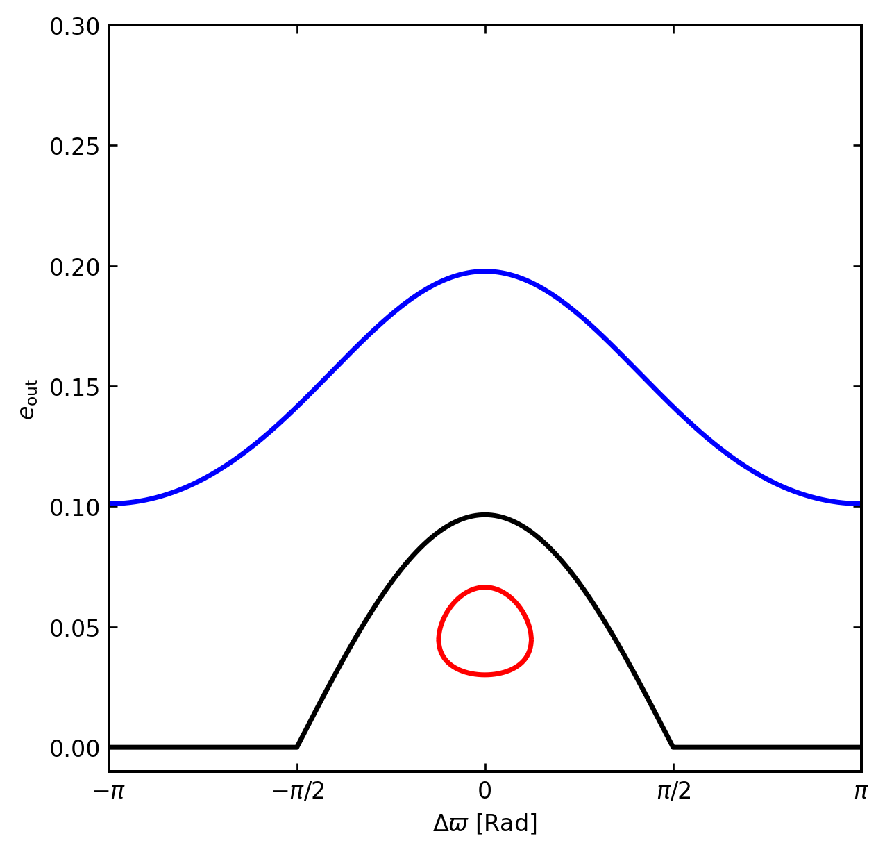

# prlb-f37350e-008: Extreme Resonant Eccentricity Excitation of Stars around Merging Black-Hole Binary

Preprint: [arXiv:2403.03250v2 — Extreme Resonant Eccentricity Excitation of Stars around Merging Black-Hole Binary](https://arxiv.org/abs/2403.03250v2)

Published as: [Extreme Resonant Eccentricity Excitation of Stars around Merging Black-Hole Binary](https://doi.org/10.1103/PhysRevLett.132.231403)

Formal citation: Physical Review Letters 132, 231403 (2024) · DOI `10.1103/PhysRevLett.132.231403` · Locator `231403`

Public status: **Paper-figure feature reproduction and PRL-Bench source audit** · Audit score: **88.75/100**

Recomputes all seven frozen numerical tasks and independently renders the source phase portrait from the secular Hamiltonian. The numerical gold is consistent, while the frozen record does not satisfy the benchmark's declared publication-window contract.

## Start Here / 从这里开始

- [中文复现 Note](note/reproduction-note.zh-CN.md)
- [English reproduction note](note/reproduction-note.en.md)
- [Formula verification](docs/FORMULA_VERIFICATION.md)
- [Benchmark gold audit](docs/GOLD_AUDIT.md)
- [Source identity audit](docs/SOURCE_AUDIT.md)
- [Code and run commands](code/README.md)
- [Machine-readable scorecard](outputs/checks/similarity_scorecard.json)
- [Derivation (equations)](docs/DERIVATION.md)
- [Numerical methods](docs/NUMERICAL_METHODS.md)
- [Lessons learned](docs/LESSONS_LEARNED.md)

## Main Reproduced Results

| Paper item | Reproduced result | Figure | Check |
| --- | --- | --- | --- |
| Source phase portrait | Secular-resonance contours and separatrix structure | [PNG](outputs/figures/prl_figC_reproduced.png) | [JSON](outputs/checks/figc_pixel_qa.json) |

### Source phase portrait: Secular-resonance contours and separatrix structure



## Quick Run

```bash
python -m venv .venv
source .venv/bin/activate
pip install -r requirements.txt
cd cases/prlb-f37350e-008/code
python scripts/run_gold_audit.py
python scripts/render_prl_figc.py
python scripts/render_idx8_audit.py
```

Generated files are kept under [data](outputs/data/), [figures](outputs/figures/), and [checks](outputs/checks/).

## Reproduction Boundary

This public case includes paper-derived code, generated data, generated figures, public validation checks, and explanatory notes. It does not redistribute the paper PDF, arXiv source archive, original figures, EPS paths, digitized source curves, source-derived point sets, or source-vs-generated composite panels.

Remaining limitation: The reproduced source is a 2024 PRL rather than a paper in the benchmark's declared 2025-2026 window. The public package excludes the original figure and publishes only independently generated data and images.

Final-parameter rule: final public figures use the paper parameters when feasible. Any reduced-scale, subset, proxy, or blocked target must be labeled explicitly and cannot be presented as a complete reproduction.
