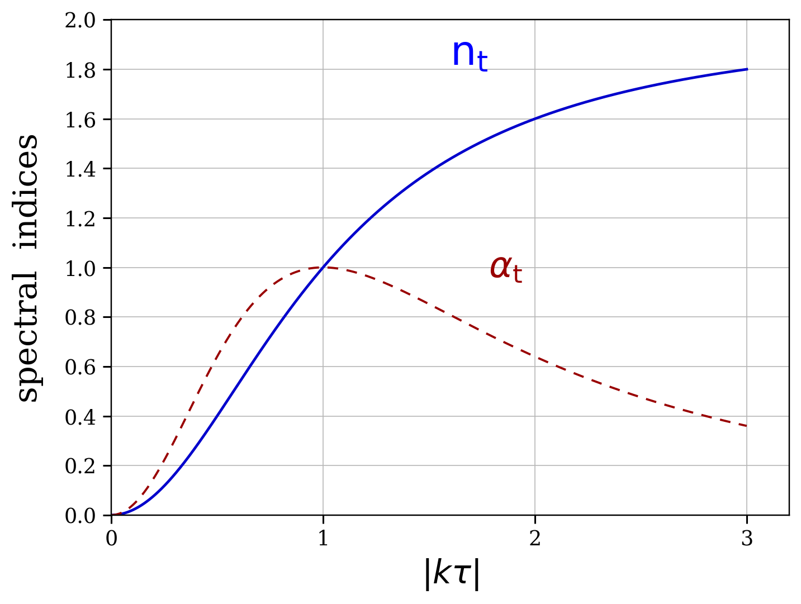

# prlb-f37350e-009: Vacuum and Gravitons of Relic Gravitational Waves, and Regularization of Spectrum and Energy-Momentum Tensor

Preprint: [arXiv:1512.03134v2 — Vacuum and Gravitons of Relic Gravitational Waves, and Regularization of Spectrum and Energy-Momentum Tensor](https://arxiv.org/abs/1512.03134v2)

Published as: [Vacuum and Gravitons of Relic Gravitational Waves, and Regularization of Spectrum and Energy-Momentum Tensor](https://doi.org/10.1103/PhysRevD.94.044033)

Formal citation: Physical Review D 94, 044033 (2016) · DOI `10.1103/PhysRevD.94.044033` · Locator `044033`

Public status: **Paper-exact figure reproduction and composite benchmark audit** · Audit score: **90.25/100**

Independently reconstructs a source running-spectrum figure and audits the composite frozen task against its three older source lineages. The figure-level target is paper-exact, while several benchmark counterterms and equation-of-state values are internally inconsistent.

## Start Here / 从这里开始

- [中文复现 Note](note/reproduction-note.zh-CN.md)
- [English reproduction note](note/reproduction-note.en.md)
- [Formula verification](docs/FORMULA_VERIFICATION.md)
- [Benchmark gold audit](docs/GOLD_AUDIT.md)
- [Source identity audit](docs/SOURCE_AUDIT.md)
- [Code and run commands](code/README.md)
- [Machine-readable scorecard](outputs/checks/similarity_scorecard.json)
- [Derivation (equations)](docs/DERIVATION.md)
- [Numerical methods](docs/NUMERICAL_METHODS.md)
- [Lessons learned](docs/LESSONS_LEARNED.md)

## Main Reproduced Results

| Paper item | Reproduced result | Figure | Check |
| --- | --- | --- | --- |
| Relic-wave running-spectrum figure | Paper-exact tensor-spectrum running curves | [PNG](outputs/figures/rgw_fig2_reproduced.png) | [JSON](outputs/checks/rgw_fig2_pixel_qa.json) |

### Relic-wave running-spectrum figure: Paper-exact tensor-spectrum running curves



## Quick Run

```bash
python -m venv .venv
source .venv/bin/activate
pip install -r requirements.txt
cd cases/prlb-f37350e-009/code
python scripts/run_gold_audit.py
python scripts/render_rgw_fig2.py
python scripts/render_idx9_audit.py
```

Generated files are kept under [data](outputs/data/), [figures](outputs/figures/), and [checks](outputs/checks/).

## Reproduction Boundary

This public case includes paper-derived code, generated data, generated figures, public validation checks, and explanatory notes. It does not redistribute the paper PDF, arXiv source archive, original figures, EPS paths, digitized source curves, source-derived point sets, or source-vs-generated composite panels.

Remaining limitation: The frozen record combines multiple older non-PRL sources and therefore is not a one-paper PRL reproduction. The public case exposes the independent calculation and audit but does not redistribute source artwork or digitized curves.

Final-parameter rule: final public figures use the paper parameters when feasible. Any reduced-scale, subset, proxy, or blocked target must be labeled explicitly and cannot be presented as a complete reproduction.
