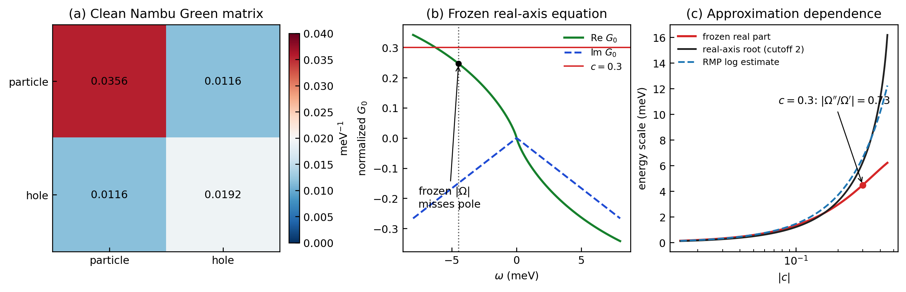

# prlb-f37350e-016: D-wave single-impurity resonance benchmark source/gold audit

Preprint: **No preprint recorded as of 2026-07-20**

Formal publication: **Not recorded as of 2026-07-20**

Public status: **Formula-level reproduction with unresolved source identity** · Audit score: **85.00/100**

Recomputes the frozen impurity-resonance arithmetic, pole equation, and diagnostic curves. The numerical audit is reproducible, but no single PRL source matching the frozen record has been identified.

## Start Here / 从这里开始

- [中文复现 Note](note/reproduction-note.zh-CN.md)
- [English reproduction note](note/reproduction-note.en.md)
- [Formula verification](docs/FORMULA_VERIFICATION.md)
- [Benchmark gold audit](docs/GOLD_AUDIT.md)
- [Source identity audit](docs/SOURCE_AUDIT.md)
- [Code and run commands](code/README.md)
- [Machine-readable scorecard](outputs/checks/similarity_scorecard.json)
- [Derivation (equations)](docs/DERIVATION.md)
- [Numerical methods](docs/NUMERICAL_METHODS.md)
- [Lessons learned](docs/LESSONS_LEARNED.md)

## Main Reproduced Results

| Paper item | Reproduced result | Figure | Check |
| --- | --- | --- | --- |
| Benchmark impurity-resonance audit | Pole equation, resonance energies, and source-identity diagnostics | [PNG](outputs/figures/idx16_gold_audit.png) | [JSON](outputs/checks/idx16_audit_figure_check.json) |

### Benchmark impurity-resonance audit: Pole equation, resonance energies, and source-identity diagnostics



## Quick Run

```bash
python -m venv .venv
source .venv/bin/activate
pip install -r requirements.txt
cd cases/prlb-f37350e-016/code
python scripts/run_gold_audit.py
python scripts/render_idx16_audit.py
```

Generated files are kept under [data](outputs/data/), [figures](outputs/figures/), and [checks](outputs/checks/).

## Reproduction Boundary

This public case includes paper-derived code, generated data, generated figures, public validation checks, and explanatory notes. It does not redistribute the paper PDF, arXiv source archive, original figures, EPS paths, digitized source curves, source-derived point sets, or source-vs-generated composite panels.

Remaining limitation: This is a benchmark-task case rather than a verified one-paper reproduction. The formulas trace to older review literature and a possible newer candidate, while the frozen third task fails its own pole contract.

Final-parameter rule: final public figures use the paper parameters when feasible. Any reduced-scale, subset, proxy, or blocked target must be labeled explicitly and cannot be presented as a complete reproduction.
