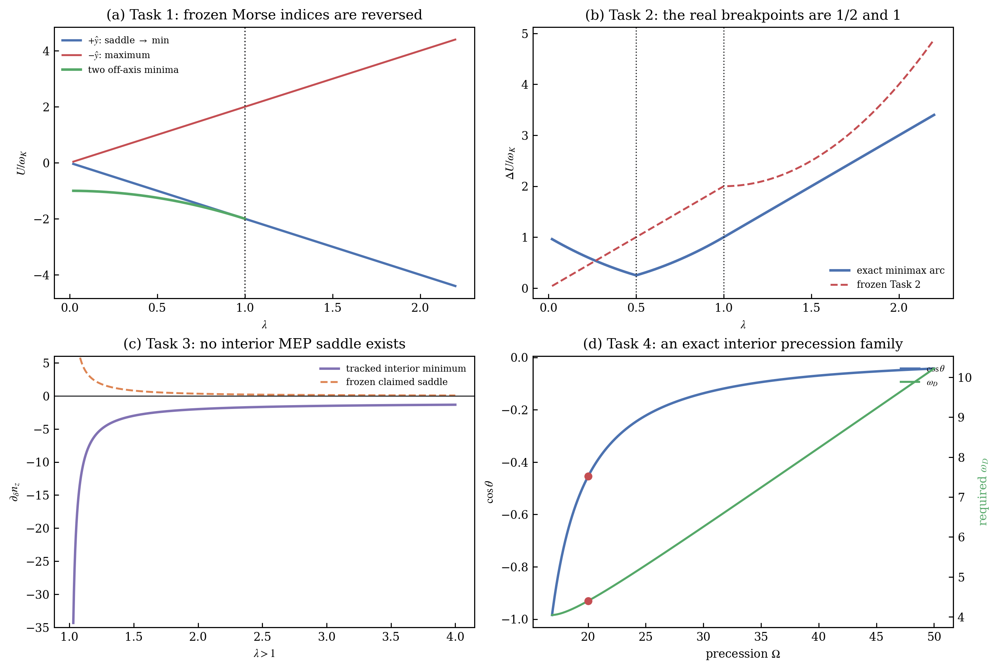

# prlb-f37350e-028: Deterministic Switching of the Neel Vector by Asymmetric Spin Torque

Preprint: [arXiv:2506.10786 — Deterministic Switching of the Neel Vector by Asymmetric Spin Torque](https://arxiv.org/abs/2506.10786)

Published as: [Deterministic Switching of the Neel Vector by Asymmetric Spin Torque](https://doi.org/10.1103/fkyr-z5b8)

Formal citation: Physical Review Letters 136, 096702 (2026) · DOI `10.1103/fkyr-z5b8` · Locator `096702`

Public status: **Source-grounded macrospin reproduction and benchmark audit** · Audit score: **90.00/100**

Implements the paper's macrospin equations, recomputes switching observables, and audits all four frozen tasks against independent algebra and source constraints. The reproducible result shows that the four frozen answers do not satisfy the verified source model.

## Start Here / 从这里开始

- [中文复现 Note](note/reproduction-note.zh-CN.md)
- [English reproduction note](note/reproduction-note.en.md)
- [Formula verification](docs/FORMULA_VERIFICATION.md)
- [Benchmark gold audit](docs/GOLD_AUDIT.md)
- [Source identity audit](docs/SOURCE_AUDIT.md)
- [Code and run commands](code/README.md)
- [Machine-readable scorecard](outputs/checks/similarity_scorecard.json)
- [Derivation (equations)](docs/DERIVATION.md)
- [Numerical methods](docs/NUMERICAL_METHODS.md)
- [Lessons learned](docs/LESSONS_LEARNED.md)

## Main Reproduced Results

| Paper item | Reproduced result | Figure | Check |
| --- | --- | --- | --- |
| Macrospin switching audit | Independent switching trajectory and four-task consistency audit | [PNG](outputs/figures/idx28_gold_audit.png) | [JSON](outputs/checks/idx28_figure_check.json) |

### Macrospin switching audit: Independent switching trajectory and four-task consistency audit



## Quick Run

```bash
python -m venv .venv
source .venv/bin/activate
pip install -r requirements.txt
cd cases/prlb-f37350e-028/code
python scripts/run_idx28_audit.py
python scripts/render_idx28_figures.py
```

Generated files are kept under [data](outputs/data/), [figures](outputs/figures/), and [checks](outputs/checks/).

## Reproduction Boundary

This public case includes paper-derived code, generated data, generated figures, public validation checks, and explanatory notes. It does not redistribute the paper PDF, arXiv source archive, original figures, EPS paths, digitized source curves, source-derived point sets, or source-vs-generated composite panels.

Remaining limitation: The package reproduces the benchmark-relevant macrospin object and audit, not the paper's full micromagnetic or experimental scope. The generated audit figure is independent and the original paper panel is not redistributed.

Final-parameter rule: final public figures use the paper parameters when feasible. Any reduced-scale, subset, proxy, or blocked target must be labeled explicitly and cannot be presented as a complete reproduction.
