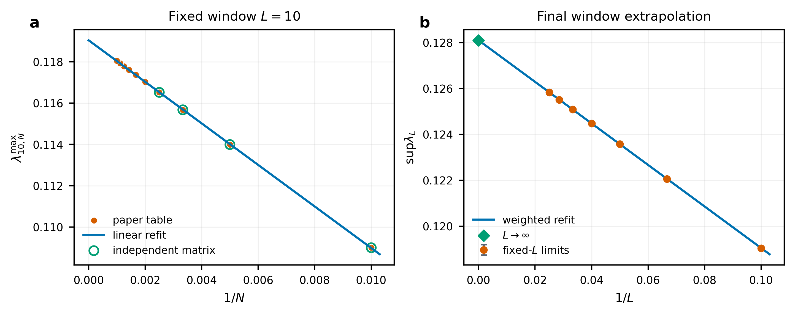

# prlb-f37350e-058: General Quantum Backflow in Realistic Wave Packets

Preprint: [arXiv:2511.10155 — General Quantum Backflow in Realistic Wave Packets](https://arxiv.org/abs/2511.10155)

Published as: [General Quantum Backflow in Realistic Wave Packets](https://doi.org/10.1103/tm9s-pkg5)

Formal citation: Physical Review Letters 136, 090202 (2026) · DOI `10.1103/tm9s-pkg5` · Locator `090202`

Public status: **Source-extrapolation feature reproduction and benchmark audit** · Audit score: **83.60/100**

Independently solves the backflow eigenproblem, validates the source extrapolation, and audits four frozen tasks. The paper-level extrapolation is reproduced at feature level; only the first frozen task survives the independent calculation.

## Start Here / 从这里开始

- [中文复现 Note](note/reproduction-note.zh-CN.md)
- [English reproduction note](note/reproduction-note.en.md)
- [Formula verification](docs/FORMULA_VERIFICATION.md)
- [Benchmark gold audit](docs/GOLD_AUDIT.md)
- [Source identity audit](docs/SOURCE_AUDIT.md)
- [Code and run commands](code/README.md)
- [Machine-readable scorecard](outputs/checks/similarity_scorecard.json)
- [Derivation (equations)](docs/DERIVATION.md)
- [Numerical methods](docs/NUMERICAL_METHODS.md)
- [Lessons learned](docs/LESSONS_LEARNED.md)

## Main Reproduced Results

| Paper item | Reproduced result | Figure | Check |
| --- | --- | --- | --- |
| Backflow extrapolation | Finite-bandwidth eigenvalue sequence and asymptotic extrapolation | [PNG](outputs/figures/idx58_source_extrapolation.png) | [JSON](outputs/checks/idx58_figure_check.json) |

### Backflow extrapolation: Finite-bandwidth eigenvalue sequence and asymptotic extrapolation



## Quick Run

```bash
python -m venv .venv
source .venv/bin/activate
pip install -r requirements.txt
cd cases/prlb-f37350e-058/code
python scripts/run_idx58_audit.py
python scripts/render_idx58_figures.py
```

Generated files are kept under [data](outputs/data/), [figures](outputs/figures/), and [checks](outputs/checks/).

## Reproduction Boundary

This public case includes paper-derived code, generated data, generated figures, public validation checks, and explanatory notes. It does not redistribute the paper PDF, arXiv source archive, original figures, EPS paths, digitized source curves, source-derived point sets, or source-vs-generated composite panels.

Remaining limitation: The public result validates the source extrapolation rather than reproducing every supplemental curve. Frozen Tasks 2-4 disagree with the independently evaluated operator and are reported as benchmark-gold failures.

Final-parameter rule: final public figures use the paper parameters when feasible. Any reduced-scale, subset, proxy, or blocked target must be labeled explicitly and cannot be presented as a complete reproduction.
