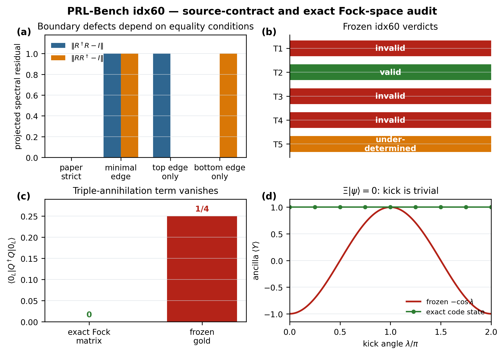

# prlb-f37350e-060: Error-Corrected Fermionic Quantum Processors with Neutral Atoms

Preprint: [arXiv:2412.16081 — Error-Corrected Fermionic Quantum Processors with Neutral Atoms](https://arxiv.org/abs/2412.16081)

Published as: [Error-Corrected Fermionic Quantum Processors with Neutral Atoms](https://doi.org/10.1103/zkpl-hh28)

Formal citation: Physical Review Letters 135, 090601 (2025) · DOI `10.1103/zkpl-hh28` · Locator `090601`

Public status: **Formula-level numerical feature reproduction and benchmark audit** · Audit score: **84.00/100**

Reconstructs the paper's fermionic reference-state formulas and independently evaluates all frozen tasks. Source identities are exact; one task passes, three fail, and one is underdetermined by the published information.

## Start Here / 从这里开始

- [中文复现 Note](note/reproduction-note.zh-CN.md)
- [English reproduction note](note/reproduction-note.en.md)
- [Formula verification](docs/FORMULA_VERIFICATION.md)
- [Benchmark gold audit](docs/GOLD_AUDIT.md)
- [Source identity audit](docs/SOURCE_AUDIT.md)
- [Code and run commands](code/README.md)
- [Machine-readable scorecard](outputs/checks/similarity_scorecard.json)
- [Derivation (equations)](docs/DERIVATION.md)
- [Numerical methods](docs/NUMERICAL_METHODS.md)
- [Lessons learned](docs/LESSONS_LEARNED.md)

## Main Reproduced Results

| Paper item | Reproduced result | Figure | Check |
| --- | --- | --- | --- |
| Fermionic reference benchmark | Independent five-task formula and identifiability audit | [PNG](outputs/figures/idx60_gold_audit.png) | [JSON](outputs/checks/idx60_figure_check.json) |

### Fermionic reference benchmark: Independent five-task formula and identifiability audit



## Quick Run

```bash
python -m venv .venv
source .venv/bin/activate
pip install -r requirements.txt
cd cases/prlb-f37350e-060/code
python scripts/run_idx60_audit.py
python scripts/render_idx60_figures.py
```

Generated files are kept under [data](outputs/data/), [figures](outputs/figures/), and [checks](outputs/checks/).

## Reproduction Boundary

This public case includes paper-derived code, generated data, generated figures, public validation checks, and explanatory notes. It does not redistribute the paper PDF, arXiv source archive, original figures, EPS paths, digitized source curves, source-derived point sets, or source-vs-generated composite panels.

Remaining limitation: This case reproduces the benchmark-relevant analytic and small numerical objects, not the full hardware protocol or experimental error-correction campaign.

Final-parameter rule: final public figures use the paper parameters when feasible. Any reduced-scale, subset, proxy, or blocked target must be labeled explicitly and cannot be presented as a complete reproduction.
