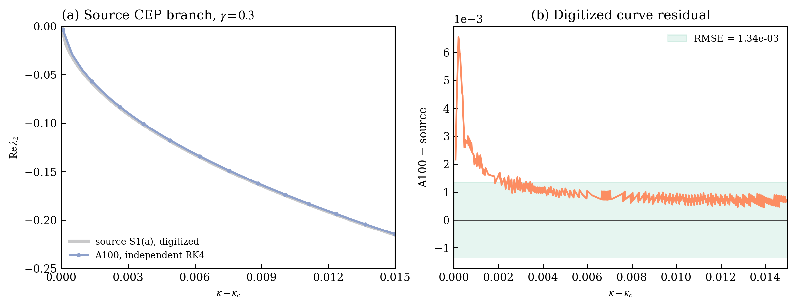

# prlb-f37350e-063: Phase Transitions in Nonreciprocal Driven-Dissipative Condensates

Preprint: [arXiv:2502.05267v3 — Phase Transitions in Nonreciprocal Driven-Dissipative Condensates](https://arxiv.org/abs/2502.05267v3)

Published as: [Phase Transitions in Nonreciprocal Driven-Dissipative Condensates](https://doi.org/10.1103/gphr-d1bc)

Formal citation: Physical Review Letters 135, 123401 (2025) · DOI `10.1103/gphr-d1bc` · Locator `123401`

Public status: **A100 source-curve feature reproduction and benchmark audit** · Audit score: **89.55/100**

Uses an A100 grid calculation to reproduce the paper's gamma=0.3 lambda-2 branch and independently audits the frozen critical-exceptional-point claims. The paper curve passes its feature gate, while the frozen benchmark gold fails independent evaluation.

## Start Here / 从这里开始

- [中文复现 Note](note/reproduction-note.zh-CN.md)
- [English reproduction note](note/reproduction-note.en.md)
- [Formula verification](docs/FORMULA_VERIFICATION.md)
- [Benchmark gold audit](docs/GOLD_AUDIT.md)
- [Source identity audit](docs/SOURCE_AUDIT.md)
- [Code and run commands](code/README.md)
- [Machine-readable scorecard](outputs/checks/similarity_scorecard.json)
- [Derivation (equations)](docs/DERIVATION.md)
- [Numerical methods](docs/NUMERICAL_METHODS.md)
- [Lessons learned](docs/LESSONS_LEARNED.md)

## Main Reproduced Results

| Paper item | Reproduced result | Figure | Check |
| --- | --- | --- | --- |
| gamma=0.3 lambda-2 branch | A100 nonreciprocal-condensate source-curve reproduction | [PNG](outputs/figures/idx63_cep_gamma03_reproduction.png) | [JSON](outputs/checks/idx63_figure_check.json) |

### gamma=0.3 lambda-2 branch: A100 nonreciprocal-condensate source-curve reproduction



## Quick Run

```bash
python -m venv .venv
source .venv/bin/activate
pip install -r requirements.txt
pip install torch
cd cases/prlb-f37350e-063/code
python scripts/render_idx63_figures.py
```

### Full paper-scale rerun

The full grid rerun requires an NVIDIA CUDA GPU and PyTorch with CUDA support. The included JSON summaries allow the figure to be regenerated without a GPU.

```bash
cd cases/prlb-f37350e-063/code
python scripts/run_idx63_a100_grid.py
python scripts/render_idx63_figures.py
```

Generated files are kept under [data](outputs/data/), [figures](outputs/figures/), and [checks](outputs/checks/).

## Reproduction Boundary

This public case includes paper-derived code, generated data, generated figures, public validation checks, and explanatory notes. It does not redistribute the paper PDF, arXiv source archive, original figures, EPS paths, digitized source curves, source-derived point sets, or source-vs-generated composite panels.

Remaining limitation: The paper-curve result is feature-level rather than author-data exact. Recomputing the full grid requires CUDA/PyTorch; the default public command regenerates figures from the included A100 summaries.

Final-parameter rule: final public figures use the paper parameters when feasible. Any reduced-scale, subset, proxy, or blocked target must be labeled explicitly and cannot be presented as a complete reproduction.
