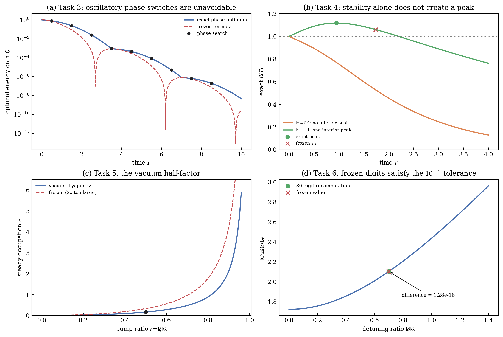

# prlb-f37350e-071: Unwanted Couplings Can Induce Amplification in Quantum Memories despite Negligible Apparent Noise

Preprint: [arXiv:2411.15362 — Unwanted Couplings Can Induce Amplification in Quantum Memories despite Negligible Apparent Noise](https://arxiv.org/abs/2411.15362)

Published as: [Unwanted Couplings Can Induce Amplification in Quantum Memories despite Negligible Apparent Noise](https://doi.org/10.1103/pz34-47pw)

Formal citation: Physical Review Letters 135, 070802 (2025) · DOI `10.1103/pz34-47pw` · Locator `070802`

Public status: **Complete benchmark-task reproduction and source audit** · Audit score: **90.00/100**

Independently evaluates all six frozen quantum-memory tasks, including gain, apparent noise, threshold behavior, and the high-precision scalar result. The complete audit shows that three central frozen answers are inconsistent with the verified source equations.

## Start Here / 从这里开始

- [中文复现 Note](note/reproduction-note.zh-CN.md)
- [English reproduction note](note/reproduction-note.en.md)
- [Formula verification](docs/FORMULA_VERIFICATION.md)
- [Benchmark gold audit](docs/GOLD_AUDIT.md)
- [Source identity audit](docs/SOURCE_AUDIT.md)
- [Code and run commands](code/README.md)
- [Machine-readable scorecard](outputs/checks/similarity_scorecard.json)
- [Derivation (equations)](docs/DERIVATION.md)
- [Numerical methods](docs/NUMERICAL_METHODS.md)
- [Lessons learned](docs/LESSONS_LEARNED.md)

## Main Reproduced Results

| Paper item | Reproduced result | Figure | Check |
| --- | --- | --- | --- |
| PRL-Bench idx 71 Tasks 1-6 | Gain, noise, threshold, and precision audit | [PNG](outputs/figures/idx71_gold_audit.png) | [JSON](outputs/checks/idx71_figure_check.json) |

### PRL-Bench idx 71 Tasks 1-6: Gain, noise, threshold, and precision audit



## Quick Run

```bash
python -m venv .venv
source .venv/bin/activate
pip install -r requirements.txt
cd cases/prlb-f37350e-071/code
python scripts/run_idx71_audit.py
python scripts/render_idx71_figures.py
```

Generated files are kept under [data](outputs/data/), [figures](outputs/figures/), and [checks](outputs/checks/).

## Reproduction Boundary

This public case includes paper-derived code, generated data, generated figures, public validation checks, and explanatory notes. It does not redistribute the paper PDF, arXiv source archive, original figures, EPS paths, digitized source curves, source-derived point sets, or source-vs-generated composite panels.

Remaining limitation: The benchmark-task scope is complete, but this is not a reproduction of every paper figure or experimental implementation. The package publishes only independently generated audit data and graphics.

Final-parameter rule: final public figures use the paper parameters when feasible. Any reduced-scale, subset, proxy, or blocked target must be labeled explicitly and cannot be presented as a complete reproduction.
