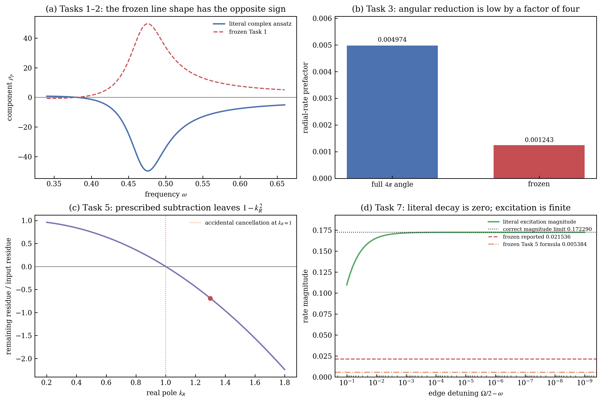

# prlb-f37350e-090: Spontaneous Emission Decay and Excitation in Photonic Time Crystals

Preprint: [arXiv:2404.13287 — Spontaneous Emission Decay and Excitation in Photonic Time Crystals](https://arxiv.org/abs/2404.13287)

Published as: [Spontaneous Emission Decay and Excitation in Photonic Time Crystals](https://doi.org/10.1103/5v2w-yg7v)

Formal citation: Physical Review Letters 135, 133801 (2025) · DOI `10.1103/5v2w-yg7v` · Locator `133801`

Public status: **Complete benchmark-task reproduction and source-consistency audit** · Audit score: **90.00/100**

Independently evaluates all seven frozen decay and excitation tasks using the source equations and controlled toy limits. Five frozen answers fail literal source or algebra consistency.

## Start Here / 从这里开始

- [中文复现 Note](note/reproduction-note.zh-CN.md)
- [English reproduction note](note/reproduction-note.en.md)
- [Formula verification](docs/FORMULA_VERIFICATION.md)
- [Benchmark gold audit](docs/GOLD_AUDIT.md)
- [Source identity audit](docs/SOURCE_AUDIT.md)
- [Code and run commands](code/README.md)
- [Machine-readable scorecard](outputs/checks/similarity_scorecard.json)
- [Derivation (equations)](docs/DERIVATION.md)
- [Numerical methods](docs/NUMERICAL_METHODS.md)
- [Lessons learned](docs/LESSONS_LEARNED.md)

## Main Reproduced Results

| Paper item | Reproduced result | Figure | Check |
| --- | --- | --- | --- |
| PRL-Bench idx 90 Tasks 1-7 | Decay, excitation, and algebra consistency audit | [PNG](outputs/figures/idx90_gold_audit.png) | [JSON](outputs/checks/idx90_figure_check.json) |

### PRL-Bench idx 90 Tasks 1-7: Decay, excitation, and algebra consistency audit



## Quick Run

```bash
python -m venv .venv
source .venv/bin/activate
pip install -r requirements.txt
cd cases/prlb-f37350e-090/code
python scripts/run_idx90_audit.py
python scripts/render_idx90_figures.py
```

Generated files are kept under [data](outputs/data/), [figures](outputs/figures/), and [checks](outputs/checks/).

## Reproduction Boundary

This public case includes paper-derived code, generated data, generated figures, public validation checks, and explanatory notes. It does not redistribute the paper PDF, arXiv source archive, original figures, EPS paths, digitized source curves, source-derived point sets, or source-vs-generated composite panels.

Remaining limitation: The seven-task audit is complete, but the package does not reproduce the paper's full electromagnetic simulation or experimental apparatus. Results are formula- and benchmark-level numerical features.

Final-parameter rule: final public figures use the paper parameters when feasible. Any reduced-scale, subset, proxy, or blocked target must be labeled explicitly and cannot be presented as a complete reproduction.
