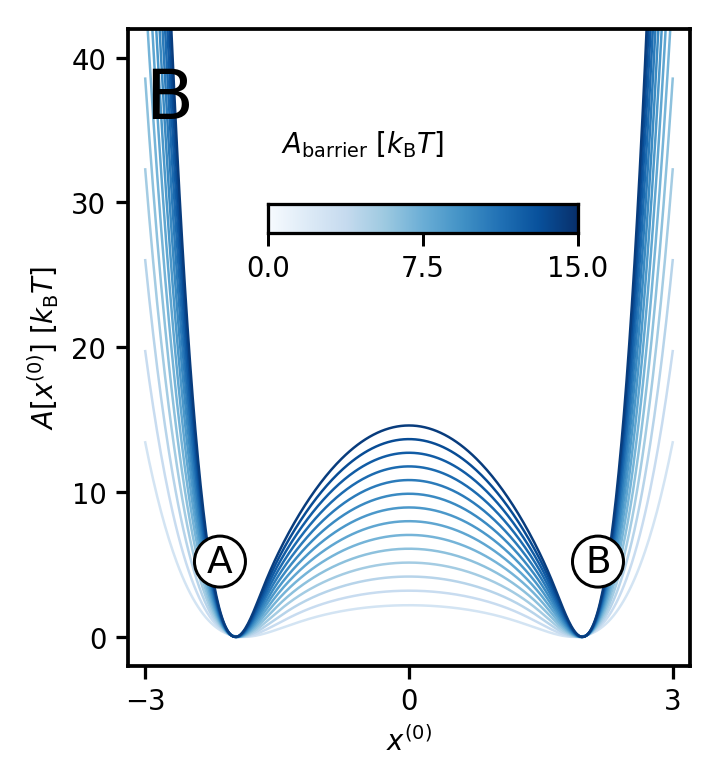

# prlb-f37350e-093: Enhanced Sampling of Configuration and Path Space in a Generalized Ensemble by Shooting Point Exchange

Preprint: [arXiv:2302.08757v2 — Enhanced Sampling of Configuration and Path Space in a Generalized Ensemble by Shooting Point Exchange](https://arxiv.org/abs/2302.08757v2)

Published as: [Enhanced Sampling of Configuration and Path Space in a Generalized Ensemble by Shooting Point Exchange](https://doi.org/10.1103/PhysRevLett.132.128001)

Formal citation: Physical Review Letters 132, 128001 (2024) · DOI `10.1103/PhysRevLett.132.128001` · Locator `128001`

Public status: **Paper-figure feature reproduction and benchmark statistics audit** · Audit score: **70.10/100**

Independently reconstructs Fig. 2B from the source potential and audits the frozen efficiency and speedup claims. The free-energy profile is reproduced, while several claimed statistics lack the event counts and rerun data needed for verification.

## Start Here / 从这里开始

- [中文复现 Note](note/reproduction-note.zh-CN.md)
- [English reproduction note](note/reproduction-note.en.md)
- [Formula verification](docs/FORMULA_VERIFICATION.md)
- [Benchmark gold audit](docs/GOLD_AUDIT.md)
- [Source identity audit](docs/SOURCE_AUDIT.md)
- [Code and run commands](code/README.md)
- [Machine-readable scorecard](outputs/checks/similarity_scorecard.json)
- [Derivation (equations)](docs/DERIVATION.md)
- [Numerical methods](docs/NUMERICAL_METHODS.md)
- [Lessons learned](docs/LESSONS_LEARNED.md)

## Main Reproduced Results

| Paper item | Reproduced result | Figure | Check |
| --- | --- | --- | --- |
| PRL Fig. 2B | Free-energy profile from deterministic marginalization | [PNG](outputs/figures/prl_fig2b_reproduced.png) | [JSON](outputs/checks/gold_audit_check.json) |

### PRL Fig. 2B: Free-energy profile from deterministic marginalization



## Quick Run

```bash
python -m venv .venv
source .venv/bin/activate
pip install -r requirements.txt
cd cases/prlb-f37350e-093/code
python scripts/render_prl_fig2b.py
python scripts/render_idx93_audit.py
```

Generated files are kept under [data](outputs/data/), [figures](outputs/figures/), and [checks](outputs/checks/).

## Reproduction Boundary

This public case includes paper-derived code, generated data, generated figures, public validation checks, and explanatory notes. It does not redistribute the paper PDF, arXiv source archive, original figures, EPS paths, digitized source curves, source-derived point sets, or source-vs-generated composite panels.

Remaining limitation: The source is a 2024 PRL outside the benchmark's declared window. Author trajectories, event counts, and optimized-coordinate rerun rates are unavailable, so the efficiency and speedup claims remain underdetermined.

Final-parameter rule: final public figures use the paper parameters when feasible. Any reduced-scale, subset, proxy, or blocked target must be labeled explicitly and cannot be presented as a complete reproduction.
